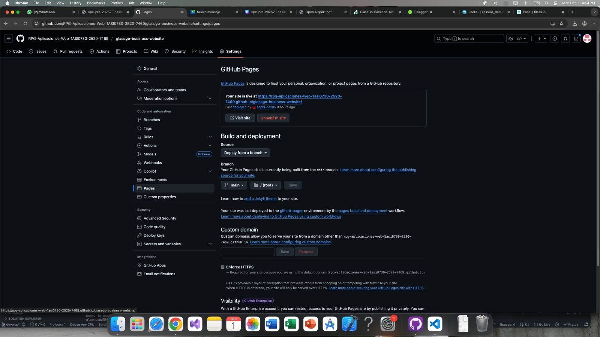
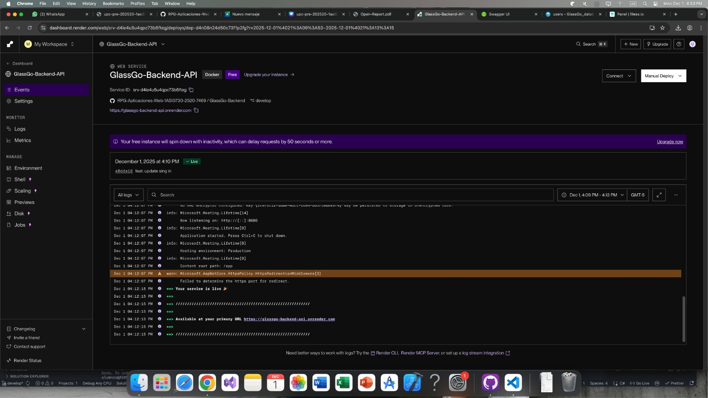
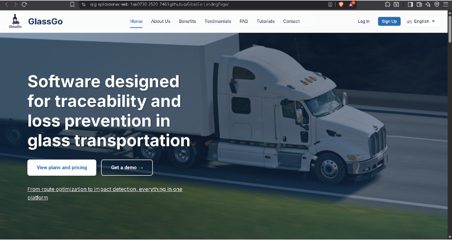
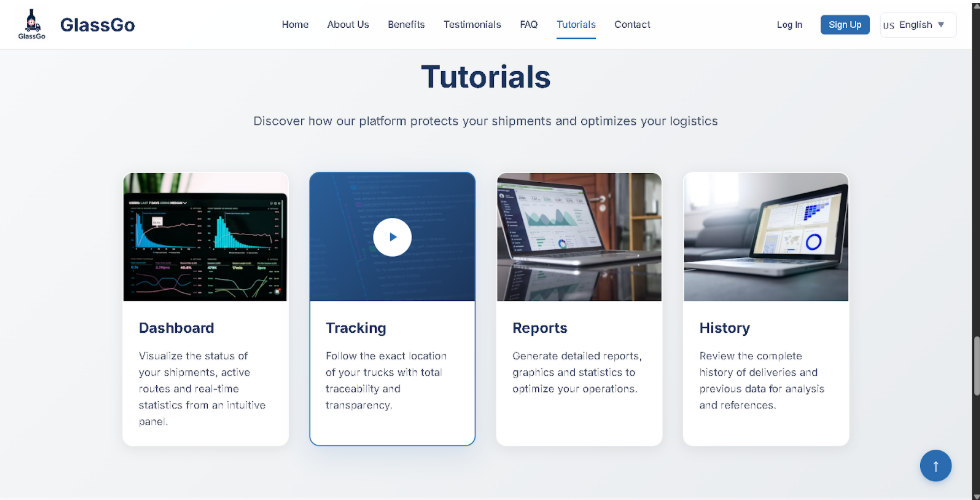
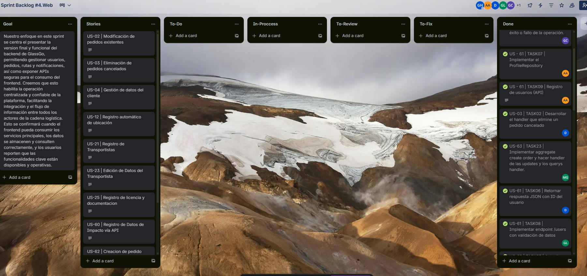
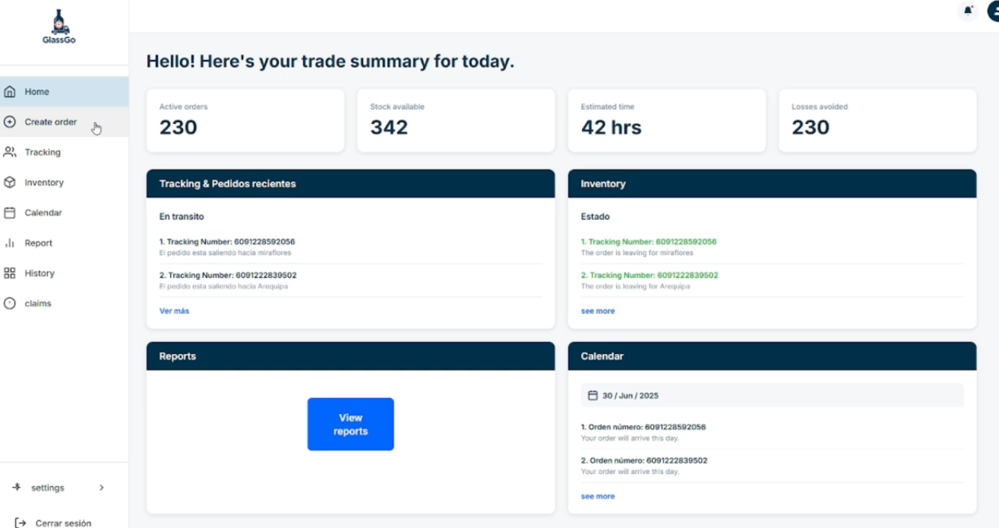
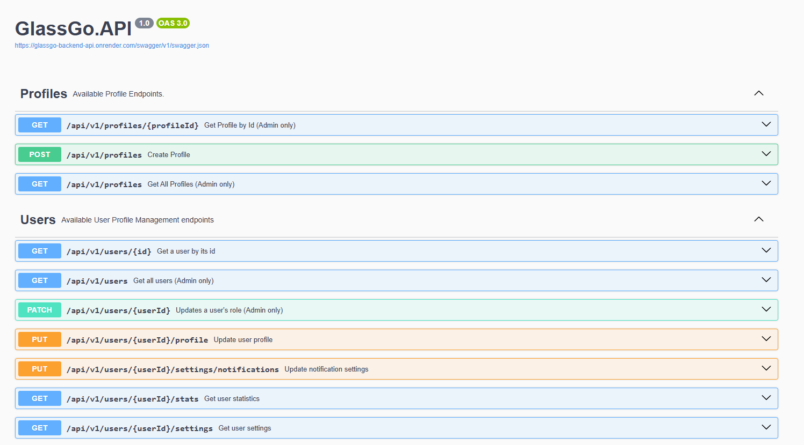
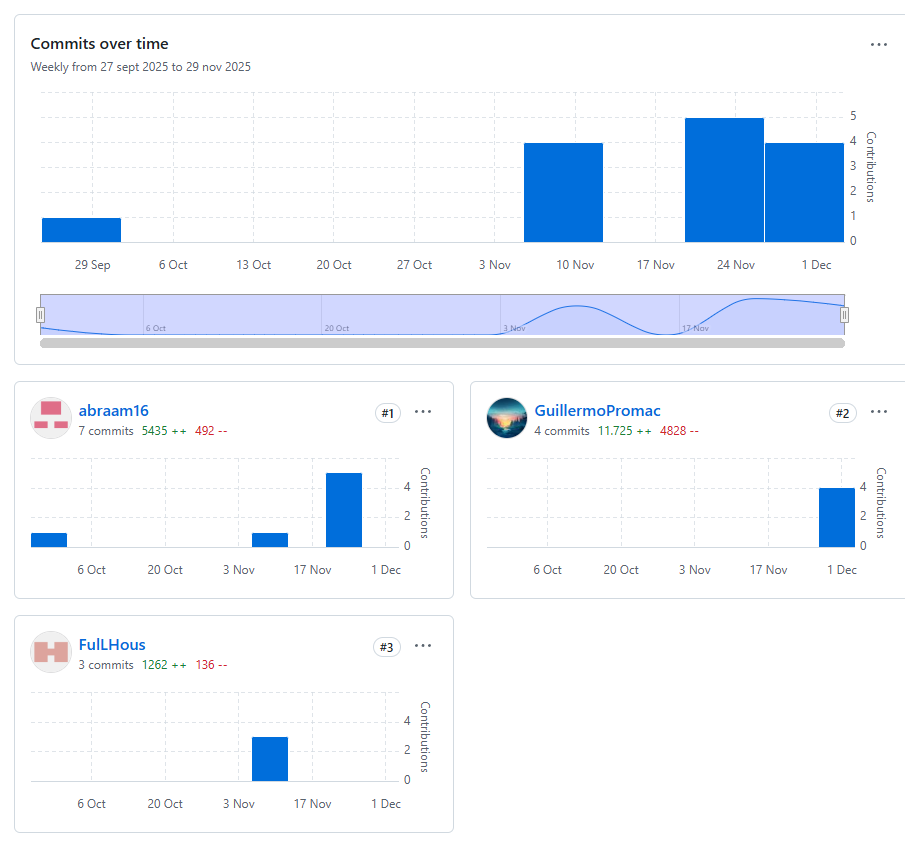
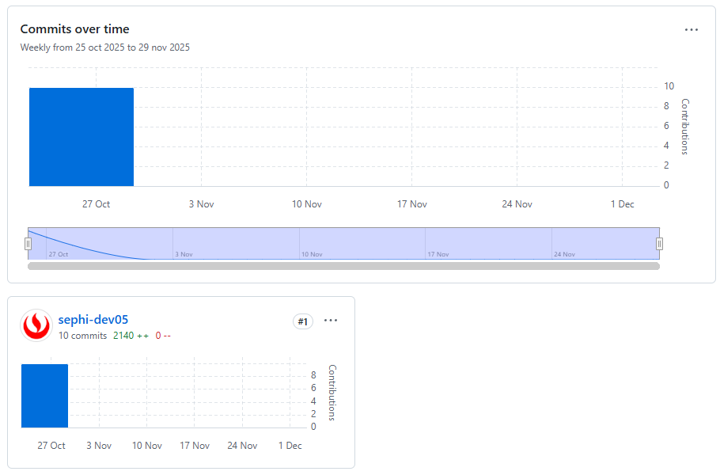
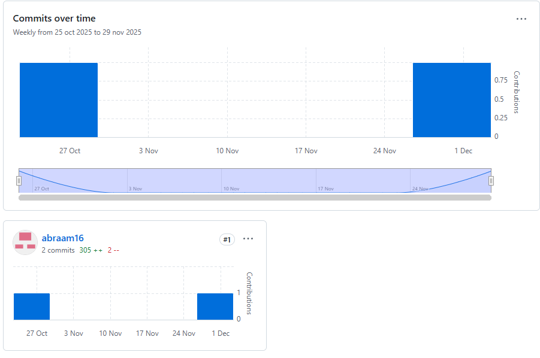

# Chapter V: Product Implementation, Validation & Deployment

## 5.1. Software Configuration Management

### 5.1.1. Software Development Environment Configuration

The following are the tools and standards adopted by the team for collaborative system development:

| Activity | Tool / Guide | Purpose | Access Type / Link |
| :---- | :---- | :---- | :---- |
| Project Management      | Trello Software                                                                                                                                                                   | Seguimiento de backlog, tareas y sprints.                                     | SaaS –[https://trello.com/](https://trello.com/software/jira)                                                                                                                                                         |
| Requirements Management | Gherkin Conventions                                                                                                                                                               | Escritura legible de requisitos con formato Given/When/Then.                  | [https://cucumber.io/docs/gherkin/](https://cucumber.io/docs/gherkin/)                                                                                                                                                 |
| Product UX/UI Design    | Figma                                                                                                                                                                             | Prototipos y diseño responsive.                                              | SaaS –[https://figma.com](https://figma.com)                                                                                                                                                                          |
| Frontend Dev            | HTML, CSS, JavaScript, Vue                                                                                                                                                        | Construcción de la interfaz web.                                             | [https://vuejs.org/guide/introduction.html](https://vuejs.org/guide/introduction.html)                                                                                                                                 |
| Backend Dev             | C# + ASP.NET Core                                                                                                                                                                 | Implementación de servicios y lógica del backend.                           | [https://learn.microsoft.com/en-us/aspnet/core](https://learn.microsoft.com/en-us/aspnet/core)                                                                                                                         |
| IDE                     | Rider + WebStorm                                                                                                                                                                  | Desarrollo, testing y depuración.                                            | [https://www.jetbrains.com/rider](https://www.jetbrains.com/rider) / [https://www.jetbrains.com/webstorm](https://www.jetbrains.com/webstorm)                                                                             |
| Code Standards          | Google HTML/CSS Style Guide, Vue Style Guide, MDN Guidelines, W3C JavaScript Style Guide, Google JavaScript Style Guide, C# Coding Conventions, Microsoft ASP.NET Core Guidelines | Aplicación de buenas prácticas de desarrollo en frontend y backend.         | [https://developer.mozilla.org/](https://developer.mozilla.org/) / [https://learn.microsoft.com/en-us/dotnet/csharp/fundamentals/coding-style](https://learn.microsoft.com/en-us/dotnet/csharp/fundamentals/coding-style) |
| Version Control         | Git + GitHub                                                                                                                                                                      | Control de versiones y trabajo colaborativo.                                  | SaaS –[https://github.com](https://github.com)                                                                                                                                                                        |
| Software Deployment     | Github pages                                                                                                                                                                      | Despliegue continuo de la aplicación para ambientes de prueba y validación. | SaaS –[https://railway.app](https://railway.app) / [https://render.com](https://render.com)                                                                                                                              |
| Software Documentation  | Swagger                                                                                                                                                                           | Documentación técnica del sistema y pruebas de API.                         | SaaS –[https://swagger.io/](https://swagger.io/)                                                                                                                                                                      |

### 5.1.2. Source Code Management

In this section, the team establishes the methods and organizational structure that will be used for tracking changes. **GitHub** will be used as the platform and version control system.

The following are the URLs of the GitHub repositories for each product:

- **Business Web Page**: https://tinyurl.com/4nvrx32h
- **Frontend Web Application**: https://tinyurl.com/44kyhyud
- **Backend Web Service**: https://tinyurl.com/53m8565y

* **GitFlow Workflow**

  The branching model proposed by Vincent Driessen in his article “A successful Git branching model,” known as GitFlow, will be implemented. This model organizes work into the following branches:

  * **main:** Main branch, always contains production code.  
  * **develop:** Main development branch, where features are integrated before going to production.  
  * **feature/\*:** Branches created from develop to develop new features.  
    * Naming convention: feature/<short-descriptive-name>  
      * **Example:** feature/login-auth  
  * **release/\*:** Branches created from develop when preparing a new version for production.  
    * Naming convention: release/<version>  
      * **Example:** release/1.2.0  

* **Commit Conventions**  
  The Conventional Commits standard will be used for commit messages. This will facilitate automation in continuous integration processes and changelog generation.  
  * **feat:** add login functionality  
  * **fix:** correct null pointer exception on user service  
  * **chore:** update dependencies

### 5.1.3. Source Code Style & Conventions

* **Frontend (Landing Page - HTML, CSS, JavaScript)**  
  * **General Conventions:**  
    * **Language:** All code, including variable names, functions, and classes, is written in English.  
    * **Indentation:** 2 spaces.  
    * **File Format:** .html, .css, .js  
    * **Adopted Code Style:**  
      * [W3Schools HTML Style Guide](https://www.w3schools.com/html/html5_syntax.asp)  
      * [Google HTML/CSS Style Guide](https://google.github.io/styleguide/htmlcssguide.html)

  * **Naming Conventions:**  
    * **CSS Classes:** kebab-case (e.g., main-container)  
    * **HTML IDs:** camelCase (e.g., mainContent)  
    * **JS Variables:** camelCase (e.g., userName)  
    * **JS Functions:** camelCase (e.g., handleClick())

* **Frontend Web App (Vue.js + JavaScript)**  
  * **General Conventions:**  
    * **Language:** Code is entirely in English.  
    * **Folder Structure:** Segregation by modules and components.  
    * **Indentation:** 2 spaces.  
    * **File Format:** .vue, .js, .css  
    * **Adopted Code Style:**  
      * [Vue.js Style Guide (Official):](https://vuejs.org/guide/reusability/style-guide.html)  
      * [Airbnb JavaScript Style Guide](https://github.com/airbnb/javascript)

  * **Naming Conventions:**  
    * **Vue Components:** PascalCase (e.g., UserProfile.vue)  
    * **JS Variables and Functions:** camelCase (e.g., userName, handleSubmit())  
    * **Files:** kebab-case (e.g., user-profile.vue)  
    * **Props:** camelCase in JavaScript, kebab-case in HTML templates (e.g., prop: userProfile, usage: user-profile)  
    * **Custom Events:** kebab-case (e.g., user-logged-in)  
    * **CSS Classes:** kebab-case

### 5.1.4. Software Deployment Configuration

This section details the necessary steps to successfully deploy the digital products that make up the solution: the Business Web Page, the web application (frontend), and the Web Services (backend), starting from their respective source code repositories.  
* **1. Business Web Page (HTML, CSS, JavaScript)**  
  * **Base Technology:**  
    * **Languages:** HTML5, CSS3, JavaScript  
    * **Hosting:** GitHub Pages

  * **Configuration and Deployment:**

    *Source Code Repository:* The Business Web Page is developed using pure HTML, CSS, and JavaScript. All project files must be uploaded to a public repository on GitHub. It is mandatory for the index.html file to be located at the root of the repository (/) for GitHub Pages to correctly detect it as the entry point of the site. Deployment steps on GitHub Pages:

    * Access the repository on GitHub.  
    * Go to the repository's Settings section.  

    
    
    * In the sidebar menu, select Pages.  
    * In the Source field, choose:  
      * **Branch:** main  
      * **Folder:** / (root)  
    * Save the changes.

      *Publication:* GitHub will automatically generate a public URL where the Business Web Page will be available, in the format: https://\<username\>.github.io/\<repository\>/

      Updates: Any new commit to the main branch will be automatically deployed by GitHub Pages, without the need for additional actions.

* **2. Frontend Web App (Vue.js + JavaScript)**  
  * **Base Technology:**  
    * **Framework:** Vue 3  
    * **Build Tool:** Vite / Vue CLI (npm run build)  
    * **Hosting:** GitHub Pages

  * **Configuration and Deployment:**

    *Source Code Repository:* The frontend project is hosted on GitHub. The output directory of the build (/dist) contains the files that need to be published.

    *Build:* The command is executed; npm run build. This generates the static files ready for production.

    *Deployment on GitHub Pages:* To publish the content of the /dist directory on GitHub Pages, you can use the gh-pages tool (npm) or perform a manual deployment via a gh-pages branch. A GitHub Actions workflow can also be set up to automate the process. Environment Variables: The URLs of the backend REST services are configured as environment variables (e.g., VITE_API_URL) and are not hardcoded. Differentiated environments:

    * Access the repository on GitHub.  
    * Go to the repository's Settings section.  
    * In the sidebar menu, select Pages.  
    * In the Source field, choose:  
      * **Branch:** main  
      * **Folder:** / (root)  
    * Save the changes.

      *Publication:* GitHub will automatically generate a public URL where the Landing Page will be available, in the format: *https://\<username\>.[github.io/](http://github.io/)\<repository\>/*

      *Updates:* Any new commit to the main branch will be automatically deployed by GitHub Pages, without the need for additional actions.

* **3. Web Services – C# ASP.NET 9.0**

    **Underlying Technology**

     - Framework: ASP.NET Core 9.0
     - Language: C#
     - Build Tool: `dotnet build`
     - Containerization: Docker
     - Database: MySQL (freesqldatabase.com)
     - Hosting: Render

    **Configuration and Deployment**
 
    *Containerization:*
       The backend project contains a `Dockerfile` that defines the Docker image to be built. This image is used in Render to run the application as a container.
    
    
    
    
  
    *Deployment on Render:*
       - Access the Render platform and create a new Web Service.
       - Connect your GitHub repository containing the backend code.
       - Configure the build and start commands:
         - **Build Command:** `dotnet build`
         - **Start Command:** `dotnet YourProjectName.dll`
       - Set environment variables for database connection and other configurations.
       - Deploy the service.

## 5.2. Landing Page, Services & Applications Implementation

### 5.2.1. Sprint 1

The first sprint is an important milestone in our agile development process. During this period, we focused on implementing the priority features and functionalities identified in the initial planning. This involves translating the requirements and specifications into functional code, iteratively developing the foundations of our product.

#### 5.2.1.1. Sprint Planning 1

Sprint planning is a meeting in agile methodology where the team plans the activities for the next sprint. It defines what work will be done, how long it will take, and who will be responsible. The goal is to establish a clear and achievable plan for the team, fostering collaboration and ensuring that everyone is aligned on objectives and priorities.

| Sprint \# | Sprint 1 |
| :---- | :---- |
| **Sprint Planning Background** |  |
| **Date** | 15-09-2025 |
| **Time** | 2:00 PM |
| **Location** | Discord (Virtual Meeting) |
| **Prepared By** | Ever Giusephi Carlos Lavado, Abraam Bernabe Acosta Elera |
| **Attendees (to planning meeting)** | Ever Giusephi Carlos Lavado / Abraam Bernabe Acosta Elera / Mike Dylan Guillen Giraldo / Guillermo Arturo Howard Robles / Gerardo Valentín Palacín Lazo / David Ignacio Vivar Cesar |
| **Sprint 1 - 1 Review Summary** | The project begins with a focus on establishing the foundations of the liquor traceability application. The team is committed to delivering a solid base that includes a functional landing page and the initial project documentation. The repository structure and the first definitions of the system architecture were established. |
| **Sprint 1 - 1 Retrospective Summary** | As this is the first sprint of the project, there is no previous retrospective. The team established the first collaborative work norms, decided to use agile methodologies with short daily meetings, and defined the main communication channels through Discord and WhatsApp for quick coordination. |
| **Sprint 1 Goal** | Our focus is on establishing a professional web presence and creating the technical foundations of the liquor traceability project. We believe this delivers initial confidence and validation of the concept to our target segments (transport operators, distributors, and store managers). This will be confirmed when we have a functional landing page deployed that clearly presents the value proposition and visitors can understand the benefit of the solution in less than 30 seconds. |
| **Sprint 1 Velocity** | For this sprint, a velocity of 25 Story Points was established, considering that it is the first sprint and the team is in the process of adapting to the working methodology. |
| **Sum of Story Points** | The total sum of Story Points for the User Stories included in this Sprint 1 is 23 Story Points. |

#### 5.2.1.2. Aspect Leaders and Collaborators

| Team Member (Last Name, First Name) | GitHub Username | Aspect Name 1: User Stories Development Leader (L) / Collaborator (C) | Aspect Name 2: Interview Development Leader (L) / Collaborator (C) | Aspect Name 3: Mockups Development Leader (L) / Collaborator (C) | Aspect Name 4: Landing Page Development Leader (L) / Collaborator (C) | Aspect Name 5: Development of Chapters 1 and 2 Leader (L) / Collaborator (C) |
| :---- | :---- | :---- | :---- | :---- | :---- | :---- |
| Carlos Lavado, Ever Giusephi | FischlTx | L | C | C | C | C |
| Acosta Elera, Abraam Bernabe | abraam16 | C | L | C | C | C |
| Guillen Giraldo, Mike Dylan | FulLHous | C | C | L | C | C |
| Howard Robles, Guillermo Arturo | Guillermo Howard |  | C | C | C | L |
| Palacín Lazo, Gerardo Valentín | GeraldP03 | C | C | C | C | L |
| Vivar Cesar, David Ignacio | DarkBeider20 | C | C | C | C | C |

#### 5.2.1.3. Sprint Backlog 1

| User Story |  | Work-Item / Task |  |  |  | Status |
| :---- | :---- | :---- | :---- | :---- | :---- | :---- |
| Id | Title | Id | Title | Description | Estimation (Hours) | Assigned To |
| **US-33** | Order Notification in Transit | W001 | Landing Page Mockup Design | Create wireframes and visual design of the landing page | 8 | Guillermo Howard |
|  |  | W002 | Landing Page HTML Structure | Implement semantic HTML structure | 6 | Ever Carlos |
|  |  | W003 | Responsive CSS Styles | Implement responsive CSS for all devices | 8 | Mike Guillen |
|  |  | W004 | Contact Form Integration | Implement functional contact form | 4 | David Vivar |
| **US-45** | Subscription to a Service Plan | W005 | Subscription Plans Section | Create visual section of plans on landing page | 6 | Guillermo Howard |
|  |  | W006 | Form Validation | Implement JavaScript validation for forms | 4 | Gerardo Palacín |
| **US-51** | Offering Free Trials | W007 | Call-to-Action for Free Trial | Design and implement CTA buttons for free trial | 3 | Ever Carlos |
|  |  | W008 | GitHub Repository Setup | Configure folder structure and initial settings | 4 | Abraam Acosta |
| **Config** | Initial Project Setup | W009 | README Documentation | Create initial project documentation in [README.md](http://readme.md/) | 6 | Mike Guillen |
|  |  | W010 | Development Environment Setup | Configure development tools and dependencies | 5 | Abraam Acosta |
|  |  | W011 | Testing and Validation | Conduct testing of implemented functionalities | 8 | Gerardo Palacín |
|  |  | W012 | Deploy Landing Page | Configure and deploy the landing page | 4 | David Vivar |

#### 5.2.1.4. Development Evidence for Sprint Review

During this Sprint, the team made significant progress in the implementation of the project. The structure and design of the landing page were completed, integrating the main sections such as navigation, testimonials, functionalities, contact form, social media, and services. Additionally, the commits and branches used were documented, ensuring traceability and effective collaboration among team members. Below is the evidence of the main deliverables and contributions made during the Sprint.

#### 5.2.1.5. Execution Evidence for Sprint Review

#### 5.2.1.6. Services Documentation Evidence for Sprint Review

For this delivery, no APIs were used, so documentation on services implemented during the Sprint was not required.

#### 5.2.1.7. Software Deployment Evidence for Sprint Review

During this Sprint, the team successfully deployed the landing page using the GitHub Pages platform. The goal was to ensure that the solution was available online for review and validation, complying with continuous delivery standards and visibility of project progress.

#### 5.2.1.8. Team Collaboration Insights during Sprint

During this Sprint, the implementation activities were carried out collaboratively and in an organized manner. The team used tools like GitHub for version management and task assignment, and Discord for daily communication and coordination. Each member took on specific responsibilities according to the backlog and aspects defined in the planning, actively participating in development, code review, and validation of deliverables.

Cross-review of progress, detailed commit logging, and documentation of changes made were promoted. Periodic meetings allowed for resolving doubts, adjusting priorities, and ensuring that all members were aligned with the Sprint objectives. This dynamic facilitated continuous integration and timely delivery of expected results.

### 5.2.2 Sprint 2

#### 5.2.2.1. Sprint Planning 2

| Sprint \# | Sprint 2 |
| ----- | ----- |
| Sprint Planning Background |  |
| Date | 2025-11-11 |
| Time | 07:00 pm (GMT-5) |
| Location | Remote mode via Discord platform |
| Prepared By | Howard Robles, Guillermo Arturo |
| Attendees (to planning meeting) |  |
| Sprint 1 Review Summary | During Sprint 1, the GlassGo system Landing Page was almost fully implemented, developing key sections such as the header, footer, benefits section, and frequently asked questions, as well as the initial integration of global styles and typography. The language switching functionality was missing, which will be a priority for the next sprint. The team met the established deliverables, respecting the mockup design and style guide. Opportunities for improvement were identified in development speed and time management. |
| Sprint 1 Retrospective Summary | During Sprint 1, the team managed to advance in a coordinated and effective manner in the development of the landing page, without facing major difficulties. Each member punctually completed the assigned sections, which allowed progress according to plan. The adoption of common conventions in code and design contributed to maintaining product coherence and facilitated integration between parts. As an improvement for the next sprint, it was agreed to implement daily reviews that allow better alignment of progress, early detection of blockers, and improved continuous communication between members. |
| Sprint Goal & User Stories |  |
| Sprint 2 Goal | Our focus is on providing clear and detailed information to platform visitors, as well as enabling inventory management, profile configuration, notifications, data summary, and sales management for internal system users. We believe this provides greater understanding of the solution's purpose to visitors and improves the operational efficiency of supplies for restaurant administrators and suppliers. This will be confirmed when visitors can explore relevant content from public access, and authenticated users navigate the main panel and access the inventory management, profile configuration, notifications, data summary, and system sales modules. |
| Sprint 2 Velocity | 30 |
| Sum of Story Points | 28 |

#### 5.2.2.2 Aspect Leaders and Collaborators

Aspect Leaders and Collaborators

During Sprint 2, the development and integration of the main modules of the GlassGo internal web application frontend has been defined, covering key functionalities such as product, order, inventory, and purchasing management. These implementations seek to optimize internal processes and improve inventory traceability, providing greater efficiency to restaurant administrators and their staff.

In order to maintain effective coordination and fluid communication between team members, the leadership and collaboration matrix (LACX) was structured, where a leader (L) in charge of each functionality and collaborators (C) who provide support in its implementation were assigned.

| Team Member (Last Name, First Name) | GitHub Username | Profile & References  | Paymets & Subscriptions  | Loyalty & Engagerment  | Service Planning  | System Administration  | Service Execution & Monitoring | Dashboard & Analytics |
| ----- | ----- | :---- | :---- | :---- | :---- | :---- | :---- | :---- |
| Carlos Lavado Ever Giusephi | sephi-dev05 | C | L | L | C | C | C | C |
| Palacín Lazo Gerardo Valentín  | GeraldP03 | C | C | C | C | C | L | C |
| Howard Robles Guillermo Arturo | GuillermoPromac | C | C | C | C | C | C | L |
| Acosta Elera Abraham Bernabe | abraam16 | L | C | C | C | C | C | C |
| Vivar Cesar David Ignacio | DarkBeider20 | C | C | C | C | L | C | C |
| Guillen Giraldo Mike Dylan | FulLHous | C | C | C | L | C | C | C |

#### 5.2.2.3 Sprint Backlog 2

The main objective of this Sprint is to develop the frontend interface of the dashboards for restaurant administrators and suppliers, focusing on a clear structure, efficient navigation, and adequate visualization of critical data.

Trello: [https://trello.com/invite/b/68ffe2b4ec71fc75648c1f28/ATTIdf711a197aade6d0da1e65a2032e1c37292FD061/sprint-backlog-2](https://trello.com/invite/b/68ffe2b4ec71fc75648c1f28/ATTIdf711a197aade6d0da1e65a2032e1c37292FD061/sprint-backlog-2)

#### 5.2.2.4 Development Evidence for Sprint Review

This section presents the progress made during Sprint 2, focused on the development of the main modules of the GlassGo internal web application.

The main objective was to implement key functionalities for product, order, inventory, and purchasing management, in order to improve operational efficiency and resource traceability within restaurants.

During this sprint, progress was made in user authentication, main panel design, and initial implementation of three key functional modules.

1\. Web Application (Frontend): The following table summarizes the commits made in the UI-Topic-Frontend repository, which include the implementation of product, inventory, and summary management, in order to improve operational efficiency and resource traceability within restaurant administrators and suppliers.

#### 5.2.2.5 Execution Evidence for Sprint Review

Below is the video of the internal web application frontend. This demonstrates the interaction of authenticated users with the main system modules, including navigation through the sidebar, product management, alert tracking, and inventory control.

#### 5.2.2.6 Services Documentation Evidence for Sprint Review

During this Sprint, progress was made in the development of the internal GlassGo frontend, enabling multiple navigable routes for authenticated users (restaurant administrators and suppliers), in a structure based on Vue Router, Domain-Driven Design, and dynamically loaded components. Although REST endpoints have not yet been documented with OpenAPI, the available navigable resources that are part of the system's web services consumption ecosystem are deployed below.

Achievement Description:

Completion of the Landing Page and multilanguage implementation.  
Modular frontend development with specific routes per role (restaurant and supplier).  
Structure based on Vue Router, DDD, and lazy loading of components.  
Visual integration with PrimeVue and best practices for separation by contexts.  
Accessible system routes (Frontend)

#### 5.2.2.7 Software Deployment Evidence for Sprint Review

#### 5.2.2.8 Team Collaboration Insights during Sprint.

During the sprint, effective collaboration strategies were adopted that allowed for smooth and well-organized project development. The following are the practices applied:

Specific branches were created per functionality or section, following the convention feature/\[section-name\]. This facilitated parallel work without conflicts and kept the repository structured.  
Each member was responsible for the development of one or more frontend sections, distributing the work evenly.  
Frequent and atomic commits were made, which allowed for detailed tracking of progress and facilitated code review.  
All functionalities were integrated through pull requests to the develop branch, ensuring quality control through cross-reviews.  
Communication between team members was constant, using the Discord platform as the main channel for daily coordination, doubt resolution, and technical decision-making.  
Good version control practices were applied with Git, such as clear commit descriptions, thematic branches, and collaborative review through PRs.  
The team also focused on code quality, using consistent structures, following coding standards, and ensuring coherence in styles and conventions.

### 5.2.3. Sprint 3

#### 5.2.3.1. Sprint Planning 3

| Sprint \# | Sprint 3 |
| ----- | ----- |
| Sprint Planning Background |  |
| Date | 2025-11-12 |
| Time | 08:00 pm (GMT-5) |
| Location | Remote mode via Discord platform |
| Prepared By | Howard Robles Guillermo Arturo |
| Attendees (to planning meeting) |  |
| Sprint 2 Review Summary | During Sprint 2, a significant improvement was achieved in the startup experience for new users, by redesigning and integrating the landing page with the main GlassGo web application frontend. Considerable progress was made in frontend module development, incorporating key functionalities such as inventory management, notifications, analytics, and subscriptions for administrator and supplier profiles. The team demonstrated solid coordination and collaboration in implementing these components, respecting the guidelines defined in the planning. As an opportunity for improvement, the need to further strengthen team alignment with prioritized sprint objectives was identified, to ensure even more consistent delivery in future cycles. |
| Sprint 2 Retrospective Summary | During Sprint 2, the team maintained fluid communication and effective coordination, which allowed for solid progress in several key frontend modules. Continuous integration, cross-code reviews, and clarity in assigned responsibilities were highlighted aspects that facilitated a good work pace. As an opportunity for improvement, the need to reinforce monitoring and compliance with prioritized objectives was identified, as well as to improve time estimation in some more complex flows. The importance of further aligning individual efforts with collective delivery objectives was also mentioned. |
| Sprint Goal & User Stories |  |
| Sprint 3 Goal | Our focus is on effectively presenting our value proposition to new visitors. Also, enabling recipe and order management, as well as improving the sales section, for restaurant administrators; incorporating order management for suppliers; and, in general, allowing both segments to pay for their subscription. Likewise, providing, through the platform API, access points for frontend developers to implement functionalities related to order management, sales, recipes, inventory, profile, and comments. We believe this offers visitors greater confidence in the work team and allows them to better understand the value proposition. Similarly, it improves user flows by allowing subscription payment processing; streamlines operations for restaurant administrators by facilitating sales creation and management, recipe configuration, and order management; optimizes operational time for suppliers by allowing order tracking. Additionally, it allows frontend developers to implement essential functionalities more efficiently, including orders, sales, recipes, inventory, profile, and comments. |
| Sprint 3 Velocity | 38 |
| Sum of Story Points | 35 |

##### 5.2.3.2. Aspect Leaders and Collaborators.

During Sprint 3, the development and integration of the main modules of the GlassGo internal web application frontend and backend has been defined, covering key functionalities such as product, order, inventory, and purchasing management. These implementations seek to optimize internal processes and improve inventory traceability, providing greater efficiency to restaurant administrators and their staff.

In order to maintain effective coordination and fluid communication between team members, the leadership and collaboration matrix (LACX) was structured, where a leader (L) in charge of each functionality and collaborators (C) who provide support in its implementation were assigned.

| Team Member (Last Name, First Name) | GitHub Username | Profile & References  | Paymets & Subscriptions  | Loyalty & Engagerment  | Service Planning  | System Administration  |
| ----- | ----- | :---- | :---- | :---- | :---- | :---- |
| Carlos Lavado Ever Giusephi | sephi-dev05 | C | L | L | C | C |
| Palacín Lazo Gerardo Valentín  | GeraldP03 | C | C | C | C | C |
| Howard Robles Guillermo Arturo | GuillermoPromac | C | C | C | C | C |
| Acosta Elera Abraham Bernabe | abraam16 | L | C | C | C | C |
| Vivar Cesar David Ignacio | DarkBeider20 | C | C | C | C | L |
| Guillen Giraldo Mike Dylan | FulLHous | C | C | C | L | C |

##### 5.2.3.3 Sprint Backlog 3  
The main objective of this Sprint is to consolidate a complete functional experience for the different user profiles within the GlassGo platform. Priority is given to improving the landing page to effectively communicate the value proposition to new visitors, as well as enabling key modules such as sales, recipe, and order management for restaurant administrators, and order management for suppliers.

Likewise, work will be done on integrating the subscription payment flow and providing documented REST APIs, allowing the frontend team to efficiently consume endpoints to build the required views. This comprehensive approach seeks to improve usability, operability, and cohesion between frontend and backend, facilitating functional validation of the platform and advancing towards its adoption by end users.

Trello: [https://trello.com/invite/b/68ffe30942dcb480aedf84d2/ATTI14ff021bc259e9ac94812c42ae4680e22318D9BD/sprint-backlog-3](https://trello.com/invite/b/68ffe30942dcb480aedf84d2/ATTI14ff021bc259e9ac94812c42ae4680e22318D9BD/sprint-backlog-3)

#### 5.2.3.4 Development Evidence for Sprint Review

Web Services (Backend):

In the platform backend, important advances were made focused on order, supply, and batch management. Detailed handling for supplies was implemented, in addition to validating and reinforcing data integrity through specific value objects. Configurations for development and production environments were also added, and database column definitions were improved to optimize date, price, and quantity handling. Services and controllers were developed that facilitate interaction with resources, allowing efficient and secure management of data related to inventory and system operations.

#### 5.2.3.5. Execution Evidence for Sprint Review  
Below is a video showing the progress made during Sprint 3, in which work was done on the landing page, as well as frontend and backend development.

https://youtu.be/fgSdkh02vZo

#### 5.2.3.6. Services Documentation Evidence for Sprint Review.

During this sprint, the development of the system Landing Page was completed 100%, consolidating its visual structure, responsive design, multilanguage translation, and navigation functionalities. Likewise, significant progress was made in the construction of the system frontend, including key components such as the side menu, initial dashboard, supplies management module, and modular architecture in Angular under DDD (Domain-Driven Design).

Although REST endpoints were not deployed yet, the relevant resources and advances of the sprint are documented below, along with deployment evidence and code repository.

Achievement Description:

Completion of Landing Page (100%).  
Complete implementation of responsive design, i18n, and functional redirects.  
Modular frontend structure initiated (sidebar menu, dashboard, and base components).  
Application of good organizational practices by bounded contexts in Angular.  
Visual integration based on Vue with VuePrime and Primeflex.

#### 5.2.3.7. Software Deployment Evidence for Sprint Review

During this sprint, deployment and testing activities were carried out for the developed services, ensuring that the system functionalities are operational and accessible to end users. The steps taken are detailed below:

#### 5.2.3.8. Team Collaboration Insights during Sprint

We continue using specific branches for each section or functionality (feature/\[section-name\]), allowing organized parallel work.

Each team member assumed responsibility for developing one or more Backend bounded contexts. Frequent commits were made, recording progress continuously and in detail. The developed functionalities were integrated through Pull Requests to the develop branch. Constant communication was maintained through the Discord platform to coordinate progress and resolve doubts in real time. Good programming practices, version control, and team collaboration were applied.

### 5.2.4. Sprint 4

#### 5.2.4.1. Sprint Planning 4\.

| Sprint \#                       | Sprint 4                                                                                                                                                                                                                                                                                                                                                                                                                                                                                                                                                                                                                                                                                                                |
|---------------------------------|-------------------------------------------------------------------------------------------------------------------------------------------------------------------------------------------------------------------------------------------------------------------------------------------------------------------------------------------------------------------------------------------------------------------------------------------------------------------------------------------------------------------------------------------------------------------------------------------------------------------------------------------------------------------------------------------------------------------------|
| Sprint Planning Background      |                                                                                                                                                                                                                                                                                                                                                                                                                                                                                                                                                                                                                                                                                                                         |
| Date                            | 2025-11-29                                                                                                                                                                                                                                                                                                                                                                                                                                                                                                                                                                                                                                                                                                              |
| Time                            | 06:00 pm (GMT-5)                                                                                                                                                                                                                                                                                                                                                                                                                                                                                                                                                                                                                                                                                                        |
| Location                        | Modalidad remota mediante la plataforma Discord                                                                                                                                                                                                                                                                                                                                                                                                                                                                                                                                                                                                                                                                         |
| Prepared By                     | Howard Robles, Guillermo Arturo                                                                                                                                                                                                                                                                                                                                                                                                                                                                                                                                                                                                                                                                                         |
| Attendees (to planning meeting) | .Ever Carlos Lavado / Gerardo Palacín Lazo / Guillermo Arturo Howard / Abraam Acosta Elera / David Vivar Cesar / Myke Guillen Giraldo                                                                                                                                                                                                                                                                                                                                                                                                                                                                                                                                                                                   |
| Sprint 3 Review Summary         | Durante el Sprint 3 se logró integrar las funcionalidades esenciales para la gestión de pedidos y ventas de licores, así como la visualización de los pedidos y perfil. Se implementaron flujos completos en frontend y backend para los administradores de dueños de neogios y proveedores. El equipo demostró gran compromiso y coordinación, permitiendo avances notables en la implementación de casos de uso claves. Sin embargo, se identificaron oportunidades de mejora en la automatización de pruebas y en la gestión de errores complejos.                                                                                                                                                                   |
| Sprint 3 Retrospective Summary  | El equipo mantuvo una comunicación activa y resolvió bloqueos técnicos con rapidez, destacando el soporte mutuo entre miembros. Se identificó que algunos endpoints requerían mejoras en validación y documentación, lo que motivó a priorizar en este nuevo sprint las tareas técnicas orientadas a robustecer los servicios RESTful, implementar nuevas funcionalidades de cuenta (generación de tablas, eliminación, cambio de contraseña) y finalizar la lógica de notificaciones y feedback. Como mejora clave se acordó dividir mejor las tareas de testing y codificación para asegurar calidad sin comprometer la velocidad de entrega.                                                                         |
| Sprint Goal & User Stories      |                                                                                                                                                                                                                                                                                                                                                                                                                                                                                                                                                                                                                                                                                                                         |
| Sprint 4 Goal                   | Our focus is on improving the experience of business owners and liquor suppliers, through the complete implementation of key profile functionalities, in addition to finalizing critical flows such as sales management and supplies management. In parallel, providing, through the platform API, access points for frontend developers to implement functionalities related to profiles, supplies management, validated login and registration. We believe this offers a more secure user flow by protecting platform access; streamlines operations for business owners by facilitating supplies creation and management; optimizes operational time for suppliers by allowing tracking of their available supplies. |
| Sprint 4 Velocity               | 48                                                                                                                                                                                                                                                                                                                                                                                                                                                                                                                                                                                                                                                                                                                      |
| Sum of Story Points             | 46                                                                                                                                                                                                                                                                                                                                                                                                                                                                                                                                                                                                                                                                                                                      |

#### 5.2.4.2. Aspect Leaders and Collaborators.

During Sprint 4, the development and integration of the main modules of the GlassGo internal web application frontend and backend has been defined, covering key functionalities such as product, order, inventory, and purchasing management. These implementations seek to optimize internal processes and improve inventory traceability, providing greater efficiency to restaurant administrators and their staff.

In order to maintain effective coordination and fluid communication between team members, the leadership and collaboration matrix (LACX) was structured, where a leader (L) in charge of each functionality and collaborators (C) who provide support in its implementation were assigned.

| Team Member (Last Name, First Name) | GitHub Username | Profile & References  | Paymets & Subscriptions  | Loyalty & Engagerment  | Service Planning  | System Administration  |
| ----- | ----- | :---- | :---- | :---- | :---- | :---- |
| Carlos Lavado Ever Giusephi | sephi-dev05 | C | L | L | C | C |
| Palacín Lazo Gerardo Valentín  | GeraldP03 | C | C | C | C | C |
| Howard Robles Guillermo Arturo | GuillermoPromac | C | C | C | C | C |
| Acosta Elera Abraham Bernabe | abraam16 | L | C | C | C | C |
| Vivar Cesar David Ignacio | DarkBeider20 | C | C | C | C | L |
| Guillen Giraldo Mike Dylan | FulLHous | C | C | C | L | C |

#### 5.2.4.3. Sprint Backlog 4\.

The main objective of this Sprint is to consolidate a complete functional experience for the different user profiles within the GlassGo platform. Priority is given to improving the landing page to effectively communicate the value proposition to new visitors, as well as enabling key modules such as sales, recipe, and order management for restaurant administrators, and order management for suppliers.

Likewise, work will be done on integrating the subscription payment flow and providing documented REST APIs, allowing the frontend team to efficiently consume endpoints to build the required views. This comprehensive approach seeks to improve usability, operability, and cohesion between frontend and backend, facilitating functional validation of the platform and advancing towards its adoption by end users.

<table>
<thead>
         <!-- Fila 1: Sprint # y Sprint n -->
        <tr>
            <th>Sprint #</th>
            <th>Sprint n</th>
            <th></th>
            <th></th>
            <th></th>
            <th></th>
            <th></th>
            <th></th>
        </tr>
        <tr>
            <th>User Story</th>
            <th></th>
            <th>Work-item / Task</th>
            <th></th>
            <th></th>
            <th></th>
            <th></th>
            <th></th>
        </tr>
        <tr>
            <th>Id</th>
            <th>Title</th>
            <th>Id</th>
            <th>Title</th>
            <th>Description</th>
            <th>Estimation (hours)</th>
            <th>Assigned To</th>
            <th>Status (To-do / In-Process / To-Review / Done)</th>
        </tr>
    </thead>
    <tbody>
    <tr>
        <td>US-02</td>
        <td>Creación de comando de verificacion</td>
        <td>TASK03</td>
        <td>Implementar comando de verigicación de los campos del pedido</td>
        <td>Crear la implementación del comando de verificación de los campos del pedido que se pueden actualizar </td>
        <td>2h</td>
        <td>Ever Lavado</td>
        <td>Done</td>
    </tr>
<tr>
    <td>US-03</td>
    <td>Devolver respuesta JSON</td>
    <td>TASK04</td>
    <td>Devolver respuesta JSON indicando éxito o fallo</td>
    <td>Implementar la lógica para enviar respuesta JSON con estado de la operación</td>
    <td>2h</td>
    <td>Ever Lavado</td>
    <td>Done</td>
</tr>

<tr>
    <td>US-61</td>
    <td>Implementación ProfileRepository</td>
    <td>TASK07</td>
    <td>Implementar el ProfileRepository</td>
    <td>Crear la implementación del repositorio para gestionar perfiles de usuario</td>
    <td>3h</td>
    <td>Abraam Acosta</td>
    <td>Done</td>
</tr>

<tr>
    <td>US-61</td>
    <td>Registro de usuarios</td>
    <td>TASK09</td>
    <td>Implementar registro de usuarios (API)</td>
    <td>Crear el endpoint y lógica para registrar usuarios desde la API</td>
    <td>4h</td>
    <td>Myke Guillen</td>
    <td>Done</td>
</tr>

<tr>
    <td>US-03</td>
    <td>Eliminar pedido cancelado</td>
    <td>TASK02</td>
    <td>Desarrollar handler que elimine un pedido cancelado</td>
    <td>Crear el handler encargado de eliminar pedidos con estado cancelado</td>
    <td>2h</td>
    <td>David Vivar</td>
    <td>Done</td>
</tr>

<tr>
    <td>US-63</td>
    <td>Aggregate Order</td>
    <td>TASK23</td>
    <td>Implementar aggregate y handlers</td>
    <td>Crear aggregate para órdenes y desarrollar handlers de updates y queries</td>
    <td>5h</td>
    <td>Abraam Acosta</td>
    <td>Done</td>
</tr>

<tr>
    <td>US-61</td>
    <td>Retornar ID de usuario</td>
    <td>TASK06</td>
    <td>Retornar respuesta JSON con ID del usuario</td>
    <td>Implementar lógica para devolver el ID del usuario en formato JSON</td>
    <td>2h</td>
    <td>Ever Lavado</td>
    <td>Done</td>
</tr>

<tr>
    <td>US-61</td>
    <td>Endpoint /users</td>
    <td>TASK08</td>
    <td>Implementar endpoint /users con validación</td>
    <td>Crear el endpoint /users e integrar validaciones de datos de entrada</td>
    <td>4h</td>
    <td>Guillermo Howard</td>
    <td>Done</td>
</tr>
    </tbody>
</table>

Trello: https://tinyurl.com/4mx2dvz8

#### 5.2.4.4. Development Evidence for Sprint Review.

**Business Web Page:**

| Repository               | Branch | Author           | Commit Id | Commit Message                 | Commit Message Body                                                                                      | Commited on (Date) |
|--------------------------|--------|------------------|-----------|--------------------------------| -------------------------------------------------------------------------------------------------------- |--------------------|
| glassgo-business-website | main   | Guillermo Howard | 1e5c2c6   | feat: add dueno-negocio setup. | The new "business-owner" element was added to the landing page | 03-12-2025         |

**Frontend (Web Application):**

Significant progress was made in developing the platform's frontend, focusing on order creation, user profiles, and inventory management. Visual components were also refined to improve the user experience. These changes aim to strengthen the platform and facilitate its use in various operational contexts.

| Repository       | Branch  | Author        | Commit Id | Commit Message                                                           | Commit Message Body                                                                                      | Commited on (Date) |
|------------------|---------|---------------|-----------|--------------------------------------------------------------------------| -------------------------------------------------------------------------------------------------------- |--------------------|
| glassgo-frontend | develop | Ever Lavado   | b7e15b5   | style(comments): update and improve code comments across multiple files. | Comments across multiple files are updated and improved to achieve better code clarity and maintainability. | 01-12-2025         |
| glassgo-frontend | develop | Ever Lavado   | 16a320f   | Merge branch 'feature/identity-access' into develop                      | The feature/identity-access branch is integrated into develop, incorporating functionalities related to identity and access management. | 01-12-2025         |
| glassgo-frontend | develop | Ever Lavado   | 28b984d   | chore: update package.json file for dependencies.                        | The dependencies in the package.json file are updated to keep the project aligned with the latest and most stable versions. | 01-12-2025         |
| glassgo-frontend | develop | Abraam Acosta | 2275ee9   | feat: IAM and profiles update and refactoring | Updates and refactoring are implemented in the IAM and Profiles modules to improve the system's structure, scalability, and maintainability. | 01-12-2025         |
**Backend (Web Services):**

In the platform backend, important advances were made focused on order, supply, and batch management. Detailed handling for supplies was implemented, in addition to validating and reinforcing data integrity through specific value objects. Configurations for development and production environments were also added, and database column definitions were improved to optimize date, price, and quantity handling. Services and controllers were developed that facilitate interaction with resources, allowing efficient and secure management of data related to inventory and system operations.

| Repository      | Branch  | Author        | Commit Id | Commit Message                                                                 | Commit Message Body                                                                                      | Commited on (Date) |
|-----------------|---------|---------------|-----------|--------------------------------------------------------------------------------| -------------------------------------------------------------------------------------------------------- |--------------------|
| glassgo-backend | develop | Abraam Acosta | e8dde16   | feat: update sing in.                                                          | The login flow is updated to improve user experience and the consistency of the authentication module. | 01-12-2025         |
| glassgo-backend | develop | Abraam Acosta | 2ea0ed7   | fix: update program cs.                                                        | Configurations and settings within the Program.cs file are corrected to resolve problems detected in the application initialization. | 01-12-2025         |
| glassgo-backend | develop | Abraam Acosta | f352b88   | fix paymentmethods table configuration for mysql auto_increment compatibility. | The PaymentMethods table configuration is corrected to ensure compatibility with MySQL and its handling of AUTO_INCREMENT. | 01-12-2025         |
| glassgo-backend | develop | Abraam Acosta | c4c49b2   | fix: add totable('users') to ensure table creation in database.                | The ToTable("Users") configuration is added to the entity mapping to ensure that the table is created correctly in the database. | 01-12-2025         |
| glassgo-backend | develop | Abraam Acosta | 21be8d9   | fix: read database config from environment variables in production.            | The database configuration loading is corrected so that in production environments the values are read correctly from the environment variables. | 01-12-2025         |
| glassgo-backend | develop | Abraam Acosta | 0891f5b   | feat: configure mysql for production with auto table creation.                 | MySQL is configured for the production environment by enabling the automatic creation of tables when the application starts. | 01-12-2025         |
| glassgo-backend | develop | Abraam Acosta | 01f460c   | docs: add comprehensive readme.md for backend.                                 | A complete README.md file is added for the backend with detailed information about the project's architecture, configuration, and execution. | 01-12-2025         |
| glassgo-backend | develop | Abraam Acosta | 8dd0865   | fix: add tokensettings to appsettings.production.json.                         | The production environment configuration is corrected by adding the TokenSettings section to the appsettings.Production.json file. | 01-12-2025         |
| glassgo-backend | develop | Abraam Acosta | 437bf69   | feat: implement iam and Profiles bounded contexts with full user management.   | IAM bounded contexts and Profiles are implemented with full support for user management. | 01-12-2025         |
| glassgo-backend | develop | David Vivar   | 0eaf689   | refactor(payments): merge subscriptionscontroller into paymentscontroller.     | The structure of the payments module is refactored by unifying the SubscriptionsController within PaymentsController to simplify the handling of related endpoints. | 01-12-2025         |
| glassgo-backend | develop | David Vivar   | 77cad60   | feat: implement role-based admin functions.                                    | Role-based administrative functions are implemented to expand management capabilities within the system. | 01-12-2025         |

#### 5.2.4.5. Execution Evidence for Sprint Review.

Below is a video showing the progress made during Sprint 3, in which work was done on the landing page, as well as on the development of the frontend and backend.

**Video del sprint 3:**

https://youtu.be/fgSdkh02vZo

#### 5.2.4.6. Services Documentation Evidence for Sprint Review.

During this sprint, the development of the system Landing Page was completed 100%, consolidating its visual structure, responsive design, multilanguage translation, and navigation functionalities. Likewise, significant progress was made in the construction of the system frontend, including key components such as the side menu, initial dashboard, supplies management module, and modular architecture in Angular under DDD (Domain-Driven Design).

Although REST endpoints were not deployed yet, the relevant resources and advances of the sprint are documented below, along with deployment evidence and code repository.

Achievement Description:

Completion of Landing Page (100%).  
Complete implementation of responsive design, i18n, and functional redirects.  
Modular frontend structure initiated (sidebar menu, dashboard, and base components).  
Application of good organizational practices by bounded contexts in Angular.  
Visual integration based on Vue with VuePrime and Primeflex.

#### 5.2.4.7. Software Deployment Evidence for Sprint Review.

Web Services (Backend):

En el backend de la plataforma se realizaron importantes avances enfocados en la gestión de pedios, suministros y lotes. Se implementaron un manejo detallado para los insumos, además de validar y reforzar la integridad de datos mediante objetos de valor específicos. También se añadieron configuraciones para ambientes de desarrollo y producción, y se mejoraron las definiciones de columnas en la base de datos para optimizar el manejo de fechas, precios y cantidades. Se desarrollaron servicios y controladores que facilitan la interacción con los recursos, permitiendo una gestión eficiente y segura de los datos relacionados con el inventario y las operaciones del sistema.

1. Starting a service in Render: A new service was created in Render for the backend and the link to the backend repository was provided.

2. Environment variables: The necessary environment variables for service configuration were added, such as database credentials and API keys.

3. Service deployment: The service deployment was initiated on Render, making the backend available at the provided URL.

4. Deployment verification: The service was verified to be working correctly by accessing the URL provided by Render.

#### 5.2.4.8. Team Collaboration Insights during Sprint.

We continued using dedicated branches for each section or feature (feature/[section-name]), enabling organized parallel work.

Each team member took responsibility for developing one or more backend branches. Frequent commits were made, with continuous and detailed progress tracking. Developed features were integrated into the develop branch via pull requests. Constant communication was maintained through the Discord platform to coordinate progress and resolve questions in real time. Good programming practices, version control, and team collaboration were implemented.

##### **Analíticos de colaboración**

**1. Business Web Page:**

- Total commits made: **14**
- Total contributing authors: **3**
- The graph shows a consistent distribution of activity throughout the sprint

**2. Web Application Frontend:**

-The total number of comics in the repository could not be displayed

- Total commits made: **19**
- Total contributing authors: **5**
- The graph shows a consistent distribution of activity throughout the sprint

**3. Web Services Backend:**

-The total number of comics in the repository could not be displayed

- Total commits made: **15**
- Total contributing authors: **5**
- The graph shows a consistent distribution of activity throughout the sprint

## 5.3. Validation Interviews.

### 5.3.1. Diseño de Entrevistas.

To ensure that the application meets the real needs of end users, a validation interview process was designed focused on two key target segments: **business owners** and **liquor suppliers**. Each validation session will include interaction with the **Landing Page** and the **web application** (desktop and mobile), following specific user flows that cover critical system functionalities.

**General Objective**

To validate the usability, comprehension, and usefulness of the system's functionalities through controlled interaction sessions, applying heuristic evaluation principles and collecting qualitative observations.

**Segment 1: Liquor Suppliers**

Elements to validate:

- Purchase order creation.
- Order tracking.
- Supplies inventory management.
- Product table creation.
- History recording.

User Flows to evaluate:

- **Desktop & Mobile User Flow 1:** Registration and supplies management.
- **Desktop & Mobile User Flow 4:** Product Overview.
- **Desktop & Mobile User Flow 5:** Order Viewing.
- **Desktop & Mobile User Flow 6:** Order Tracking.
- **Desktop & Mobile User Flow 7:** Supplier Claims.

Activities during the session:

1. Explore the Landing Page and describe their understanding of the product.
2. Simulate the registration process.
3. Log into the system and register products in their catalog.
4. Review received orders.
5. Comment on the usefulness of the order interface and feedback.

**Validation Tools and Resources**

- **Heuristic Evaluation Format:** Nielsen's 10 heuristic principles will be applied in each session.
- **Observation instrument:** Checklist + open notes section.
- **Screen and voice recording:** with prior authorization, for later analysis.

**Segment 3: Business Owners**

Elements to validate:

- Purchase order creation.
- Order tracking.
- Supplies inventory management.
- Product table creation.
- History recording.

User Flows to evaluate:

- **Desktop & Mobile User Flow 1:** Registration and supplies management.
- **Desktop & Mobile User Flow 4:** Product Overview.
- **Desktop & Mobile User Flow 5:** Order Viewing.
- **Desktop & Mobile User Flow 6:** Order Tracking.
- **Desktop & Mobile User Flow 7:** Supplier Claims.
- 
Activities during the session:

1. Explore the Landing Page and describe their understanding of the product.
2. Simulate the registration process.
3. Log into the system and register products in their catalog.
4. Review received orders.
5. Comment on the usefulness of the order interface and feedback.

### 5.3.2. Registro de Entrevistas.

Segment 3: Business Owners

**Interview 1:**

* **Name:** Alejandro Rodriguez
* **Age:** 37 years old
* **District:** Lima Metropolitana
* **Timing:** (00:00- 12:39 min)

****

View interview: https://tinyurl.com/3vn4bcyw

**Summary:**

Alejandro Rodríguez, 37 years old, is the owner of a medium-sized bar located in Lima, with several years of operation. His business targets a young and young adult audience. Alejandro projects an organized, analytical personality with an interest in maintaining operational control, although he delegates part of the management to his team. He shows a predisposition to using technology, although he prefers to maintain direct supervision of administrative processes.

### 5.3.3. Evaluación según heurísticas.

**Major:** Software Engineering
**Course:** Open Source Applications Development
**Section:** 7327
**Professor:** Angel Velasquez
**Auditor:** Guillermo Arturo Howard Robles
**Client(s):** Alejandro Rodriguez

**Site or App to evaluate:** GlassGo

**Tasks evaluated:**

1. Purchase order creation
2. Order tracking
3. Supplies inventory management
4. Product table creation
5. History recording

---

**SEVERITY SCALE:**

Errors will be scored taking into account the following severity scale

<table>
    <tr>
        <td>Level</td>
        <td>Description</td>
    </tr>
    <tr>
        <td>1</td>
        <td>Superficial problem: can be easily overcome by the user or occurs very infrequently. It does not need to be fixed unless time is available.</td>
    </tr>
    <tr>
        <td>2</td>
        <td>Minor problem: may occur a bit more frequently or is somewhat more difficult for the user to overcome. It should be assigned a low priority to be resolved for the next release.</td>
    </tr>
    <tr>
        <td>3</td>
        <td>Major problem: occurs frequently or users are unable to resolve it. It is important that they be corrected and should be assigned a high priority.</td>
    </tr>
    <tr>
        <td>4</td>
        <td>Very serious problem: a high-impact error that prevents the user from continuing to use the tool. It is imperative that it be corrected before launch.</td>
    </tr>
</table>

---

**SUMMARY TABLE**

| #  | Problem                                                | Severity Scale | Heuristic / Principle Violated |
| -- |--------------------------------------------------------|----------------|--------------------------------|
| 1  | No existen filtros para los productos en el inventario | 3              | Usabilidad: Flexibilidad y eficiencia de uso                  |
| 2  | Flujo de creacion de reclamos mas concistente          | 3              | Usabilidad: Libertad y control del usuario                  |

---

**PROBLEM DESCRIPTION**

**PROBLEM #1: No existen filtros para los productos en el inventario**
**Severity:** 3
**Violated Heuristic:** Usabilidad - Flexibilidad y eficiencia de uso
**Problem:** Actualmente, el sistema no ofrece opciones de filtrado para los productos en el inventario, lo que dificulta la localización rápida de artículos específicos, especialmente cuando el inventario es extenso.
**Evidence:** EL usuario indicó: "Para encontrar un producto específico, tengo que desplazarme por toda la lista, lo que consume mucho tiempo y es frustrante."
**Recommendation:** Implementar funcionalidades de filtrado y búsqueda en la sección de inventario, permitiendo a los usuarios filtrar productos por categorías, nombres, fechas de ingreso, entre otros criterios relevantes. Esto mejorará significativamente la eficiencia en la gestión del inventario.

---

**PROBLEM #2: More consistent claims creation flow**
**Severity:** 3
**Violated Heuristic:** Usability - User freedom and control
**Problem:** The current flow for creating claims is not intuitive or consistent, which generates confusion among users and makes it difficult to submit claims effectively.
**Evidence:** The user indicated: "To create a claim for a specific order, it would be better to add an option to generate the claim."
**Recommendation:** Redesign the claims creation flow to be more intuitive and consistent. This could include adding a direct button in the orders section to initiate a claim, as well as providing clear instructions and guided steps during the process.

---

## 5.4. Video About-the-Product.

The following video, "About the Product," showcases GlassGo, a technology solution developed to digitize and automate inventory and order management for bars. This video is primarily aimed at visitors to the landing page who want to learn about the business model and key features of the platform, as well as potential users of the applications interested in performing tasks related to the processes supported by the solution.

The video clearly and dynamically communicates the product's purpose, demonstrating how GlassGo helps reduce waste, improve operational efficiency, and strengthen the relationship between business owners and liquor suppliers. It uses a tone consistent with the product's visual and communication style, combining narration, usage demonstrations, and real-world scenarios.

As part of the product validation, a testimonial from a business owner interviewed during the discovery phase is also included.

Below, you will find a screenshot of the video, along with links to the published version on Microsoft Stream and YouTube.

https://youtu.be/fgSdkh02vZo

https://tinyurl.com/2nj6czbv