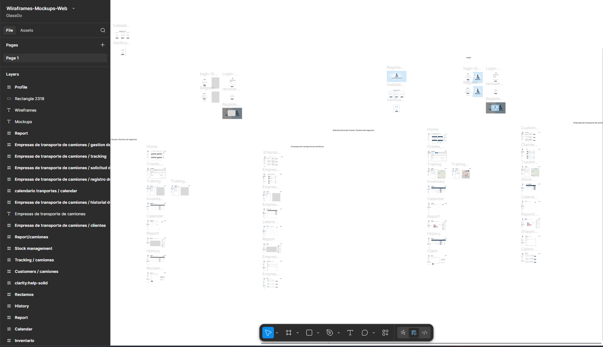
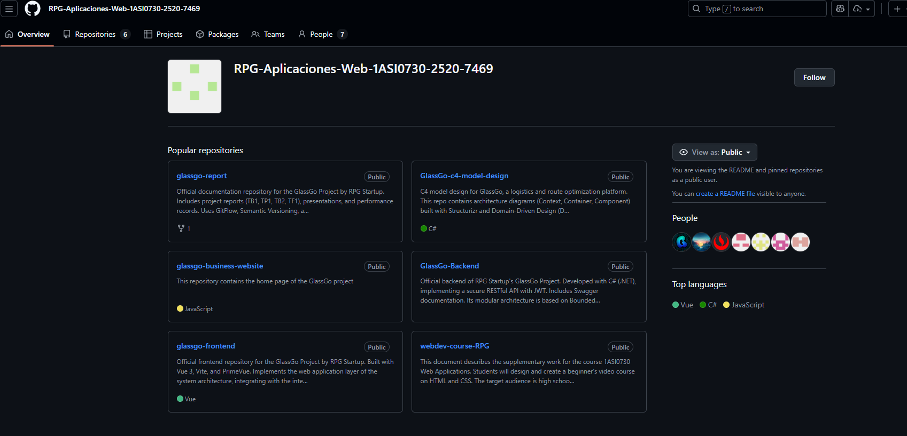

# Anexos

## Anexo A. Figma de diseños

- Link de Figma de diseño de la plataforma: https://tinyurl.com/3rwshbb9

## Anexo B. Trello

- Link de Trello del proyecto Sprint Backlog 1: https://tinyurl.com/yp5emm4j

- Link de Trello del proyecto Sprint Backlog 2: https://tinyurl.com/yvyuumnb

- Link de Trello del proyecto Sprint Backlog 3: https://tinyurl.com/a78xeesn

- Link de Trello del proyecto Sprint Backlog 4: https://tinyurl.com/2yshdx79

## Anexo C. Organización Github

- Link del repositorio Github del proyecto: https://github.com/RPG-Aplicaciones-Web-1ASI0730-2520-7469

