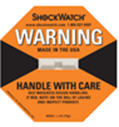
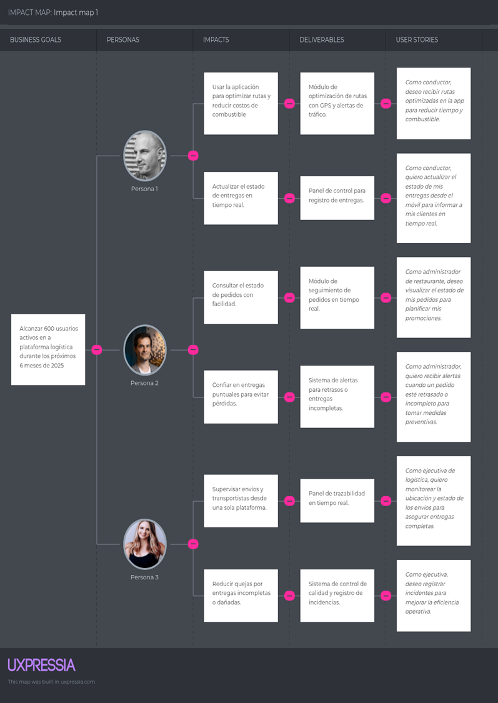

<div style="page-break-after: always;"></div>

# **Chapter I: Introduction**
## **1.1. Startup Profile**
### **1.1.1. Startup Description**

<p style="text-align: justify;">
  RPG was born with the purpose of transforming safety and efficiency in the transportation of liquors in glass containers, a sector where losses due to breakage, lack of traceability, and distribution delays directly affect company profitability.
</p>

<p style="text-align: justify;">
  Our main product, GlassGo, is a B2B platform that integrates real-time GPS tracking, route optimization algorithms, and smart sensors to ensure safe, transparent, and efficient transportation.
</p>

<p style="text-align: justify;">
  Through a Netflix-style membership model, GlassGo offers carriers, distributors, and business owners a scalable tool that facilitates shipment supervision, minimizes risks, and improves service quality throughout the distribution chain.
</p>

<p style="text-align: justify;">
  RPG's proposal differs from traditional fleet management software and existing impact sensors by combining three key elements: total delivery traceability, breakage prevention, and an accessible business model for companies of all sizes.
</p>
  
<p style="text-align: justify;">
  With GlassGo, we seek to reduce economic losses due to breakage, optimize delivery times, and provide transparency in the transportation of liquors in glass, contributing to a more competitive, efficient, and reliable industry.
</p>

- **Mission:** 
  
  <p style="text-align: justify;">
    Revolutionize the transportation of liquors in glass containers through GlassGo, a comprehensive platform that combines traceability, logistics optimization, and damage prevention. We want to support transportation and distribution companies to reduce losses, improve operational efficiency, and ensure safe deliveries through accessible and reliable technology.
  </p>

- **Vision** 
  
  <p style="text-align: justify;">
    We envision a future where all transportation of liquors in glass is supported by smart solutions like GlassGo, ensuring deliveries without breakage, with total transparency and efficiency. We aspire for RPG to become a leader in the digitalization and safety of glass transportation regionally, creating a new standard in the logistics industry.
  </p>

<div style="page-break-after: always;"></div>

### **1.1.2. Team Member Profiles**

<table style="width: 100%; border-collapse: collapse; text-align: center;">
  <tr>
    <td style="width: 180px;">
      
    </td>
    <td style="text-align: justify;">
      <strong>Ever Giusephi Carlos Lavado - u202224867</strong><br>
      My name is Giusephi Carlos. I am 20 years old and I am currently studying software engineering at the UPC. I am fascinated by how technology has evolved over the years and that is why I chose this career. In my free time, I enjoy playing video games and hope to improve my way of thinking before programming, as well as my programming skills.
    </td>
  </tr>
  <tr>
    <td>
      
    </td>
    <td style="text-align: justify;">
      <strong>Gerardo Valentin Palacin Lazon - u20211C201</strong><br>
      I am a Software Engineering student, with a marked inclination towards curiosity and constant learning. I am characterized by always looking for different ways to approach a problem, digging deeply to understand not only how things work, but also what type of professional I want to become. My approach focuses on comprehensive software development, exploring methodologies, good practices and technologies that allow building efficient, scalable and quality solutions. I especially enjoy the process of research and analysis, since it drives me to continually improve my knowledge and apply innovative approaches in the projects I develop.
    </td>
  </tr>
  <tr>
    <td>
      
    </td>
    <td style="text-align: justify;">
      <strong>Guillermo Arturo Howard Robles - u202222275</strong><br>
      I am a Software Engineering student, focused and committed to continuous learning. I am passionate about researching and analyzing problems to propose innovative solutions. I aim to develop comprehensive software, applying best practices and modern technologies that ensure efficiency, scalability, quality, and continuous improvement in every project.
    </td>
  </tr>
  <tr>
    <td>
      
    </td>
    <td style="text-align: justify;">
      <strong>Abraam Bernabe Acosta Elera - u202224867</strong><br>
      Software Engineering student with initiative for group work and an interest in technological and innovative projects, applying sound programming concepts to innovative ideas. My focus within the group is to develop a high-quality product and enhance my experience in teamwork, culminating in a strong final project and achieving the course competencies.
    </td>
  </tr>
  <tr>
    <td>
      
    </td>
    <td style="text-align: justify;">
      <strong>David Ignacio Vivar Cesar - u202414424</strong><br>
      Software engineering student interested in developing efficient solutions using cutting-edge technology. Always striving to improve and open to constructive criticism.
    </td>
  </tr>
  <tr>
    <td>
      
    </td>
    <td style="text-align: justify;">
      <strong>Mike Dylan Guillen Giraldo - u202211881</strong><br>
      I am a Software Engineering student with an interest in developing scalable applications and systems. I enjoy researching and learning new technologies to create innovative and impactful solutions. I am motivated by applying best programming practices, software architecture principles, and agile methodologies to build high-quality projects, always maintaining a focus on continuous improvement and professional growth.
    </td>
  </tr>
</table>

<div style="page-break-after: always;"></div>

## **1.2. Solution Profile**
### **1.2.1 Background and problems**

- **Who *(Who is affected?)***

  - Heavy cargo transport companies in Peru, facing high operating costs due to inefficient routes, vehicle wear, and accidents.
  - Liquor distributors, who must cover economic losses due to glass bottle breakage and partial theft of merchandise during transport.
  - Bar, liquor store, and restaurant owners, who receive incomplete or late orders, affecting inventory planning, promotions, and sales.

- **What *(What happens?)***
  
  <p style="text-align: justify;">
    The logistics chain for liquor transportation in Peru presents structural problems:
  </p>

  - Truck fleets with an average age of 17 years *(MTC, 2023)*, increasing the risk of failures and merchandise damage.
  - **Limited real-time cargo traceability:** only 50% of logistics companies use digital tracking systems *(Andina, 2023)*.
  - Losses due to bottle breakage reach up to 3% of transported cargo in the beverage sector *(Durán, UNI, 2020)*.

- **Where *(Where does it happen?)***

  <p style="text-align: justify;">
    The problem occurs in the Peruvian market for alcoholic beverage transportation and distribution, especially on high-consumption interprovincial and urban routes <em>(Lima, Arequipa, Trujillo, Cusco)</em>. The impact is greater on small and medium-sized transport and distribution companies, which lack resources to implement advanced technological solutions.
  </p>

- **When *(Since when and how often?)***

  <p style="text-align: justify;">
    This problem is persistent and structural. Although technological advances have improved efficiency in other sectors, digitalization in beverage logistics in Peru is slow. The problem occurs daily with each product delivery and intensifies during high-demand seasons <em>(national holidays, year-end, regional campaigns)</em>.
  </p

- **Why *(Why is it a problem?)***
  
  <p style="text-align: justify;">
    The lack of digitalization and logistical control generates serious consequences:
  </p>

  - **Economic:** losses due to breakage, replacements, theft, and delays losses due to breakage, replacements, theft, and delay.
  - **Operational:** inefficient routes, fleet wear, and lack of traceability.
  - **Commercial:** delivery failures affect trust between distributors and clients.
  - **Strategic:** without consolidated data, it is impossible to plan inventories and optimize costs.

- **How *(How does it manifest?)***

  - Orders arrive incomplete or late.
  - Merchandise damaged during transport *(broken bottles due to vibrations and poor stacking)*.
  - Difficulty monitoring cargo location and status in real time.
  - Informal coordination processes between carriers, distributors, and clients.
  - Limited ability to react to unforeseen events on the road.

- **How Much *(What is the quantitative impact?)***

  - Land transport in Peru moves more than 80% of national cargo *(MTC, 2024)*.
  - Fleet age averages over 17 years, increasing risk of failures *(MTC, 2023)*.
  - Glass container breakage represents up to 3% losses in beverage transport *(Durán, UNI, 2020)*.
  - Road interruptions cause losses of up to S/ 280 million daily in the transport sector *(RPP, 2024)*.
  - Digital models in logistics SMEs can reduce operating costs by up to 15% by optimizing routes and traceability *(Cabrera-Gala et al., 2021)*.

<div style="page-break-after: always;"></div>

### **1.2.2 Lean UX Process**
#### **1.2.2.1. Lean UX Problem Statements**

  <p style="text-align: justify;">
    Liquor transportation and distribution in Peru seeks to ensure safe and timely deliveries, but today this goal is not met. Operations depend on aging fleets and low digitalization, leading to bottle breakage, partial cargo and fuel theft, and delays. The market demands greater traceability and efficiency, highlighting the limitations of the current system.
  </p>

  <p style="text-align: justify;">
    Available solutions do not respond to this reality: they are costly, designed for large companies, and poorly adapted to logistics SMEs. They do not directly address the reduction of losses due to breakage nor facilitate coordination between carriers, distributors, and clients, who continue to face high costs and reduced service confidence.
  </p>

  <p style="text-align: justify;">
    The challenge, therefore, is not to create a predefined tool, but to propose ways to improve the safety and efficiency of distribution. We will know we are on the right track when we observe fewer losses, lower operating costs, and higher customer satisfaction thanks to complete and timely deliveries.
  </p>

#### **1.2.2.2. Lean UX Assumptions**

- **Business Assumptions:**

  <ul style="text-align:justify;">
    <li>
      We believe our clients <em>(carriers, distributors, and business owners)</em> need to reduce losses due to breakage, theft, and delays in the liquor distribution chain.
    </li>
    <li>
      These needs are solved with an accessible digital platform offering route optimization, real-time traceability, and centralized communication.
    </li>
    <li>
      Our first clients will be SMEs in beverage transportation and distribution in Lima and major cities in Peru.
    </li>
    <li>
      <strong>Expected value #1:</strong> security and real-time cargo traceability.
    </li>
    <li>
      <strong>Additional benefits:</strong> savings in operating costs <em>(fuel, maintenance)</em>, reduced breakage, confidence in complete and timely deliveries.
    </li>
    <li>
      <strong>Acquisition:</strong> sector referrals, partnerships with distributors, chambers of commerce, B2B digital marketing.
    </li>
    <li>
      <strong>Revenue:</strong> monthly SaaS subscription model <em>(scaled by fleet or shipment volume)</em>.
    </li>
    <li>
      <strong>Main competition:</strong> generic fleet management solutions <em>(Geotab, GPS Peru, TrackLink)</em>.
    </li>
    <li>
      <strong>Competitive advantage:</strong> affordable pricing for SMEs, specific focus on glass transportation and reduction of losses due to breakage.
    </li>
    <li>
      <strong>Main product risk:</strong> low adoption due to technological distrust in logistics SMEs.
    </li>
    <li>
      <strong>Mitigation:</strong> guided onboarding, local technical support, lightweight platform version showing quick wins.
    </li>
    <li>
      <strong>Other critical assumptions:</strong> stable mobile connectivity on interprovincial routes and willingness of companies to share fleet and cargo data.
    </li>
  </ul>

- **User Assumptions:**

  <ul style="text-align:justify;">
    <li>
      <strong> Who is the user?</strong> Truck drivers, liquor distributors, and bar/liquor store owners.
    </li>
    <li>
      <strong>Where does the product fit?</strong> In daily transport and order reception operations, via mobile app and web dashboard.
    </li>
    <li>
      <strong>Problem to solve:</strong> losses due to breakage <em>(3% of cargo)</em>, delivery delays, lack of cargo visibility.
    </li>
    <li>
      <strong>Typical use:</strong> assign route, monitor cargo status in real time, receive incident alerts, confirm deliveries.
    </li>
    <li>
      <strong>Important features:</strong> GPS traceability, impact sensors, automatic alerts, centralized chat, efficiency reports.
    </li>
    <li>
      <strong>Look & feel:</strong> clear and responsive UI; interactive maps, red/amber visual alerts, and simple dashboards with key KPIs.
    </li>
  </ul>

- **User Outcome & Benefit Assumptions:**

  - Fewer economic losses due to breakage and theft.
  - Optimized routes → less fleet wear and fuel consumption.
  - Business owners receive complete and timely deliveries.
  - Greater trust and transparency in the logistics chain.
  - Data-driven decision-making *(e.g., delivery times, route incidents)*.

- **Business Outcome Assumptions *(target metrics)*:**

  - Reduce losses due to breakage by 50% in the first year.
  - Reduce operating costs by 15% in 12 months.
  - Increase on-time delivery compliance by +25%.
  - Reach 200 logistics SMEs and distributors subscribed in 12 months.
  - 70% of active users use the system daily for monitoring and coordination.

- **Feature Assumptions:**

  - GPS and sensor traceability reduces losses and theft.
  - Route optimization lowers operating costs and delivery times.
  - Centralized communication reduces errors and improves coordination.
  - Reports and alerts enable data-driven decisions and increase customer trust.

#### **1.2.2.3. Lean UX Hypothesis Statements**

- **Route Optimization:**
  <p style="text-align:justify;">
    We believe that by offering a real-time route optimization module, we will reduce transport operating costs.
  </p>
  
  <p style="text-align:justify;">
    We will know we are successful when we see the following market feedback: fleet managers report lower fuel and maintenance expenses, and/or dashboards show sustained 15% savings in monthly logistics costs.
  </p>

- **Real-Time Traceability with Alerts:**

  <p style="text-align:justify;">
    We believe that by implementing cargo traceability with immediate alerts, we will reduce losses due to breakage or partial theft.
  </p>

  <p style="text-align:justify;">
    We will know we are successful when we see the following market feedback: carriers and distributors say “now we know exactly where the cargo is and if something fails” and/or incident records show a 50% decrease in breakage and theft.
  </p>

- **Centralized Communication:**

  <p style="text-align:justify;">
    We believe that by enabling a digital communication channel between carriers, distributors, and clients, we will reduce coordination errors and delivery delays.
  </p>

  <p style="text-align:justify;">
    We will know we are successful when we see the following market feedback: clients comment that “deliveries arrive more complete and on time” and/or on-time delivery metrics increase by 30% over baseline.
  </p>

- **Customer Control Panel:**

  <p style="text-align:justify;">
    We believe that by offering a real-time order and delivery control panel, business owners *(bars, liquor stores, restaurants)* will increase their satisfaction and trust.
  </p>

  <p style="text-align:justify;">
    We will know we are successful when we see the following market feedback: clients express that “now we can better plan inventories and promotions” and/or satisfaction surveys *(NPS)* increase by 40% compared to the initial state.
  </p>

#### **1.2.2.4. Lean UX Canvas**

<table style="width:100%; border-collapse:collapse; margin:auto;">
  <thead>
    <tr>
      <th style="width:40%; text-align:center;">Business Problem</th>
      <th style="width:30%; text-align:center;">Solutions</th>
      <th style="width:30%; text-align:center;">Business Outcomes</th>
    </tr>
  </thead>
  <tbody>
    <tr>
      <td style="text-align:justify; padding:10px; vertical-align: top;">
       The current state of liquor transportation and distribution in Peru is characterized by aging fleets and poorly digitized processes, resulting in losses due to breakage, cargo and fuel theft, delivery delays, and high operating costs. Existing products or services do not address the reality of logistics SMEs: they are costly, complex, and not focused on reducing losses or facilitating coordination between carriers, distributors, and clients. Our product aims to close this gap through an accessible digital platform that optimizes routes, reduces costs, provides real-time traceability, alerts incidents, and centralizes communication in the logistics chain. Our initial focus will be to meet the needs of transport business owners and their stakeholders. We will know we have succeeded when we reduce losses due to breakage, operating costs, and increase customer satisfaction through complete and timely deliveries.
      </td>
      <td style="text-align:justify; padding:10px; vertical-align: top;">
        <ul>
          <li>Route optimization with predictive analysis: algorithms that reduce travel times and fuel costs.</li>
          <li>Real-time traceability system: location monitoring, incident alerts, and cargo tracking.</li>
          <li>Centralized communication: single channel between carriers, distributors, and clients.</li>
          <li>Customer dashboards: visibility of orders, delivery status, and compliance metrics.</li>
        </ul>
      </td>
      <td style="text-align:justify; padding:10px; vertical-align: top;">
        <ul>
          <li>50% reduction in losses due to breakage and partial theft.</li>
          <li>15% reduction in transport operating costs.</li>
          <li>30% increase in complete and timely deliveries.</li>
          <li>Reach 300–500 active users in 6 months.</li>
          <li>Improve trust in the distribution chain <em>(NPS > 40%)</em>.</li>
        </ul>
      </td>
    </tr>
  </tbody>
</table>

<div style="page-break-after: always;"></div>

<table style="width:100%; border-collapse:collapse; margin:auto;">
  <thead>
    <tr>
      <th style="width:40%; text-align:center;">Users</th>
      <th style="width:60%; text-align:center;">User Outcomes &amp; Benefits</th>
    </tr>
  </thead>
  <tbody>
    <tr>
      <td style="text-align:justify; padding:10px; vertical-align: top;">
        <ul>
          <li>
            <strong>Truck transport companies:</strong> “Our goal is to optimize routes and reduce vehicle wear.”
          </li>
          <li>
            <strong>Liquor distributors:</strong> “Our goal is for merchandise to arrive complete and on time to avoid replacements.”
          </li>
          <li>
            <strong>Business owners <em>(bars, liquor stores, restaurants)</em>:</strong> 
            “Our goal is to require complete, timely, and traceable orders to plan inventories, promotions, and sales.”
          </li>
        </ul>
      </td>
      <td style="text-align:justify; padding:10px; vertical-align: top;">
        <ul>
          <li>
            <strong>Truck drivers:</strong> Optimize routes, reduce wear and costs, maintain timely deliveries, safety and control in fleet management.  
            Benefits: real-time traceability, recommended routes, proactive alerts.  
            Success: lower cost per km, less wear, more punctual deliveries.
          </li>
          <li>
            <strong>Liquor distributors:</strong> Complete and timely deliveries with total traceability.  
            Benefits: confidence in batch location, reduced replacements, shipment tracking, incident alerts, centralized communication.  
            Results: fewer losses due to damage, fewer returns, more complete deliveries.
          </li>
          <li>
            <strong>Business owners:</strong> Complete and timely orders with traceability for inventories and promotions.  
            Benefits: peace of mind, greater visibility of the supply chain, delivery dashboards, delay notifications, planning reports.  
            Outcomes: more accurate inventories, better planned promotions, fewer breakages.
          </li>
        </ul>
      </td>
    </tr>
  </tbody>
</table>

<div style="page-break-after: always;"></div>

<table style="width:100%; border-collapse:collapse; margin:auto;">
  <thead>
    <tr>
      <th style="width:35%; text-align:center;">Hypotheses</th>
      <th style="width:35%; text-align:center;">Key Learning Questions</th>
      <th style="width:30%; text-align:center;">Minimum Work to Learn</th>
    </tr>
  </thead>
  <tbody>
    <tr>
      <td style="text-align:justify; padding:10px; vertical-align: top;">
        <ul>
          <li>We believe we will reduce transport operating costs by 15% if truck drivers get more efficient routes and less vehicle wear with a predictive route optimization system.</li>
          <li>We believe we will decrease losses due to breakage and partial theft by 50% if liquor distributors get total batch traceability and real-time incident alerts with a digital cargo monitoring and tracking system.</li>
          <li>We believe we will increase complete and timely deliveries by 30% if bar, liquor store, and restaurant owners get order visibility, delay notifications, and compliance reports with control panels and delivery dashboards.</li>
          <li>We believe we will reach 300–500 active users in the first 6 months if carriers, distributors, and business owners get an accessible, mobile-first platform with guided onboarding.</li>
          <li>We believe we will improve trust in the distribution chain <em>(NPS &gt; 40%)</em> if all actors get transparency in information, order traceability, and a unified communication channel.</li>
        </ul>
      </td>
      <td style="text-align:justify; padding:10px; vertical-align: top;">
        <ul>
          <li>Do carriers perceive fuel cost, time, and wear as important enough problems to try a route optimization system?</li>
          <li>Do distributors consider total traceability critical and would actually use an alert system to reduce losses due to breakage or theft?</li>
          <li>Do business owners need order visibility and would benefit from receiving delay notifications and real-time reports?</li>
          <li>Does app adoption depend on being easy to use, mobile-first, and with a quick registration process?</li>
          <li>Is lack of communication and transparency the main cause of distrust between carriers, distributors, and business owners?</li>
        </ul>
      </td>
      <td style="text-align:justify; padding:10px; vertical-align: top;">
        <ul>
          <li>Interviews and surveys with carriers, distributors, and business owners to validate needs and willingness to use the platform.</li>
          <li>Functional prototype <em>(MVP)</em> of traceability with basic cargo alerts en route.</li>
          <li>Pilot test with 1–2 transport companies and a group of liquor distributors to measure reduction in losses and delivery times.</li>
          <li>Create a functional platform prototype and conduct usability tests with real users <em>(business owners, distributors, or carriers)</em>.</li>
        </ul>
      </td>
    </tr>
  </tbody>
</table>

<div style="page-break-after: always;"></div>

## **1.3. Target Segments**

- **Segment 1: Truck Transport Companies**

  - Seek to optimize routes and reduce losses. Need tools that provide real-time traceability and less wear in logistics.
  
- **Segment 2: Liquor Distributors**

  - Their main need is for merchandise to arrive without losses and on schedule. They incur additional costs when replacing damaged products.

- **Segment 3: Business Owners *(Bars, Liquor Stores, Restaurants)***

  - Require complete and timely orders. Transparency in traceability allows them to plan inventories, promotions, and sales without relying on unreliable processes.

<div style="page-break-after: always;"></div>

# **Chapter II: Requiremnts Elicitation & Analysis**
## **2.1. Competitors**

- **Verizon Connect *(direct competitor)*:**

  <p style="text-align: justify;">
    This is a cloud-based fleet management platform that offers GPS tracking, route optimization, predictive maintenance, and vehicle security solutions. It is aimed at companies with medium and large fleets looking to improve logistics efficiency and reduce operating costs. It has a strong presence in the United States, Canada, and Europe, where it serves sectors such as transportation, construction, and distribution.
  </p>

- **Frotcom *(direct competitor)*:**

  <p style="text-align: justify;">
    This is a fleet management software designed for real-time vehicle monitoring and control. It offers features such as geolocation, fuel consumption analysis, driver monitoring, and route planning. It focuses on medium and large companies that need to improve the traceability and efficiency of their transportation operations. It has an international presence, with strong adoption in Europe, Africa, and Latin America.
  </p>

- **Schockwatch *(direct competitor)*:**

  <p style="text-align: justify;">
    This company specializes in shock- and vibration-sensitive devices and labels, designed to detect impacts and mishandling during transportation. Its products are used in sectors where the physical integrity of goods is critical, such as pharmaceuticals, electronics, and beverages. It has a global presence, with an extensive distributor network in the Americas, Europe, and Asia.
  </p>

<div style="page-break-after: always;"></div>

### **2.1.1. Competitive analysis**

<table style="width:100%; border-collapse: collapse;">
  <!-- TÍTULO GENERAL -->
  <tr>
    <th colspan="6" style="padding: 12px; text-align: center; border-bottom: 1px solid;">
      <strong>Competitive Analysis Landscape</strong>
    </th>
  </tr>
  <!-- WHY CONDUCT THIS ANALYSIS -->
  <tr>
    <th style="width:18%; padding: 12px; text-align: center; border-bottom: 1px solid;">
      <strong>Why conduct this analysis?</strong>
    </th>
    <!-- TEXTO EXPLICATIVO OCUPA 5 COLUMNAS -->
    <td colspan="5" style="padding: 12px; text-align: justify; border-bottom: 1px solid;">
      Compare seismic mapping technology proposals to identify competitive advantages 
      in accessibility, education, and citizen personalization.
    </td>
  </tr>
  <!-- ENCABEZADOS DE COMPETIDORES -->
  <tr>
    <th colspan="2"></th>
    <th style="padding: 10px; text-align: center; border-bottom: 1px solid;">GlassGo</th>
    <th style="padding: 10px; text-align: center; border-bottom: 1px solid;">Verizon</th>
    <th style="padding: 10px; text-align: center; border-bottom: 1px solid;">Frotcom</th>
    <th style="padding: 10px; text-align: center; border-bottom: 1px solid;">Schockwatch</th>
  </tr>
  <!-- LOGOS -->
  <tr>
    <td colspan="2"></td>
    <td style="padding: 12px; text-align:center; border-bottom: 1px solid;">
      
    </td>
    <td style="padding: 12px; text-align:center; border-bottom: 1px solid;">
      
    </td>
    <td style="padding: 12px; text-align:center; border-bottom: 1px solid;">
      
    </td>
    <td style="padding: 12px; text-align:center; border-bottom: 1px solid;">
      
    </td>
  </tr>
  <!-- ===== PROFILE ===== -->
  <tr>
    <th rowspan="2" style="padding: 12px; text-align:center; vertical-align: center; border-bottom: 1px solid;">
      <strong>Profile</strong>
    </th>
    <th style="padding: 10px; text-align:center; border-bottom: 1px solid;"><strong>Overview</strong></th>
    <td style="padding: 10px; text-align: justify;">
      Comprehensive platform that seeks to improve safety and efficiency in the transportation of spirits in glass containers. It integrates real-time tracking, route optimization, and smart sensors, under an accessible membership model.
    </td>
    <td style="padding: 10px; text-align: justify;">
      Global fleet management software. Offers GPS tracking, driver behavior reports, route optimization, and preventive maintenance compliance for all types of vehicles.
    </td>
    <td style="padding: 10px; text-align: justify;">
      European fleet management system. Allows monitoring of location, fuel consumption, driver performance, and route planning for transportation companies.
    </td>
    <td style="padding: 10px; text-align: justify;">
      Specialist in impact and temperature sensors. Its labels and devices record vibrations and shocks during the transport of fragile goods, reducing losses due to damage.
    </td>
  </tr>
  <tr>
    <th style="padding: 10px; text-align:center; border-bottom: 1px solid;">
      <strong>Competitive Advantage: What value does it offer customers?</strong>
    </th>
    <td style="padding: 10px; text-align: justify;">
      Complete shipment traceability, breakage prevention through sensors, logistics optimization, and an affordable subscription model for companies of any size.
    </td>
    <td style="padding: 10px; text-align: justify;">
      Global coverage and advanced tools for large-scale fleets.
    </td>
    <td style="padding: 10px; text-align: justify;">
      Simplicity in monitoring and costs adapted to medium-sized transport companies.
    </td>
    <td style="padding: 10px; text-align: justify;">
      Specific protection for fragile goods using impact devices.
    </td>
  </tr>
  <!-- ===== MARKETING PROFILE ===== -->
  <tr>
    <th rowspan="2" style="padding: 12px; text-align:center; vertical-align: center; border-bottom: 1px solid;">
      <strong>Marketing Profile</strong>
    </th>
    <th style="padding: 10px; text-align:center; border-bottom: 1px solid;"><strong>Target Market</strong></th>
    <td style="padding: 10px; text-align: justify;">
      Transporters, distributors, and liquor business owners requiring safety and efficiency for glass containers.
    </td>
    <td style="padding: 10px; text-align: justify;">
      Large corporations with diverse fleets and need for total control.
    </td>
    <td style="padding: 10px; text-align: justify;">
      Growing transportation and logistics SMEs.
    </td>
    <td style="padding: 10px; text-align: justify;">
      Companies transporting delicate products <em>(electronics, glass, premium foods)</em>.
    </td>
  </tr>
  <tr>
    <th style="padding: 10px; text-align:center; border-bottom: 1px solid;">
      <strong>Marketing Strategies</strong>
    </th>
    <td style="padding: 10px; text-align: justify;"> Digital strategy, alliances with distributors, and demonstrations at beverage and logistics trade shows.
    </td>
    <td style="padding: 10px; text-align: justify;">
      Global campaigns, webinars, and B2B consultative sales.
    </td>
    <td style="padding: 10px; text-align: justify;">
      Local distributors, personalized demonstrations, and after-sales support.
    </td>
    <td style="padding: 10px; text-align: justify;">
      Specialized catalogs, industrial distributors, and presence at packaging events.
    </td>
  </tr>
  <!-- ===== PRODUCT PROFILE ===== -->
  <tr>
    <th rowspan="3" style="padding: 12px; text-align:center; vertical-align: center; border-bottom: 1px solid;">
      <strong>Product Profile</strong>
    </th>
    <th style="padding: 10px; text-align:center; border-bottom: 1px solid;"><strong>Products & Services</strong></th>
    <td style="padding: 10px; text-align: justify;">
      SaaS platform with dashboard, smart impact sensors, real-time alerts, and analytical reports.
    </td>
    <td style="padding: 10px; text-align: justify;">
      Fleet management software, advanced telemetry, and performance reporting.
    </td>
    <td style="padding: 10px; text-align: justify;">
      GPS tracking, fuel consumption, and route planning modules.
    </td>
    <td style="padding: 10px; text-align: justify;">
      Visual indicators and electronic sensors to detect shocks and vibrations.
    </td>
  </tr>
  <tr>
    <th style="padding: 10px; text-align:center; border-bottom: 1px solid;"><strong>Pricing & Costs</strong></th>
    <td style="padding: 10px; text-align: justify;">
      Monthly membership scalable based on vehicles and sensors.
    </td>
    <td style="padding: 10px; text-align: justify;">
      Licenses per vehicle + installation.
    </td>
    <td style="padding: 10px; text-align: justify;">
      Fee per device + monthly service.
    </td>
    <td style="padding: 10px; text-align: justify;">
      Direct sales of devices and kits.
    </td>
  </tr>
  <tr>
    <th style="padding: 10px; text-align:center; border-bottom: 1px solid;">
      <strong>Distribution Channels <em>(Web and/or Mobile)</em></strong>
    </th>
    <td style="padding: 10px; text-align: justify;">
      Web platform and mobile app.
    </td>
    <td style="padding: 10px; text-align: justify;">
      Integrated website and mobile apps.
    </td>
    <td style="padding: 10px; text-align: justify;">
      Website and lightweight mobile app.
    </td>
    <td style="padding: 10px; text-align: justify;">
      Corporate website and physical distributors.
    </td>
  </tr>
  <!-- ===== SWOT ===== -->
  <tr>
    <th rowspan="4" style="padding: 12px; text-align:center; vertical-align: center;">
      <strong>SWOT Analysis</strong>
    </th>
    <th style="padding: 10px; text-align:center; border-bottom: 1px solid;"><strong>Strengths</strong></th>
    <td style="padding: 10px; text-align: justify;">
      Specialized solution for glass spirits integrating traceability, breakage prevention, and optimization.
    </td>
    <td style="padding: 10px; text-align: justify;">
      Global experience and robust telemetry.
    </td>
    <td style="padding: 10px; text-align: justify;">
      Ease of use and close support.
    </td>
    <td style="padding: 10px; text-align: justify;">
      Accurate impact control.
    </td>
  </tr>
  <tr>
    <th style="padding: 10px; text-align:center; border-bottom: 1px solid;"><strong>Opportunities</strong></th>
    <td style="padding: 10px; text-align: justify;">
      Partnerships with wineries and distributors; insurance integrations; regional expansion.
    </td>
    <td style="padding: 10px; text-align: justify;">
      Adapt plans for specific sectors <em>(beverages)</em>.
    </td>
    <td style="padding: 10px; text-align: justify;">
      Expand services for delicate transportation.
    </td>
    <td style="padding: 10px; text-align: justify;">
      Develop sensors connected to logistics platforms.
    </td>
  </tr>
  <tr>
    <th style="padding: 10px; text-align:center; border-bottom: 1px solid;"><strong>Weaknesses</strong></th>
    <td style="padding: 10px; text-align: justify;">
      Need to educate the market about its innovative proposal.
    </td>
    <td style="padding: 10px; text-align: justify;">
      High costs for SMEs.
    </td>
    <td style="padding: 10px; text-align: justify;">
      Limited functionality for fragile goods.
    </td>
    <td style="padding: 10px; text-align: justify;">
      Lack of comprehensive traceability and optimization features.
    </td>
  </tr>
  <tr>
    <th style="padding: 10px; text-align:center;"><strong>Threats</strong></th>
    <td style="padding: 10px; text-align: justify;">
      Entry of major fleet management competitors into fragile goods niche.
    </td>
    <td style="padding: 10px; text-align: justify;">
      Competition from more affordable solutions.
    </td>
    <td style="padding: 10px; text-align: justify;">
      Rise of free tracking tools.
    </td>
    <td style="padding: 10px; text-align: justify;">
      Low-cost copies without technical support.
    </td>
  </tr>
</table>

<div style="page-break-after: always;"></div>

### **2.1.2. Estrategias y tácticas frente a competidores**

- **GlassGo Strategic Approach:**

  <p style="text-align: justify;">
    GlassGo is positioned as the comprehensive solution for the transportation of spirits in glass containers, combining GPS tracking, route optimization, and smart sensors to minimize losses due to breakage and ensure transparency in the logistics chain. Unlike generic fleet management software or isolated impact monitoring devices, GlassGo specializes in a highly sensitive and profitable sector, with a flexible and accessible membership model for companies of any size.
  </p>

- **Versus Verizon Connect:**

  - **Accessible Niche Strategy:**

    <p style="text-align: justify;">
      Targeting SMEs in the beverage and distribution sector with limited budgets, offering a more economical and specialized alternative to Verizon Connect's high-cost solutions.
    </p>

  - **Flexible Model Tactic:**

    <p style="text-align: justify;">
      Implementation of a Netflix-like subscription plan, allowing access to advanced tools without large initial investments.
    </p>

  - **Optimizing Technology Adoption:**

    <p style="text-align: justify;">
      Easy-to-integrate platform without the need for specialized technical personnel, reducing implementation times.
    </p>

  - **Personalized Support:**

    <p style="text-align: justify;">
      Local support with direct attention to carriers and distributors, strengthening customer proximity and loyalty.
    </p>

- **Versus Frotcom:**

  - **Functional Specialization Strategy:**

    <p style="text-align: justify;">
      Exclusive focus on fragile goods, offering greater depth in traceability and breakage prevention compared to Frotcom's general offering.
    </p>

  - **Advanced Integration Tactic:**

    <p style="text-align: justify;">
      Combination of GPS tracking, impact sensors, and predictive analytics in a single digital environment.
    </p>

  - **Operational Simplicity:**

    <p style="text-align: justify;">
      Intuitive interface designed for transportation personnel, avoiding complex processes and improving operational efficiency.
    </p>

  - **Sector-specific Added Value:**

    <p style="text-align: justify;">
      Implementation of specific functionalities for the transportation of glass and premium beverages, improving service quality and reducing losses.
    </p>

- **Versus Schockwatch:**
  - **Intelligent Traceability Strategy:**

    <p style="text-align: justify;">
      Evolving beyond passive impact monitoring through a system that records, analyzes, and optimizes every stage of transportation.
    </p>

  - **Total connectivity tactic:**

    <p style="text-align: justify;">
      Integration of impact sensors with the GlassGo platform, generating real-time alerts and alternative routes in the event of incidents.
    </p>

  - **Logistics optimization:**

    <p style="text-align: justify;">
      Application of safe route algorithms to minimize sudden movements and prevent breakages during transit.
    </p>

  - **Comprehensive proposal:**

    <p style="text-align: justify;">
      Unify physical monitoring, digital traceability, and logistics performance management into a single solution, surpassing Schockwatch's fragmented offering.
    </p>

<div style="page-break-after: always;"></div>

##  **2.2. Entrevistas**
### **2.2.1. Diseño de entrevistas**

- **Segment 1: Trucking Companies**

  - **Discovery Questions:**

    - What is your full name and age?
    - What is your position in the company and your current length of service?
    - Could you briefly tell me about your trucking business? *(Location, primary merchandise transported, current company fleet)*
    - Who are your main customers *(distributors, bars, liquor stores, supermarkets)*?
    - What times of year does demand for transportation increase?
    - What electronic devices do you use to coordinate routes and deliveries? *(Smartphone, tablet, computer)*
    - What brands or platforms do you currently use for fleet tracking?

  - **Main Questions:**

    - How do you evaluate logistics wear and tear *(fuel consumption, maintenance, man-hours)* with the current system?
    - Do you have any direct connections with suppliers? *(Communication)*
    - How do you currently plan delivery routes to optimize time and costs?
    - How frequent are loss or damage issues during transportation?
    - What additional costs do these losses or delays generate for the company?
    - Do you use any real-time tracking tools? If so, what advantages and limitations have you encountered?
    - What type of information would you like to receive in real time about each trip *(vehicle status, cargo status, exact position*)?
    - If there were a solution to improve logistics efficiency, what features would be essential for adopting it?

- **Segment 2: Liquor Suppliers**

  - **Discovery Questions:**

    - What is your full name and age?
    - What is your title or role within the business?
    - Could you briefly tell me about the liquor distribution business? *(type, location, size, years in operation, periods of peak demand)*
    - What type of customers do you serve most frequently? *(bars, liquor stores, restaurants, supermarkets)*
    - How many liquor deliveries do you make on average per month?
    - What electronic devices do you use to manage orders, routes, and deliveries? *(smartphone, tablet, laptop, PC)*
    - What brands, apps, or platforms do you currently use for logistics tracking?

  - **Main Questions:**

    - Who usually coordinates directly with carriers: the logistics department, the warehouse, the owner?
    - Do you have any direct connection with the business owners? *(communication)*
    - When there are setbacks or delays, do they find out? Do they have a way to obtain the necessary information about their cargo?
    - What logistics indicators or reports would you like to see to improve control? *(times, impacts, cargo status)*
    - What additional costs do losses or delays in deliveries generate?
    - What consequences do delays have on your customer satisfaction or your logistics operations?
    - Have you ever used a technology management platform to ensure the traceability of your orders?
    - What would make you change or include a new service/technology in your logistics chain?
    - If there were a tool to reduce losses and guarantee accurate timing, what features would you consider essential?

- **Segment 3: Business Owners**

  - **Discovery Questions:**

    - What is your full name and age?
    - What is your position or role within the business?
    - Could you briefly tell me about your business *(type, location, size, years in operation, periods of peak demand)*
    - What devices do you use most to manage orders and inventory *(PC, tablet, smartphone)*?
    - What digital channels do you prefer to communicate with suppliers *(phone calls, WhatsApp, email, specialized apps)*?

  - **Main Questions**

    - When ordering your product, how easy or difficult is it for you to coordinate with suppliers?
    - What are the key criteria when choosing a supplier?
    - Do you prefer to order in advance or as the need arises?
    - How much do you use digital tools for inventory and sales planning?
    - What information do you consider essential to receive when placing an order *(confirmation, estimated time, stock availability, traceability)*?
    - What are the most common problems you face with orders *(delays, stock shortages, price changes, communication issues)*?
    - How would you like to receive updates on the status of your orders *(automatic notifications, real-time tracking, direct contact)*?
    - Would you be willing to invest in a service that offers complete transparency and delivery reliability? What else should it offer to encourage them to adopt it?

<div style="page-break-after: always;"></div>

### **2.2.2. Interview Records**

- **Segment 1: Truck Transport Companies**

  - **Interview Information #1:**

    - **Names:** Luis Abad  
    - **Surnames:** Palacin Lope  
    - **Age:** 50 years  
    - **District:** Santa Anita  
    - **Screenshot:**

      <p align="center">
        
      </p>

    - **URL:**  

      > [Segment 1 - Interview 1](https://upcedupe-my.sharepoint.com/:f:/g/personal/u20211c201_upc_edu_pe/Es8K6_X_xsJHrlv-dxhmHkABEHjeQZwvaX-u0im39rLfLQ?e=p8hklN)

    - **Timing *(Start - End)*:** 00:00 - 10:48
    - **Descriptive Summary:**

      <p style="text-align: justify;">
        Luis Abad Palacin López, operations manager at HPL Transport SAC, is a professional with more than 20 years of experience in road freight transport. At 50 years old, he is characterized by a meticulous, analytical personality oriented towards operational efficiency, reflected in his process management and fleet supervision. His leadership combines discipline and logistical control with a preventive approach to road safety and technical maintenance. The company has a fleet of trucks mainly transporting containers and finished products from Cervecería Backus, operating in Lima, provinces, and the Peruvian jungle. The help of logistics partners is crucial to continue expanding their national reach, making communication and planning between the logistics center and transport drivers highly important, especially during peak demand seasons such as national holidays, Christmas, and New Year.
      </p>

      <p style="text-align: justify;">
        The technologies used by Luis include the Frotcom platform for fleet tracking and control, smartphones, and personal computers with the popular Windows operating system. Essential tools for real-time visualization of units, establishing geofences, defining authorized stops, and notifying about unauthorized deviations.  
      </p>

      <p style="text-align: justify;">
        Additionally, the mentioned system can obtain metrics such as fuel consumption and tire wear. An attractive feature for the user to consider the complete context of each unit. Although the Frotcom platform meets most of his expectations, he mentions as a pending need driver fatigue sensors and drowsiness alerts. This way, he would feel greater security during long journeys. In summary, the user has high confidence in digital tools but also a critical view towards innovation through tangible improvements.
      </p>

  - **Interview Information #2:**

    - **Names:** Jordan Paolo  
    - **Surnames:** Palacin Raraz  
    - **Age:** 31 years  
    - **District:** Santa Anita
    - **Screenshot:**

      <p align="center">
        
      </p>

    - **URL:**  

      > [Segment 1 - Interview 2](https://upcedupe-my.sharepoint.com/:f:/g/personal/u20211c201_upc_edu_pe/Es8K6_X_xsJHrlv-dxhmHkABEHjeQZwvaX-u0im39rLfLQ?e=p8hklN)

    - **Timing *(Start - End)*:** 10:51 - 40:18  
    - **Descriptive Summary:**

      <p style="text-align: justify;">
        Jordan Paolo Palacín Raraz, 31, works as a primary distribution analyst at Arca Continental Logística, where he has worked for more than two years and has five and a half years of experience in distribution. His profile reflects an analytical, responsible, and methodical personality, with a strong focus on operational efficiency and logistics planning. He demonstrates clear, technical communication centered on problem-solving, evidencing his deep knowledge of national transport and supply processes. In his role, he coordinates product distribution nationwide, ensuring deliveries arrive on time and in the requested quantities. The main clients he serves are the company's own warehouses and wholesalers, with peak periods in summer and year-end months.  
      </p>

      <p style="text-align: justify;">
        Regarding his technological environment, he uses an Android mobile phone <em>(Samsung)</em> and a Toshiba T40 laptop, tools that allow him to maintain continuous connection with carriers and suppliers. Within the company, they use the Geotab platform, a GPS system that centralizes fleet monitoring nationwide, allowing visualization of unit transit, report generation, and tracking of critical products. However, he recognizes that the system has limitations in rugged areas of the country, where the signal is interrupted.  
      </p>

      <p style="text-align: justify;">
        The company works with contracted carriers and third parties, who manage their own maintenance and wear costs. His role involves ensuring efficient route planning, prioritizing critical products, and always seeking to balance transport costs with maximum load capacity utilization <em>(filling as many pallets as possible per unit)</em>. He explains that the freight agreed with contracted carriers is more competitive, while third-party freight is usually higher, so they must optimize route assignment according to convenience and efficiency.  
      </p>

      <p style="text-align: justify;">
        Regarding operational problems, he mentions that product losses and shrinkage are frequent, mainly due to stacking type and poor road conditions. These failures impact unit returnability and therefore require routine weekly reports. The user values emerging technologies such as onboard cameras to detect driver fatigue and monitor incidents, as well as fuel sensors to identify theft by analyzing real-time consumption. He considers these tools a necessary evolution, although he recognizes that their high cost limits adoption by third-party carriers.  
      </p>

      <p style="text-align: justify;">
        Finally, he mentions that the company is in the process of migrating to the SAP S/4HANA system and soon to TMS <em>(Transport Management System)</em>, aiming to automate route planning, cubing, and costs, reducing the time of analytical processes.
      </p>

  - **Interview Information #3:**

    - **Names:** Percy Adrián  
    - **Surnames:** Rojas León  
    - **Age:** 37 years  
    - **District:** Lima
    - **Screenshot:**

      <p align="center">
        
      </p>

    - **URL:**  

      > [Segment 1 - Interview 3](https://upcedupe-my.sharepoint.com/:f:/g/personal/u20211c201_upc_edu_pe/Es8K6_X_xsJHrlv-dxhmHkABEHjeQZwvaX-u0im39rLfLQ?e=p8hklN)

    - **Timing *(Start - End)*:** 40:19 - 46:25  
    - **Descriptive Summary:**

      <p style="text-align: justify;">
        Percy Adrián Rojas León, 37, is the director of a freight transport company with several years of experience in the field. His personality reflects organization, responsibility, and results orientation, especially in meeting delivery times and caring for transported goods. He manages a medium-sized truck fleet, mainly dedicated to transporting and distributing consumer products and beverages to bars, liquor stores, and supermarkets, evidencing his involvement in a commercial segment with high demand for punctuality and product preservation.
      </p>

      <p style="text-align: justify;">
        His team is small but efficient, focused on logistics coordination and delivery integrity. Regarding technology use, the main tool is the smartphone, used by both drivers and logistics staff for daily communication and coordination. They also use computers for general management and spreadsheets for semi-manual route planning, combining traditional procedures with basic digital resources.
      </p>

      <p style="text-align: justify;">
        The user employs standard GPS systems for location tracking and delivery progress monitoring. However, he recognizes limitations in automation and data accuracy. He identifies as valuable the possibility of accessing real-time alerts about location, cargo temperature, impacts, or sudden movements, showing interest in improving traceability and control of transport conditions, especially when handling fragile bottles and liquids. These shortcomings can represent additional costs.
      </p>

      <p style="text-align: justify;">
        Finally, the user expresses that an ideal solution for his company should be characterized by ease of use, especially from mobile applications, so that both he and his team can integrate it without needing complex technical knowledge. This reflects a preference for intuitive, accessible technologies compatible with mobile devices, consolidating a pragmatic and functional user profile seeking logistics efficiency without sacrificing operational simplicity.
      </p>

- **Segment 2: Liquor Distributors**

  - **Interview Information #1:**

    - **Names:** Omar
    - **Surnames:**
    - **Age:** 48 years  
    - **District:** Arequipa
    - **Screenshot:**  

      <p align="center">
        
      </p>

    - **URL:**

      > [Segment 2 - Interview 1](https://upcedupe-my.sharepoint.com/:f:/g/personal/u20211c201_upc_edu_pe/Es8K6_X_xsJHrlv-dxhmHkABEHjeQZwvaX-u0im39rLfLQ?e=p8hklN)

    - **Timing *(Start - End)*:** 57:30 - 01:04:35
    - **Descriptive Summary:**

      <p style="text-align: justify;">
        Omar is the general manager of a liquor distributor located in Arequipa, with 18 years of experience in the sector. At 48, he presents himself as an organized, strategic professional with strong negotiation skills, allowing him to effectively lead his team and truck fleet. His role combines executive management with direct involvement in commercial agreements, investment decisions, and supplier management, while delegating daily logistics coordination to a specialized supervisor.
      </p>

      <p style="text-align: justify;">
        The company's operations focus mainly on serving hotels, restaurant chains, medium and large liquor stores, and supermarkets. Peak demand periods occur during July campaigns <em>(National Holidays)</em> and December <em>(Christmas and New Year)</em>, as well as gastronomic fairs and corporate events, reaching up to 600 monthly deliveries, representing about 40% of total operations.
      </p>

      <p style="text-align: justify;">
        Regarding technology use, the organization uses computers and laptops for administrative and accounting tasks, while drivers use Android phones with GPS for route coordination and report sending. Additionally, tools like WhatsApp and spreadsheets are used for inventory control, invoicing, and operational communication, evidencing a partially functional but not highly developed digital environment.
      </p>

      <p style="text-align: justify;">
        However, Omar recognizes significant limitations in current management, particularly in timely identification of incidents, which depends on late reports from drivers or customer complaints. This affects satisfaction and trust of key clients, generating additional costs associated with product replacement, overtime, penalties, and urgent shipments.
      </p>

      <p style="text-align: justify;">
        Therefore, the interviewee considers implementing advanced technological solutions that allow real-time tracking, automatic report generation, and early alerts for possible delays or incidents a priority. He emphasizes that any innovation must guarantee a clear and measurable return on investment, demonstrating a pragmatic and results-oriented view regarding the adoption of new digital platforms.
      </p>

  - **Interview Information #2:**

    - **Names:** Lulio Adolfo
    - **Surnames:** Palacin Lope
    - **Age:** 46 years  
    - **District:** Lima
    - **Screenshot:**  

      <p align="center">
        
      </p>

    - **URL:**  

      > [Segment 2 - Interview 2](https://upcedupe-my.sharepoint.com/:f:/g/personal/u20211c201_upc_edu_pe/Es8K6_X_xsJHrlv-dxhmHkABEHjeQZwvaX-u0im39rLfLQ?e=p8hklN)

    - **Timing *(Start - End)*:** 46:26 - 57:28
    - **Descriptive Summary:**

      <p style="text-align: justify;">
        Lulio Adolfo Palacín López, transport supervisor at Distribuidora San Martín, has more than 10 years of experience in logistics management within the liquor distribution sector. At 46, he projects an organized, solution-oriented personality committed to operational efficiency, mainly focused on trip scheduling, coordination with drivers, and supervising the transport of goods to various clients, including bars, liquor stores, restaurants, small supermarkets, and minimarkets in Lima.
      </p>

      <p style="text-align: justify;">
        The company, located in Ate district, has a fleet of five medium trucks and concentrates its highest volume of operations during July <em>(National Holidays)</em>, December <em>(Christmas and New Year)</em>, and weekends or festive dates, averaging between 150 and 160 monthly deliveries. Its logistics management relies mainly on basic tools such as Android mobile phones, WhatsApp, and Google Maps, which facilitate communication and route planning, though with limitations in automation and traceability.
      </p>

      <p style="text-align: justify;">
        Communication with drivers is direct, and incidents are reported via photos or messages, sometimes with delays, complicating real-time operation monitoring. Lulio identifies main concerns as cargo shrinkage, transport accidents, and delays against agreed delivery times, factors that affect customer satisfaction and can impact service credibility and reputation, even causing cancellations or loss of future business opportunities.
      </p>

      <p style="text-align: justify;">
        Regarding new technology adoption, the interviewee expresses interest in implementing a digital platform that issues alerts and notifications for possible bottlenecks, helping prevent delays and maintain continuous control of the logistics process. He especially values that the tool is economical, easy to use, and compatible with mobile devices, reflecting a practical and results-oriented vision. His main motivation is to strengthen operational control, reduce losses, and ensure reliable service that reinforces customer loyalty and trust.
      </p>

  - **Interview Information #3:**

    - **Names:** Luis Javier
    - **Surnames:** Jimenéz Sandoval
    - **Age:** 52 years  
    - **District:** Lima metropolitan 
    - **Screenshot:**  

      <p align="center">
        
      </p>

    - **URL:**  

      > [Segment 2 - Interview 3](https://upcedupe-my.sharepoint.com/:f:/g/personal/u20211c201_upc_edu_pe/Es8K6_X_xsJHrlv-dxhmHkABEHjeQZwvaX-u0im39rLfLQ?e=p8hklN)

    - **Timing *(Start - End)*:** 01:04:36 - 01:14:50
    - **Descriptive Summary:**

      <p style="text-align: justify;">
        Luis Javier Jiménez Sandoval, a 52-year-old businessman from Lima, has 28 years of experience in liquor sales and distribution, both wholesale and retail, within Lima Metropolitan sector. His business is characterized by a consolidated trajectory based on trust relationships, mainly with bars, restaurants, and liquor stores, avoiding supermarkets due to high volumes and bonus requirements. Regarding market seasonality, Javier explains that the most demanded products vary by season: spirits <em>(whisky, vodka, 40° rum)</em> sell best in autumn and winter, while beers and ready-to-drink beverages <em>(RTD)</em> dominate spring and summer. Distribution volume fluctuates between 500 and 1000 boxes monthly, depending on seasonality.
      </p>

      <p style="text-align: justify;">
        His main communication channel with clients is WhatsApp, discarding email as slower. He states that his client network has formed through word of mouth and personal recommendations, though he recognizes the need to adapt to the current digital environment, planning to implement social networks as a sales channel soon. Javier shows a receptive attitude towards digitalization, expressing interest in a mobile app to streamline orders, filter clients, and ensure transaction security. He highlights the importance of the system implementing validation filters such as identity verification or RUC registration to prevent fraud, comparing it to classification systems used in services like eDriver or phone apps that identify suspicious calls.
      </p>

      <p style="text-align: justify;">
        Regarding operational management, he identifies as a fundamental need knowing the status of his orders in real time, due to frequent delivery delays, especially in Lima, where traffic complicates punctuality. He notes that delays cause time losses and possible cancellations from clients who turn to other distributors, affecting reputation and profitability. He considers that logistics indicators within an app should allow inventory management, product rotation control, and display of the available sales catalog, all within a secure and accessible environment for verified clients.
      </p>

      <p style="text-align: justify;">
        The user also commented on negative experiences in the field, such as client scams and fake payments. Therefore, he insists that any digital system must include security and buyer validation mechanisms, as well as georeferenced tracking of delivery units to visualize routes and delivery status in real time. Finally, he recommends that developers of such platforms consider the “hidden variables” of the liquor market, such as volume bonuses, loyalty rewards <em>(trips, appliances, cars)</em>, and logistics costs from traffic and urban delays, to offer a comprehensive system reflecting the real value of the operation.
      </p>

- **Segment 3: Business Owners *(bars, liquor stores, restaurants)***

  - **Interview Information #1:**

    - **Names:** Carla
    - **Surnames:** Martinéz
    - **Age:** 33 years  
    - **District:** San Juan de Miraflores 
    - **Screenshot:**  

      <p align="center">
        
      </p>

    - **URL:**  

      > [Segment 3 - Interview 1](https://upcedupe-my.sharepoint.com/:f:/g/personal/u20211c201_upc_edu_pe/Es8K6_X_xsJHrlv-dxhmHkABEHjeQZwvaX-u0im39rLfLQ?e=p8hklN)

    - **Timing *(Start - End)*:** 01:21:59 - 01:25:35 
    - **Descriptive Summary:**

      <p style="text-align: justify;">
        Carla Martínez, administrator of a retail business with three years of operation, demonstrates an organized, methodical personality focused on inventory control. At 33, she combines discipline and adaptability in management, standing out for practical leadership and a vision oriented towards operational efficiency. Her daily work centers on coordinating supply processes and maintaining stable product flow, mainly relying on basic digital tools.
      </p>

      <p style="text-align: justify;">
        The business uses a desktop computer <em>(PC)</em> for order and inventory management, while communication with suppliers is done via phone calls, emails, and WhatsApp, allowing direct and constant contact with commercial partners. This approach reflects a simple but functional digital management environment, based on trust and continuous communication.
      </p>

      <p style="text-align: justify;">
        Regarding supplier selection criteria, Carla prioritizes trust, product quality, and brand reputation in the market. She usually places orders in advance to ensure stock availability, though she recognizes that coordination can vary depending on demand and control of the most requested items. Main difficulties include delivery delays, lack of specific products, and unexpected price fluctuations, factors affecting planning and customer satisfaction.
      </p>

      <p style="text-align: justify;">
        Carla considers it essential to have clear shipping confirmations and know exact arrival times for orders, providing predictability and control over operations. She also perceives that a real-time tracking system increases trust and transparency in supplier relationships. Finally, she expresses openness to investing in technological solutions that provide transparency, reliability, and punctuality, as long as these align with her mission to offer quality and trustworthy service to society.
      </p>

  - **Interview Information #2:**

    - **Names:** Alejandro
    - **Surnames:** Rodrigez
    - **Age:** 37 years  
    - **District:** Lima metropolitan
    - **Screenshot:**  

      <p align="center">
        
      </p>

    - **URL:**  

      > [Segment 3 - Interview 2](https://upcedupe-my.sharepoint.com/:f:/g/personal/u20211c201_upc_edu_pe/Es8K6_X_xsJHrlv-dxhmHkABEHjeQZwvaX-u0im39rLfLQ?e=p8hklN)
    - **Timing *(Start - End)*:** 01:14:52 - 01:21:57
    - **Descriptive Summary:**

      <p style="text-align: justify;">
        Alejandro Rodríguez, 37, is the owner of a medium-sized bar in Lima, with several years of operation. His business targets a young and young adult audience. Alejandro projects an organized, analytical personality interested in maintaining operational control, though he delegates part of management to his team. He shows willingness to use technology, though prefers direct supervision of administrative processes.
      </p>

      <p style="text-align: justify;">
        Regarding technology use, his work dynamic relies mainly on smartphones and laptops. Smartphones are used for quick inventory and order coordination, while the laptop is his preferred tool for writing reports, invoicing, and reviewing administrative details. He does not mention using specialized software, but rather common and accessible tools, indicating a medium level of digitalization.

      <p style="text-align: justify;">
        Alejandro uses WhatsApp as the main means to interact with suppliers, highlighting its speed and practicality. For larger or more formal suppliers, he resorts to email or corporate profiles, reflecting adaptability depending on the interlocutor. These are slow or non-standardized processes to adopt as a rule in a formal business.
      </p>

      <p style="text-align: justify;">
        Consequently, the user indicated frequent difficulties such as order delays, last-minute changes in merchandise arrival, price changes without notice, and problems with damaged or poorly packed products.
      </p>

      <p style="text-align: justify;">
        Alejandro emphasizes the need for immediate order confirmations, visibility of delivery status in real time, and the possibility to report incidents or issues directly in a platform. He shows special interest in having an integrated and automated system, with automatic notifications, pre-dispatch checklists, and centralized tracking of the entire logistics process. He considers this would reduce errors and improve communication with suppliers and delivery personnel.
      </p>

      <p style="text-align: justify;">
        In general, he is a pragmatic, technologically active but not specialized user. His digital habits rely on everyday tools <em>(WhatsApp, email, laptop)</em>, and his improvement vision is centered on automation and traceability for his business.
      </p>

  - **Interview Information #3:**

    - **Names:** Bruno  
    - **Surnames:** Del Castillo  
    - **Age:** 27 years
    - **District:** Trujillo
    - **Screenshot:**

      <p align="center">
        
      </p>

    - **URL:**

      > [Segment 3 - Interview 3](https://upcedupe-my.sharepoint.com/:f:/g/personal/u20211c201_upc_edu_pe/Es8K6_X_xsJHrlv-dxhmHkABEHjeQZwvaX-u0im39rLfLQ?e=p8hklN)

    - **Timing *(Start - End)*:** 01:25:36 - 01:30:20
    - **Descriptive Summary:**

      <p style="text-align: justify;">
        Logistics manager at a grocery store in Trujillo, leads a business with six years of operation and a consolidated clientele, especially active during high demand periods such as holidays and weekends. Despite his youth, he demonstrates an organized, practical personality with an operational focus, combining administrative responsibility with adaptability under market pressure.
      </p>

      <p style="text-align: justify;">
        In technological terms, Bruno uses the smartphone as the main tool for quick order management and supplier communication, while the PC is used for inventory tasks. However, his inventory management still maintains a manual or semi-digital component, relying on notebooks or Excel files, evidencing a partial transition to digitalization.

      <p style="text-align: justify;">
        Regarding supplier selection criteria, Bruno prioritizes punctuality, price stability, stock availability, and ease of payment, showing a pragmatic vision focused on operational reliability. He prefers to plan orders in advance, though admits that sometimes emergency orders are needed when stock unexpectedly drops.

      <p style="text-align: justify;">
        Common difficulties include delivery delays, out of stock, poor communication, and unannounced changes, factors affecting logistics efficiency and response capacity to demand.
      </p>

      <p style="text-align: justify;">
        Finally, he is open to investing in technological solutions that provide transparency, reliability, and traceability, valuing features such as purchase history, expense reports, online payments, and personalized alerts. This profile shows a proactive, modern mindset, willing to adopt digital tools that integrate management processes and improve overall business efficiency.
      </p>

<div style="page-break-after: always;"></div>

### **2.2.3. Interview Analysis**

- **Segment 1: Truck Transport Companies**

  <p style="text-align: justify;">
    Interviews were conducted with operations managers of transport companies using basic digital tools to coordinate their fleets. The information allowed identification of key objective and subjective characteristics for project planning.
  </p>

  <table style="width: 100%; border-collapse: collapse;">
    <tr>
      <th style="padding: 10px; text-align: center;">Characteristics</th>
      <th style="padding: 10px; text-align: center;">Mention</th>
      <th style="padding: 10px; text-align: center;">%</th>
      <th style="padding: 10px; text-align: center;">Evidence</th>
    </tr>
    <tr>
      <td style="padding: 10px; text-align: justify;">
        Use of Android smartphones as main coordination tool
      </td>
      <td style="padding: 10px; text-align: center;">3/3</td>
      <td style="padding: 10px; text-align: center;">100%</td>
      <td style="padding: 10px; text-align: justify;">
        All three interviewees mention using Android mobile phones for communication, coordination and route tracking.
      </td>
    </tr>
    <tr>
      <td style="padding: 10px; text-align: justify;">
        Use of spreadsheets <em>(Excel)</em> for planning or control
      </td>
      <td style="padding: 10px; text-align: center;">2/3</td>
      <td style="padding: 10px; text-align: center;">66%</td>
      <td style="padding: 10px; text-align: justify;">
        Percy and Luis report using spreadsheets to plan routes and monitor administrative operations.
      </td>
    </tr>
    <tr>
      <td style="padding: 10px; text-align: justify;">
        Use of GPS systems for fleet tracking
      </td>
      <td style="padding: 10px; text-align: center;">3/3</td>
      <td style="padding: 10px; text-align: center;">100%</td>
      <td style="padding: 10px; text-align: justify;">
        All use GPS: Luis <em>(Frotcom)</em>, Jordan <em>(Geotab)</em> and Percy <em>(basic GPS)</em>.
      </td>
    </tr>
    <tr>
      <td style="padding: 10px; text-align: justify;">
        Technological limitations due to cost or lack of training
      </td>
      <td style="padding: 10px; text-align: center;">2/3</td>
      <td style="padding: 10px; text-align: center;">66%</td>
      <td style="padding: 10px; text-align: justify;">
        Luis and Percy mention that costs and training are obstacles to implementing new digital tools.
      </td>
    </tr>
    <tr>
      <td style="padding: 10px; text-align: justify;">
        Interest in advanced monitoring <em>(temperature alerts, impacts, driver fatigue)</em>
      </td>
      <td style="padding: 10px; text-align: center;">3/3</td>
      <td style="padding: 10px; text-align: center;">100%</td>
      <td style="padding: 10px; text-align: justify;">
        All express interest in having more detailed data and sensors to ensure safety and traceability.
      </td>
    </tr>
    <tr>
      <td style="padding: 10px; text-align: justify;">
        Positive predisposition toward digitization with practical focus
      </td>
      <td style="padding: 10px; text-align: center;">3/3</td>
      <td style="padding: 10px; text-align: center;">100%</td>
      <td style="padding: 10px; text-align: justify;">
        All value technology but prioritize usefulness and operational return over system complexity.
      </td>
    </tr>
    <tr>
      <td style="padding: 10px; text-align: justify;">
        Interest in integrating more robust systems <em>(TMS, SAP, Frotcom)</em>
      </td>
      <td style="padding: 10px; text-align: center;">2/3</td>
      <td style="padding: 10px; text-align: center;">66%</td>
      <td style="padding: 10px; text-align: justify;">
        Luis uses Frotcom and Jordan is in process of migrating to SAP S/4HANA and TMS to automate processes.
      </td>
    </tr>
    <tr>
      <td style="padding: 10px; text-align: justify;">
        Use of Windows-based computers
      </td>
      <td style="padding: 10px; text-align: center;">3/3</td>
      <td style="padding: 10px; text-align: center;">100%</td>
      <td style="padding: 10px; text-align: justify;">
        There is explicit mention of using laptops or Windows PCs for logistics and administrative tasks.
      </td>
    </tr>
    <tr>
      <td style="padding: 10px; text-align: justify;">
        Frequent problems: losses or damage to cargo
      </td>
      <td style="padding: 10px; text-align: center;">3/3</td>
      <td style="padding: 10px; text-align: center;">100%</td>
      <td style="padding: 10px; text-align: justify;">
        They mention losses or damage due to poor road conditions, handling or improper stacking.
      </td>
    </tr>
    <tr>
      <td style="padding: 10px; text-align: justify;">
        High experience in transport and distribution sector
      </td>
      <td style="padding: 10px; text-align: center;">3/3</td>
      <td style="padding: 10px; text-align: center;">100%</td>
      <td style="padding: 10px; text-align: justify;">
        All have over 5 years of experience in transport, logistics or distribution at national level.
      </td>
    </tr>
  </table>

  - **Insights**

    <ul style="text-align: justify;">
      <li>
        Although companies use GPS or digital platforms, the Android smartphone remains the central tool for daily coordination. This shows practical but still limited digitalization, focused more on communication than automation.
      </li>
      <li>
        All three managers value technological solutions that provide tangible efficiency without requiring complex processes. This suggests the market is ready for intuitive, modular tools rather than large-scale systems.
      </li>
      <li>
        Recurring losses due to poor stacking or bad roads reflect the lack of integration between digital monitoring and physical management of operations, opening space for predictive or early alert systems.
      </li>
    </ul>

- **Segment 2: Liquor Distributors**

  <p style="text-align: justify;">
    Interviews were conducted with two distributors with extensive logistics experience. Both have similar practices despite differences in fleet size.
  </p>

  <table style="width: 100%; border-collapse: collapse;">
    <tr>
      <th style="padding: 10px; text-align: center;">Characteristics</th>
      <th style="padding: 10px; text-align: center;">Mention</th>
      <th style="padding: 10px; text-align: center;">%</th>
      <th style="padding: 10px; text-align: center;">Evidence</th>
    </tr>
    <tr>
      <td style="padding: 10px; text-align: justify;">
        Use of Android smartphones and WhatsApp to coordinate deliveries and orders
      </td>
      <td style="padding: 10px; text-align: center;">3/3</td>
      <td style="padding: 10px; text-align: center;">100%</td>
      <td style="padding: 10px; text-align: justify;">
        All interviewees mention using mobile phones and WhatsApp as key communication tools among drivers, clients, and supervisors.
      </td>
    </tr>
    <tr>
      <td style="padding: 10px; text-align: justify;">
        Use of computers or laptops for administrative tasks
      </td>
      <td style="padding: 10px; text-align: center;">3/3</td>
      <td style="padding: 10px; text-align: center;">100%</td>
      <td style="padding: 10px; text-align: justify;">
        All three report using computers for inventory management, invoicing, or accounting.
      </td>
    </tr>
    <tr>
      <td style="padding: 10px; text-align: justify;">
        Dependence on manual or delayed incident reports
      </td>
      <td style="padding: 10px; text-align: center;">2/3</td>
      <td style="padding: 10px; text-align: center;">66%</td>
      <td style="padding: 10px; text-align: justify;">
        Omar and Lulio state that incidents are reported via messages or photos, often with delays.
      </td>
    </tr>
    <tr>
      <td style="padding: 10px; text-align: justify;">
        Valuing ROI as a criterion for technology adoption
      </td>
      <td style="padding: 10px; text-align: center;">2/3</td>
      <td style="padding: 10px; text-align: center;">100%</td>
      <td style="padding: 10px; text-align: justify;">
        Omar and Luis Javier emphasize that new technologies must justify their cost with measurable benefits.
      </td>
    </tr>
    <tr>
      <td style="padding: 10px; text-align: justify;">
        Interest in digital security and client/order validation
      </td>
      <td style="padding: 10px; text-align: center;">1/3</td>
      <td style="padding: 10px; text-align: center;">33%</td>
      <td style="padding: 10px; text-align: justify;">
        Luis Javier mentions the need for validation filters and anti-fraud mechanisms in digital platforms.
      </td>
    </tr>
    <tr>
      <td style="padding: 10px; text-align: justify;">
        Recognition of losses and shrinkage due to logistics failures or incidents
      </td>
      <td style="padding: 10px; text-align: center;">2/3</td>
      <td style="padding: 10px; text-align: center;">66%</td>
      <td style="padding: 10px; text-align: justify;">
        Omar and Lulio report product losses and accidents as frequent problems.
      </td>
    </tr>
    <tr>
      <td style="padding: 10px; text-align: justify;">
        Lack of traceability or real-time monitoring
      </td>
      <td style="padding: 10px; text-align: center;">3/3</td>
      <td style="padding: 10px; text-align: center;">100%</td>
      <td style="padding: 10px; text-align: justify;">
        All agree on the need for solutions providing continuous tracking and alerts for delays or incidents.
      </td>
    </tr>
    <tr>
      <td style="padding: 10px; text-align: justify;">
        Consolidated experience in distribution
      </td>
      <td style="padding: 10px; text-align: center;">3/3</td>
      <td style="padding: 10px; text-align: center;">100%</td>
      <td style="padding: 10px; text-align: justify;">
        All have over 10 years in the sector, with leadership or logistics supervision roles.
      </td>
    </tr>
  </table>

  - **Insights:**

    <ul style="text-align: justify;">
      <li>
        Technology is used more for communication and basic management than for comprehensive logistics control; there is still dependence on spreadsheets and manual reports.
      </li>
      <li>
        Some actors, especially the more digitalized, demand systems with anti-fraud validation and order monitoring to prevent scams or failed deliveries.
      </li>
      <li>
        Despite decades of experience, segment leaders still lack automated management tools integrating logistics and commercial information.
      </li>
    </ul>

- **Segment 3: Business Owners**
  
  <p style="text-align: justify;">
    This segment corresponds to small retail merchants with 2 to 3 years of experience consolidating their own business.
  </p>

  <table style="width: 100%; border-collapse: collapse;">
    <tr>
      <th style="padding: 10px; text-align: left;">Characteristic</th>
      <th style="padding: 10px; text-align: center;">Mention</th>
      <th style="padding: 10px; text-align: center;">%</th>
      <th style="padding: 10px; text-align: left;">Evidence</th>
    </tr>
    <tr>
      <td style="padding: 10px; text-align: justify;">
        Organized profile oriented to operational control
      </td>
      <td style="padding: 10px; text-align: center;">3/3</td>
      <td style="padding: 10px; text-align: center;">100%</td>
      <td style="padding: 10px; text-align: justify;">
        All three prioritize planning, inventory control, and direct order management.
      </td>
    </tr>
    <tr>
      <td style="padding: 10px; text-align: justify;">
        Use of basic or medium technology <em>(no specialized systems)</em>
      </td>
      <td style="padding: 10px; text-align: center;">3/3</td>
      <td style="padding: 10px; text-align: center;">100%</td>
      <td style="padding: 10px; text-align: justify;">
        Use PC, laptops, and smartphones for operations; none use specialized logistics management software.
      </td>
    </tr>
    <tr>
      <td style="padding: 10px; text-align: justify;">
        Value trust, punctuality, and communication with suppliers
      </td>
      <td style="padding: 10px; text-align: center;">3/3</td>
      <td style="padding: 10px; text-align: center;">100%</td>
      <td style="padding: 10px; text-align: justify;">
        Reliability, compliance, and clear information are essential criteria for choosing and maintaining suppliers.
      </td>
    </tr>
    <tr>
      <td style="padding: 10px; text-align: justify;">
        Motivation to maintain service quality and business reputation
      </td>
      <td style="padding: 10px; text-align: center;">3/3</td>
      <td style="padding: 10px; text-align: center;">100%</td>
      <td style="padding: 10px; text-align: justify;">
        Associate technological efficiency with customer satisfaction and professional business image.
      </td>
    </tr>
    <tr>
      <td style="padding: 10px; text-align: justify;">
        Interest in automating or digitalizing order management
      </td>
      <td style="padding: 10px; text-align: center;">3/3</td>
      <td style="padding: 10px; text-align: center;">100%</td>
      <td style="padding: 10px; text-align: justify;">
        Want to improve traceability, receive alerts, and have real-time visibility of order status.
      </td>
    </tr>
    <tr>
      <td style="padding: 10px; text-align: justify;">
        Preference for familiar and easily accessible tools
      </td>
      <td style="padding: 10px; text-align: center;">3/3</td>
      <td style="padding: 10px; text-align: center;">100%</td>
      <td style="padding: 10px; text-align: justify;">
        Use WhatsApp, calls, and email; avoid complex processes or hard-to-use platforms.
      </td>
    </tr>
    <tr>
      <td style="padding: 10px; text-align: justify;">
        Constant concern about delays and unexpected changes
      </td>
      <td style="padding: 10px; text-align: center;">3/3</td>
      <td style="padding: 10px; text-align: center;">100%</td>
      <td style="padding: 10px; text-align: justify;">
        Mention delays, variable prices, and communication problems as main pain points in logistics.
      </td>
    </tr>
    <tr>
      <td style="padding: 10px; text-align: justify;">
        Willingness to invest in technological solutions if they generate tangible value
      </td>
      <td style="padding: 10px; text-align: center;">2/3</td>
      <td style="padding: 10px; text-align: center;">66%</td>
      <td style="padding: 10px; text-align: justify;">
        Carla and Bruno indicate willingness to invest in systems providing transparency and operational control.
      </td>
    </tr>
    <tr>
      <td style="padding: 10px; text-align: justify;">
        Semi-digital or manual inventory management
      </td>
      <td style="padding: 10px; text-align: center;">2/3</td>
      <td style="padding: 10px; text-align: center;">66%</td>
      <td style="padding: 10px; text-align: justify;">
        Bruno and Carla still record part of their inventories with traditional methods or Excel files.
      </td>
    </tr>
    <tr>
      <td style="padding: 10px; text-align: justify;">
        Need for confirmations and real-time tracking
      </td>
      <td style="padding: 10px; text-align: center;">3/3</td>
      <td style="padding: 10px; text-align: center;">100%</td>
      <td style="padding: 10px; text-align: justify;">
        All consider automatic notifications and delivery confirmations crucial to reduce uncertainty.
      </td>
    </tr>
  </table>

  - **Insights**

    <ul style="text-align: justify;">
      <li>
        Business owners want to visualize the status of their orders, deliveries, and confirmations in real time.
      </li>
      <li>
        There is strong dependence on WhatsApp as a management channel with suppliers, which could be integrated into the GlassGo proposal.
      </li>
      <li>
        Their need is less in the fleet and more in inventory management and purchase forecasting, which can be solved with clear, simple reports.
      </li>
    </ul>

<div style="page-break-after: always;"></div>

## **2.3. Needfinding**
### **2.3.1. User Personas**

<p style="text-align: justify;">
  This section presents three User Personas representing the project's key segments: Freight Carriers, Liquor Distributors, and Bar/Liquor Store Owners. These profiles allow a deep understanding of the needs, motivations, frustrations, and behaviors of potential users of the GlassGo system, a platform seeking to improve traceability, efficiency, and security in the transport of glass-packaged liquors in Peru.
</p>

- **Segment 1: Truck Transport Companies**

  <p style="text-align: justify;">
    The User Persona Jorge Mendoza represents independent heavy cargo carriers, responsible for transporting beverages between different cities in the country. Jorge has more than twenty years of experience in the field and works with an aging fleet that causes operational difficulties and losses due to bottle breakage. He has tried some geolocation tools, but none really adapt to local route conditions or his level of digital familiarity. His main motivation is to optimize routes and reduce fuel and maintenance costs, achieving timely deliveries to maintain his reputation and contracts. He seeks a simple, accessible, and reliable solution to monitor his cargo without relying on manual processes or phone calls.
  </p>

  <p align="center">
    
  </p>

- **Segment 2: Liquor Suppliers**

  <p style="text-align: justify;">
    The User Persona Andrea Flores represents liquor distributors, responsible for ensuring orders arrive complete and in good condition. Andrea manages distribution logistics for bars and restaurants in Lima, frequently facing losses due to partial thefts or damaged bottles during transport. Although she has implemented some control systems, these are often expensive or not adaptable to her company's needs. Her main motivation is to have total cargo traceability and minimize risks in each delivery, ensuring client trust. She seeks a platform offering real-time visibility, automatic alerts, and simple reports to make quick decisions without relying on multiple communication channels.
  </p>

  <p align="center">
    
  </p>

<div style="page-break-after: always;"></div>

- **Segment 3: Business Owners**

  <p style="text-align: justify;">
    The User Persona José Álvarez represents bar and liquor store owners, who depend on supplier punctuality to maintain sales flow. José manages a bar in Miraflores and has had to deal with late or incomplete deliveries that directly affect his inventory and promotions. He has tried to control orders using spreadsheets and messaging, but these methods are inefficient and inaccurate. His main motivation is to have a system providing transparency and punctuality in orders, allowing better purchase planning and avoiding losses due to lack of stock. He seeks an intuitive, visual, and easily accessible tool to receive real-time delivery notifications and maintain direct communication with suppliers.
  </p>

  <p align="center">
    
  </p>

<div style="page-break-after: always;"></div>

### **2.3.2. User Task Matrix**

- **Segment 1: Truck Transport Companies**

  <table style="width:100%; border-collapse: collapse;">
    <tr>
      <th rowspan="2" style="padding: 10px; text-align: center;">
        Tasks
      </th>
      <th colspan="2" style="padding: 10px; text-align: center;">
        Sandra Haro <em>(Operations Manager)</em>
      </th>
    </tr>
    <tr>
      <th style="padding: 10px; text-align: center;">Frequency</th>
      <th style="padding: 10px; text-align: center;">Importance</th>
    </tr>
    <tr>
      <td style="padding: 10px; text-align: center;">Optimize routes to reduce fuel and time costs</td>
      <td style="padding: 10px; text-align: center;">Always</td>
      <td style="padding: 10px; text-align: center;">High</td>
    </tr>
    <tr>
      <td style="padding: 10px; text-align: center;">Monitor drivers and vehicles in real time</td>
      <td style="padding: 10px; text-align: center;">Always</td>
      <td style="padding: 10px; text-align: center;">High</td>
    </tr>
    <tr>
      <td style="padding: 10px; text-align: center;">Manage traceability of finished products</td>
      <td style="padding: 10px; text-align: center;">Often</td>
      <td style="padding: 10px; text-align: center;">High</td>
    </tr>
    <tr>
      <td style="padding: 10px; text-align: center;">Coordinate with clients about delivery schedules</td>
      <td style="padding: 10px; text-align: center;">Often</td>
      <td style="padding: 10px; text-align: center;">High</td>
    </tr>
    <tr>
      <td style="padding: 10px; text-align: center;">Implement new monitoring and sensor technologies</td>
      <td style="padding: 10px; text-align: center;">Sometimes</td>
      <td style="padding: 10px; text-align: center;">High</td>
    </tr>
    <tr>
      <td style="padding: 10px; text-align: center;">Generate operational efficiency reports</td>
      <td style="padding: 10px; text-align: center;">Often</td>
      <td style="padding: 10px; text-align: center;">Medium</td>
    </tr>
    <tr>
      <td style="padding: 10px; text-align: center;">Maintain communication with drivers about incidents</td>
      <td style="padding: 10px; text-align: center;">Always</td>
      <td style="padding: 10px; text-align: center;">High</td>
    </tr>
    <tr>
      <td style="padding: 10px; text-align: center;">Analyze third-party dependency for planning</td>
      <td style="padding: 10px; text-align: center;">Sometimes</td>
      <td style="padding: 10px; text-align: center;">Medium</td>
    </tr>
    <tr>
      <td style="padding: 10px; text-align: center;">Seek solutions to reduce inefficiencies</td>
      <td style="padding: 10px; text-align: center;">Often</td>
      <td style="padding: 10px; text-align: center;">High</td>
    </tr>
    <tr>
      <td style="padding: 10px; text-align: center;">Supervise logistics processes to avoid failures</td>
      <td style="padding: 10px; text-align: center;">Always</td>
      <td style="padding: 10px; text-align: center;">Medium</td>
    </tr>
  </table>

<div style="page-break-after: always;"></div>

- **Segment 2: Liquor Suppliers**

  <table style="width:100%; border-collapse: collapse;">
    <tr>
      <th rowspan="2" style="padding: 10px; text-align: center;">
        Tasks
      </th>
      <th colspan="2" style="padding: 10px; text-align: center;">
        Ricardo Salazar <em>(General Manager)</em>
      </th>
    </tr>
    <tr>
      <th style="padding: 10px; text-align: center;">Frequency</th>
      <th style="padding: 10px; text-align: center;">Importance</th>
    </tr>
    <tr>
      <td style="padding: 10px; text-align: center;">Optimize logistics to reduce operating costs</td>
      <td style="padding: 10px; text-align: center;">Always</td>
      <td style="padding: 10px; text-align: center;">High</td>
    </tr>
    <tr>
      <td style="padding: 10px; text-align: center;">Maintain trust with hotels, restaurants, and large stores</td>
      <td style="padding: 10px; text-align: center;">Always</td>
      <td style="padding: 10px; text-align: center;">High</td>
    </tr>
    <tr>
      <td style="padding: 10px; text-align: center;">Ensure timely deliveries and real-time tracking</td>
      <td style="padding: 10px; text-align: center;">Always</td>
      <td style="padding: 10px; text-align: center;">High</td>
    </tr>
    <tr>
      <td style="padding: 10px; text-align: center;">Manage a team of over 30 people</td>
      <td style="padding: 10px; text-align: center;">Often</td>
      <td style="padding: 10px; text-align: center;">High</td>
    </tr>
    <tr>
      <td style="padding: 10px; text-align: center;">Manage inventory to avoid losses and breakages</td>
      <td style="padding: 10px; text-align: center;">Always</td>
      <td style="padding: 10px; text-align: center;">High</td>
    </tr>
    <tr>
      <td style="padding: 10px; text-align: center;">Coordinate with carriers for efficient deliveries</td>
      <td style="padding: 10px; text-align: center;">Often</td>
      <td style="padding: 10px; text-align: center;">High</td>
    </tr>
    <tr>
      <td style="padding: 10px; text-align: center;">Analyze delayed system reports and make adjustments</td>
      <td style="padding: 10px; text-align: center;">Sometimes</td>
      <td style="padding: 10px; text-align: center;">Medium</td>
    </tr>
    <tr>
      <td style="padding: 10px; text-align: center;">Supervise additional costs for pending replacements</td>
      <td style="padding: 10px; text-align: center;">Often</td>
      <td style="padding: 10px; text-align: center;">High</td>
    </tr>
    <tr>
      <td style="padding: 10px; text-align: center;">Maintain strong, lasting business relationships</td>
      <td style="padding: 10px; text-align: center;">Often</td>
      <td style="padding: 10px; text-align: center;">High</td>
    </tr>
    <tr>
      <td style="padding: 10px; text-align: center;">Implement technological tools to improve efficiency</td>
      <td style="padding: 10px; text-align: center;">Sometimes</td>
      <td style="padding: 10px; text-align: center;">High</td>
    </tr>
  </table>

<div style="page-break-after: always;"></div>

- **Segment 3: Business Owners**

  <table style="width:100%; border-collapse: collapse;">
    <tr>
      <th rowspan="2" style="padding: 10px; text-align: center;">
        Tasks
      </th>
      <th colspan="2" style="padding: 10px; text-align: center;">
        María Fernanda Ruiz <em>(Business Administrator)</em>
      </th>
    </tr>
    <tr>
      <th style="padding: 10px; text-align: center;">Frequency</th>
      <th style="padding: 10px; text-align: center;">Importance</th>
    </tr>
    <tr>
      <td style="padding: 10px; text-align: center;">Maintain an organized and reliable inventory</td>
      <td style="padding: 10px; text-align: center;">Always</td>
      <td style="padding: 10px; text-align: center;">High</td>
    </tr>
    <tr>
      <td style="padding: 10px; text-align: center;">Avoid stockouts in high-turnover products</td>
      <td style="padding: 10px; text-align: center;">Always</td>
      <td style="padding: 10px; text-align: center;">High</td>
    </tr>
    <tr>
      <td style="padding: 10px; text-align: center;">Ensure product quality before sale</td>
      <td style="padding: 10px; text-align: center;">Always</td>
      <td style="padding: 10px; text-align: center;">High</td>
    </tr>
    <tr>
      <td style="padding: 10px; text-align: center;">Manage orders using PC and decision-making</td>
      <td style="padding: 10px; text-align: center;">Often</td>
      <td style="padding: 10px; text-align: center;">High</td>
    </tr>
    <tr>
      <td style="padding: 10px; text-align: center;">Communicate with suppliers mainly via WhatsApp</td>
      <td style="padding: 10px; text-align: center;">Often</td>
      <td style="padding: 10px; text-align: center;">High</td>
    </tr>
    <tr>
      <td style="padding: 10px; text-align: center;">Plan purchases in advance for special events</td>
      <td style="padding: 10px; text-align: center;">Sometimes</td>
      <td style="padding: 10px; text-align: center;">High</td>
    </tr>
    <tr>
      <td style="padding: 10px; text-align: center;">Implement real-time tracking systems</td>
      <td style="padding: 10px; text-align: center;">Sometimes</td>
      <td style="padding: 10px; text-align: center;">High</td>
    </tr>
    <tr>
      <td style="padding: 10px; text-align: center;">Reduce losses and extra costs due to delays or failures</td>
      <td style="padding: 10px; text-align: center;">Often</td>
      <td style="padding: 10px; text-align: center;">High</td>
    </tr>
    <tr>
      <td style="padding: 10px; text-align: center;">Adopt simple and accessible digital solutions</td>
      <td style="padding: 10px; text-align: center;">Sometimes</td>
      <td style="padding: 10px; text-align: center;">Medium</td>
    </tr>
    <tr>
      <td style="padding: 10px; text-align: center;">Improve transparency and efficiency in the logistics chain</td>
      <td style="padding: 10px; text-align: center;">Often</td>
      <td style="padding: 10px; text-align: center;">High</td>
    </tr>
  </table>

<div style="page-break-after: always;"></div>

### **2.3.3. User Journey Mapping**

- **Segment 1: Truck Transport Companies**

  <p align="center">
    
  </p>

- **Segment 2: Liquor Suppliers**

  <p align="center">
    
  </p>

- **Segment 3: Business Owners**

  <p align="center">
    
  </p>

<div style="page-break-after: always;"></div>

### **2.3.4. Empathy Mapping**

- **Segment 1: Truck Transport Companies**

  <p align="center">
    
  </p>

<div style="page-break-after: always;"></div>

- **Segment 2: Liquor Suppliers**

  <p align="center">
    
  </p>

<div style="page-break-after: always;"></div>

- **Segment 3: Business Owners**

  <p align="center">
    
  </p>

<div style="page-break-after: always;"></div>

## **2.4. Big Picture EventStorming**

<p align="center">
  
</p>

<div style="page-break-after: always;"></div>

## **2.5. Ubiquitous Language**

<table style="width: 100%; border-collapse: collapse;">
  <tr>
    <th colspan="3" style="padding: 10px; text-align: center;">
      Identity & Access Management
    </th>
  </tr>
  <tr>
    <th style="padding: 10px; text-align: center;">Term <em>(English)</em></th>
    <th style="padding: 10px; text-align: center;">Term <em>(Spanish)</em></th>
    <th style="padding: 10px; text-align: center;">Definition <em>(in Spanish)</em></th>
  </tr>
  <tr>
    <td style="padding: 10px; text-align: center;">User</td>
    <td style="padding: 10px; text-align: center;">Usuario</td>
    <td style="padding: 10px; text-align: center;">Persona que interactúa con la aplicación. Puede ser cliente o administrador.</td>
  </tr>
  <tr>
    <td style="padding: 10px; text-align: center;">Register User</td>
    <td style="padding: 10px; text-align: center;">Registrar usuario</td>
    <td style="padding: 10px; text-align: center;">Acción de crear una cuenta nueva en el sistema.</td>
  </tr>
  <tr>
    <td style="padding: 10px; text-align: center;">Login</td>
    <td style="padding: 10px; text-align: center;">Iniciar sesión</td>
    <td style="padding: 10px; text-align: center;">Proceso de autenticación para acceder al sistema.</td>
  </tr>
  <tr>
    <td style="padding: 10px; text-align: center;">Credentials</td>
    <td style="padding: 10px; text-align: center;">Credenciales</td>
    <td style="padding: 10px; text-align: center;">Conjunto de datos <em>(correo, contraseña)</em> para la autenticación.</td>
  </tr>
  <tr>
    <td style="padding: 10px; text-align: center;">User registered</td>
    <td style="padding: 10px; text-align: center;">Usuario registrado</td>
    <td style="padding: 10px; text-align: center;">Evento que indica que una nueva cuenta ha sido creada.</td>
  </tr>
</table>

<table style="width: 100%; border-collapse: collapse;">
  <tr>
    <th colspan="3" style="padding: 10px; text-align: center;">
      Profiles & Preferences Management
    </th>
  </tr>
  <tr>
    <th style="padding: 10px; text-align: center;">Term <em>(English)</em></th>
    <th style="padding: 10px; text-align: center;">Term <em>(Spanish)</em></th>
    <th style="padding: 10px; text-align: center;">Definition <em>(in Spanish)</em></th>
  </tr>
  <tr>
    <td style="padding: 10px; text-align: center;">Profile</td>
    <td style="padding: 10px; text-align: center;">Perfil</td>
    <td style="padding: 10px; text-align: center;">Información personal del usuario <em>(nombre, correo, teléfono, etc.)</em>.</td>
  </tr>
  <tr>
    <td style="padding: 10px; text-align: center;">Preferences</td>
    <td style="padding: 10px; text-align: center;">Preferencias</td>
    <td style="padding: 10px; text-align: center;">Configuración personalizada definida por el usuario.</td>
  </tr>
  <tr>
    <td style="padding: 10px; text-align: center;">Profile created</td>
    <td style="padding: 10px; text-align: center;">Perfil creado</td>
    <td style="padding: 10px; text-align: center;">Evento que indica que se creó un perfil asociado a un usuario.</td>
  </tr>
  <tr>
    <td style="padding: 10px; text-align: center;">Preferences updated</td>
    <td style="padding: 10px; text-align: center;">Preferencias actualizadas</td>
    <td style="padding: 10px; text-align: center;">Evento que indica que el usuario cambió su configuración.</td>
  </tr>
</table>

<div style="page-break-after: always;"></div>

<table style="width: 100%; border-collapse: collapse;">
  <tr>
    <th colspan="3" style="padding: 10px; text-align: center;">
      Payments & Subscriptions
    </th>
  </tr>
  <tr>
    <th style="padding: 10px; text-align: center;">Term <em>(English)</em></th>
    <th style="padding: 10px; text-align: center;">Term <em>(Spanish)</em></th>
    <th style="padding: 10px; text-align: center;">Definition <em>(in Spanish)</em></th>
  </tr>
  <tr>
    <td style="padding: 10px; text-align: center;">Subscription</td>
    <td style="padding: 10px; text-align: center;">Suscripción</td>
    <td style="padding: 10px; text-align: center;">Relación activa entre cliente y plan de servicios.</td>
  </tr>
  <tr>
    <td style="padding: 10px; text-align: center;">Subscription started</td>
    <td style="padding: 10px; text-align: center;">Suscripción iniciada</td>
    <td style="padding: 10px; text-align: center;">Evento que indica el inicio de un plan contratado.</td>
  </tr>
  <tr>
    <td style="padding: 10px; text-align: center;">Payment</td>
    <td style="padding: 10px; text-align: center;">Pago</td>
    <td style="padding: 10px; text-align: center;">Transacción financiera para habilitar un servicio o renovar la suscripción.</td>
  </tr>
  <tr>
    <td style="padding: 10px; text-align: center;">Payment processed</td>
    <td style="padding: 10px; text-align: center;">Pago procesado</td>
    <td style="padding: 10px; text-align: center;">Evento que confirma que un pago fue realizado exitosamente.</td>
  </tr>
  <tr>
    <td style="padding: 10px; text-align: center;">Plan</td>
    <td style="padding: 10px; text-align: center;">Plan</td>
    <td style="padding: 10px; text-align: center;">Conjunto de servicios con un precio definido.</td>
  </tr>
  <tr>
    <td style="padding: 10px; text-align: center;">Grace Period</td>
    <td style="padding: 10px; text-align: center;">Periodo de gracia</td>
    <td style="padding: 10px; text-align: center;">Tiempo extra permitido antes de cancelar un servicio por falta de pago.</td>
  </tr>
</table>

<table style="width: 100%; border-collapse: collapse;">
  <tr>
    <th colspan="3" style="padding: 10px; text-align: center;">
      Service Planning
    </th>
  </tr>
  <tr>
    <th style="padding: 10px; text-align: center;">Term <em>(English)</em></th>
    <th style="padding: 10px; text-align: center;">Term <em>(Spanish)</em></th>
    <th style="padding: 10px; text-align: center;">Definition <em>(in Spanish)</em></th>
  </tr>
  <tr>
    <td style="padding: 10px; text-align: center;">Service</td>
    <td style="padding: 10px; text-align: center;">Servicio</td>
    <td style="padding: 10px; text-align: center;">Actividad que la plataforma organiza para atender al cliente.</td>
  </tr>
  <tr>
    <td style="padding: 10px; text-align: center;">Schedule service</td>
    <td style="padding: 10px; text-align: center;">Programar servicio</td>
    <td style="padding: 10px; text-align: center;">Acción de definir fecha y hora para un servicio.</td>
  </tr>
  <tr>
    <td style="padding: 10px; text-align: center;">Service planned</td>
    <td style="padding: 10px; text-align: center;">Servicio planificado</td>
    <td style="padding: 10px; text-align: center;">Evento que confirma la programación de un servicio.</td>
  </tr>
  <tr>
    <td style="padding: 10px; text-align: center;">Administrator</td>
    <td style="padding: 10px; text-align: center;">Administrador</td>
    <td style="padding: 10px; text-align: center;">Actor responsable de planificar y supervisar servicios.</td>
  </tr>
</table>

<table style="width: 100%; border-collapse: collapse;">
  <tr>
    <th colspan="3" style="padding: 10px; text-align: center;">
      Service Execution & Monitoring
    </th>
  </tr>
  <tr>
    <th style="padding: 10px; text-align: center;">Term <em>(English)</em></th>
    <th style="padding: 10px; text-align: center;">Term <em>(Spanish)</em></th>
    <th style="padding: 10px; text-align: center;">Definition <em>(in Spanish)</em></th>
  </tr>
  <tr>
    <td style="padding: 10px; text-align: center;">Execute service</td>
    <td style="padding: 10px; text-align: center;">Ejecutar servicio</td>
    <td style="padding: 10px; text-align: center;">Acción de poner en marcha un servicio planificado.</td>
  </tr>
  <tr>
    <td style="padding: 10px; text-align: center;">Service executed</td>
    <td style="padding: 10px; text-align: center;">Servicio ejecutado</td>
    <td style="padding: 10px; text-align: center;">Evento que indica que el servicio fue completado.</td>
  </tr>
  <tr>
    <td style="padding: 10px; text-align: center;">Monitoring</td>
    <td style="padding: 10px; text-align: center;">Monitoreo</td>
    <td style="padding: 10px; text-align: center;">Proceso de supervisión en tiempo real de los servicios activos.</td>
  </tr>
  <tr>
    <td style="padding: 10px; text-align: center;">Notification sent</td>
    <td style="padding: 10px; text-align: center;">Notificación enviada</td>
    <td style="padding: 10px; text-align: center;">Evento que informa al usuario sobre el estado del servicio.</td>
  </tr>
</table>

<div style="page-break-after: always;"></div>

<table style="width: 100%; border-collapse: collapse;">
  <tr>
    <th colspan="3" style="padding: 10px; text-align: center;">
      Dashboard & Analytics
    </th>
  </tr>
  <tr>
    <th style="padding: 10px; text-align: center;">Term <em>(English)</em></th>
    <th style="padding: 10px; text-align: center;">Term <em>(Spanish)</em></th>
    <th style="padding: 10px; text-align: center;">Definition <em>(in Spanish)</em></th>
  </tr>
  <tr>
    <td style="padding: 10px; text-align: center;">Dashboard</td>
    <td style="padding: 10px; text-align: center;">Panel de control</td>
    <td style="padding: 10px; text-align: center;">Vista centralizada con métricas y reportes del sistema.</td>
  </tr>
  <tr>
    <td style="padding: 10px; text-align: center;">Analytics</td>
    <td style="padding: 10px; text-align: center;">Analítica</td>
    <td style="padding: 10px; text-align: center;">Proceso de análisis de datos para generar insights.</td>
  </tr>
  <tr>
    <td style="padding: 10px; text-align: center;">Report</td>
    <td style="padding: 10px; text-align: center;">Reporte</td>
    <td style="padding: 10px; text-align: center;">Documento con resultados y métricas del negocio.</td>
  </tr>
  <tr>
    <td style="padding: 10px; text-align: center;">Report generated</td>
    <td style="padding: 10px; text-align: center;">Reporte generado</td>
    <td style="padding: 10px; text-align: center;">Evento que confirma que se creó un reporte.</td>
  </tr>
</table>

<table style="width: 100%; border-collapse: collapse;">
  <tr>
    <th colspan="3" style="padding: 10px; text-align: center;">
      Loyalty & Engagement
    </th>
  </tr>
  <tr>
    <th style="padding: 10px; text-align: center;">Term <em>(English)</em></th>
    <th style="padding: 10px; text-align: center;">Term <em>(Spanish)</em></th>
    <th style="padding: 10px; text-align: center;">Definition <em>(in Spanish)</em></th>
  </tr>
  <tr>
    <td style="padding: 10px; text-align: center;">Loyalty Program</td>
    <td style="padding: 10px; text-align: center;">Programa de fidelización</td>
    <td style="padding: 10px; text-align: center;">Sistema que premia al cliente por su interacción.</td>
  </tr>
  <tr>
    <td style="padding: 10px; text-align: center;">Loyalty points</td>
    <td style="padding: 10px; text-align: center;">Puntos de fidelidad</td>
    <td style="padding: 10px; text-align: center;">Beneficios acumulados por el cliente.</td>
  </tr>
  <tr>
    <td style="padding: 10px; text-align: center;">Accumulate points</td>
    <td style="padding: 10px; text-align: center;">Acumular puntos</td>
    <td style="padding: 10px; text-align: center;">Acción de añadir puntos al programa de fidelización.</td>
  </tr>
  <tr>
    <td style="padding: 10px; text-align: center;">Loyalty points accumulated</td>
    <td style="padding: 10px; text-align: center;">Puntos de fidelidad acumulados</td>
    <td style="padding: 10px; text-align: center;">Evento que indica que los puntos fueron sumados.</td>
  </tr>
</table>

<table style="width: 100%; border-collapse: collapse;">
  <tr>
    <th colspan="3" style="text-align: center; padding: 10px;">
      External Systems
    </th>
  </tr>
  <tr>
    <th style="padding: 10px; text-align: center;">Term <em>(English)</em></th>
    <th style="padding: 10px; text-align: center;">Term <em>(Spanish)</em></th>
    <th style="padding: 10px; text-align: center;">Definition <em>(in Spanish)</em></th>
  </tr>
  <tr>
    <td style="padding: 10px; text-align: center;">Payment Gateway</td>
    <td style="padding: 10px; text-align: center;">Pasarela de pagos</td>
    <td style="padding: 10px; text-align: center;">
      Servicio externo que procesa transacciones financieras.
    </td>
  </tr>
  <tr>
    <td style="padding: 10px; text-align: center;">External Provider</td>
    <td style="padding: 10px; text-align: center;">Proveedor externo</td>
    <td style="padding: 10px; text-align: center;">
      Actor o empresa que ejecuta servicios subcontratados.
    </td>
  </tr>
  <tr>
    <td style="padding: 10px; text-align: center;">Notification Service</td>
    <td style="padding: 10px; text-align: center;">Servicio de notificaciones</td>
    <td style="padding: 10px; text-align: center;">
      Sistema externo que envía correos, SMS o push.
    </td>
  </tr>
  <tr>
    <td style="padding: 10px; text-align: center;">Logistics Partner</td>
    <td style="padding: 10px; text-align: center;">Socio logístico</td>
    <td style="padding: 10px; text-align: center;">
      Entidad que apoya en la ejecución o entrega de servicios.
    </td>
  </tr>
</table>

<div style="page-break-after: always;"></div>

# **Chapter III: Requirements Specification**
## **3.1. User Stories**

<p style="text-align: justify;">
  User Stories describe system requirements from the end-user perspective, prioritizing the functionality and value that each action provides. In the GlassGo project, stories were formulated based on the needs identified during the user analysis and empathy stages, with the goal of ensuring a consistent, efficient, and human-centered experience for the people interacting with the platform.
</p>

<p style="text-align: justify;">
  Each story clearly defines who the user is, what they want to achieve, and their goal. It also includes verifiable acceptance criteria that ensure compliance with the expected behavior.
</p>

<table style="width:100%; border-collapse: collapse;">
  <tr>
    <th style="text-align: center;">Epic / Story ID</th>
    <th style="text-align: center;">Title</th>
    <th style="text-align: center;">Description</th>
    <th style="text-align: center;">Acceptance Criteria</th>
    <th style="text-align: center;">Related to <em>(Epic ID)</em></th>
  </tr>
  <tr>
    <td style="text-align: center;">E-1</td>
    <td style="text-align: center;">Order and Customer Management</td>
    <td style="text-align: justify;">
      As a system, I want to centralize authentication so that different roles can access it securely.
    </td>
    <td style="text-align: center;">N/A</td>
    <td style="text-align: center;">N/A</td>
  </tr>
  <tr>
    <td style="text-align: center;">US-1</td>
    <td style="text-align: center;">Digital Order Entry</td>
    <td style="text-align: justify;">
      As a distributor, you want to record customer orders in a digital system to have centralized control and reduce manual errors.
    </td>
    <td style="text-align: justify;">
      Given the distributor accesses the system, when a new order is entered, then the order is correctly stored with the date, customer, and total amount.
    </td>
    <td style="text-align: center;">E-1</td>
  </tr>
  <tr>
    <td style="text-align: center;">US-2</td>
    <td style="text-align: center;">Modification of Existing Orders</td>
    <td style="text-align: justify;">
      As a distributor, I want to edit the information of an active order so that I can correct errors or update data before dispatch.
    </td>
    <td style="text-align: justify;">
      Given an order with “Pending” status, when the distributor updates the order information, then the system records the changes and maintains an edit history.
    </td>
    <td style="text-align: center;">E-1</td>
  </tr>
  <tr>
    <td style="text-align: center;">US-3</td>
    <td style="text-align: center;">Deletion of Canceled Orders</td>
    <td style="text-align: justify;">
      As a distributor, I want to delete canceled orders so that the database remains organized.
    </td>
    <td style="text-align: justify;">
      Given an order with “Canceled” status, when the distributor selects the delete option, then the system removes the record and updates the list of active orders.
    </td>
    <td style="text-align: center;">E-1</td>
  </tr>
  <tr>
    <td style="text-align: center;">US-4</td>
    <td style="text-align: center;">Customer Data Management</td>
    <td style="text-align: justify;">
      As a distributor, I want to register customer information so that I can maintain contact and track orders.
    </td>
    <td style="text-align: justify;">
      Given that the distributor accesses the customer module, when customer data is entered, then the system saves the information in the database.
    </td>
    <td style="text-align: center;">E-1</td>
  </tr>
</table>

<div style="page-break-after: always;"></div>

<table style="width:100%; border-collapse: collapse;">
  <tr>
    <th style="padding: 10px; text-align: center;">Epic / Story ID</th>
    <th style="padding: 10px; text-align: center;">Title</th>
    <th style="padding: 10px; text-align: center;">Description</th>
    <th style="padding: 10px; text-align: center;">Acceptance Criteria</th>
    <th style="padding: 10px; text-align: center;">Related to <em>(Epic ID)</em></th>
  </tr>
  <tr>
    <td style="padding: 10px; text-align: center;">E-2</td>
    <td style="padding: 10px; text-align: center;">Shipment Tracking and Monitoring</td>
    <td style="padding: 10px; text-align: justify;">
      This epic covers shipment traceability, incident logging, real-time location tracking, and delivery status management. It focuses on the distributor and the carrier <em>(Jorge)</em>.
    </td>
    <td style="padding: 10px; text-align: center;">N/A</td>
    <td style="padding: 10px; text-align: center;">N/A</td>
  </tr>
  <tr>
    <td style="padding: 10px; text-align: center;">US-11</td>
    <td style="padding: 10px; text-align: center;">Start of Trip</td>
    <td style="padding: 10px; text-align: justify;">
      <strong>As</strong> a carrier, <strong>I want</strong> to record the start of the trip <strong>so that</strong> the order is marked as “In transit.”
    </td>
    <td style="padding: 10px; text-align: justify;">
      <strong>Given</strong> an order with “Pending shipment” status, <strong>When</strong> the carrier selects “Start trip,” <strong>Then</strong> the system changes the order status to “In transit” and logs the departure time.
    </td>
    <td style="padding: 10px; text-align: center;">E-2</td>
  </tr>
  <tr>
    <td style="padding: 10px; text-align: center;">US-12</td>
    <td style="padding: 10px; text-align: center;">Automatic Location Logging</td>
    <td style="padding: 10px; text-align: justify;">
      <strong>As</strong> a carrier, <strong>I want</strong> the system to automatically record my location periodically <strong>so that</strong> route traceability is maintained.
    </td>
    <td style="padding: 10px; text-align: justify;">
      <strong>Given</strong> that the trip is in progress, <strong>When</strong> the system detects a GPS signal, <strong>Then</strong> it stores the coordinates with timestamp and associated order.
    </td>
    <td style="padding: 10px; text-align: center;">E-2</td>
  </tr>
  <tr>
    <td style="padding: 10px; text-align: center;">US-13</td>
    <td style="padding: 10px; text-align: center;">Real-Time Map Visualization</td>
    <td style="padding: 10px; text-align: justify;">
      <strong>As</strong> a distributor, <strong>I want</strong> to visualize the carrier’s location <strong>so that</strong> I can monitor shipment status.
    </td>
    <td style="padding: 10px; text-align: justify;">
      <strong>Given</strong> that the order is in transit, <strong>When</strong> the distributor opens the tracking map, <strong>Then</strong> the system displays the vehicle’s real-time location.
    </td>
    <td style="padding: 10px; text-align: center;">E-2</td>
  </tr>
  <tr>
    <td style="padding: 10px; text-align: center;">US-14</td>
    <td style="padding: 10px; text-align: center;">Impact Incident Reporting</td>
    <td style="padding: 10px; text-align: justify;">
      <strong>As</strong> a carrier, <strong>I want</strong> to record an impact or damage detected during the trip <strong>so that</strong> I can notify the distributor.
    </td>
    <td style="padding: 10px; text-align: justify;">
      <strong>Given</strong> that an impact event occurs, <strong>When</strong> the carrier reports the incident, <strong>Then</strong> the system logs the event with time, location, and damage type.
    </td>
    <td style="padding: 10px; text-align: center;">E-2</td>
  </tr>
  <tr>
    <td style="padding: 10px; text-align: center;">US-15</td>
    <td style="padding: 10px; text-align: center;">Automatic Incident Notification</td>
    <td style="padding: 10px; text-align: justify;">
      <strong>As</strong> a distributor, <strong>I want</strong> to receive an automatic alert when an incident occurs <strong>so that</strong> I can take immediate action.
    </td>
    <td style="padding: 10px; text-align: justify;">
      <strong>Given</strong> a registered impact event, <strong>When</strong> the report is confirmed, <strong>Then</strong> the distributor receives a notification on their dashboard and via email.
    </td>
    <td style="padding: 10px; text-align: center;">E-2</td>
  </tr>
  <tr>
    <td style="padding: 10px; text-align: center;">US-16</td>
    <td style="padding: 10px; text-align: center;">End of Trip</td>
    <td style="padding: 10px; text-align: justify;">
      <strong>As</strong> a carrier, <strong>I want</strong> to record the end of the trip <strong>so that</strong> delivery completion is confirmed.
    </td>
    <td style="padding: 10px; text-align: justify;">
      <strong>Given</strong> that the order is “In transit,” <strong>When</strong> “End trip” is selected, <strong>Then</strong> the system updates the order to “Delivered” and records the arrival time.
    </td>
    <td style="padding: 10px; text-align: center;">E-2</td>
  </tr>
  <tr>
    <td style="padding: 10px; text-align: center;">US-17</td>
    <td style="padding: 10px; text-align: center;">Delivery Confirmation with Photo Evidence</td>
    <td style="padding: 10px; text-align: justify;">
      <strong>As</strong> a carrier, <strong>I want</strong> to attach a photograph when confirming delivery <strong>so that</strong> I can provide proof of product condition.
    </td>
    <td style="padding: 10px; text-align: justify;">
      <strong>Given</strong> that the order is being delivered, <strong>When</strong> the carrier uploads an image,  <strong>Then</strong> the system saves the photo and links it to the delivered order.
    </td>
    <td style="padding: 10px; text-align: center;">E-2</td>
  </tr>
  <tr>
    <td style="padding: 10px; text-align: center;">US-18</td>
    <td style="padding: 10px; text-align: center;">Trip History</td>
    <td style="padding: 10px; text-align: justify;">
      <strong>As</strong> a carrier, <strong>I want</strong> to view my delivery history <strong>so that</strong> I can review dates, routes, and times.
    </td>
    <td style="padding: 10px; text-align: justify;">
      <strong>Given</strong> that previous trips exist, <strong>When</strong> the carrier accesses the history, <strong>Then</strong> the system displays a list with details of each delivery.
    </td>
    <td style="padding: 10px; text-align: center;">E-2</td>
  </tr>
  <tr>
    <td style="padding: 10px; text-align: center;">US-19</td>
    <td style="padding: 10px; text-align: center;">Delay Alert Notifications</td>
    <td style="padding: 10px; text-align: justify;">
      <strong>As</strong> a distributor, <strong>I want</strong> to receive alerts when a shipment is delayed <strong>so that</strong> I can notify the customer.
    </td>
    <td style="padding: 10px; text-align: justify;">
      <strong>Given</strong> that an order exceeds the estimated delivery time, <strong>When</strong> the system detects the delay, <strong>Then</strong> a notification is generated with the cause and estimated delay.
    </td>
    <td style="padding: 10px; text-align: center;">E-2</td>
  </tr>
  <tr>
    <td style="padding: 10px; text-align: center;">US-20</td>
    <td style="padding: 10px; text-align: center;">Completed Route Report Generation</td>
    <td style="padding: 10px; text-align: justify;">
      <strong>As</strong> a carrier, <strong>I want</strong> to generate a completed trip report <strong>so that</strong> I can keep proof of fulfillment.
    </td>
    <td style="padding: 10px; text-align: justify;">
      <strong>Given</strong> that a trip has ended, <strong>When</strong> the carrier requests a report, <strong>Then</strong> the system generates a document with times, route, incidents, and completed deliveries.
    </td>
    <td style="padding: 10px; text-align: center;">E-2</td>
  </tr>
</table>

<div style="page-break-after: always;"></div>

<table style="width:100%; border-collapse: collapse;">
  <tr>
    <th style="padding: 10px; text-align: center;">Epic / Story ID</th>
    <th style="padding: 10px; text-align: center;">Title</th>
    <th style="padding: 10px; text-align: center;">Description</th>
    <th style="padding: 10px; text-align: center;">Acceptance Criteria</th>
    <th style="padding: 10px; text-align: center;">Related to <em>(Epic ID)</em></th>
  </tr>
  <tr>
    <td style="padding: 10px; text-align: center;">E-3</td>
    <td style="padding: 10px; text-align: center;">Incident and Communication Management</td>
    <td style="padding: 10px; text-align: justify;">
      This epic addresses the management of carriers, route assignment, availability control, and trip safety.
    </td>
    <td style="padding: 10px; text-align: center;">N/A</td>
    <td style="padding: 10px; text-align: center;">N/A</td>
  </tr>
  <tr>
    <td style="padding: 10px; text-align: center;">US-21</td>
    <td style="padding: 10px; text-align: center;">Carrier Registration</td>
    <td style="padding: 10px; text-align: justify;">
      <strong>As</strong> an administrator, <strong>I want</strong> to register new carriers in the system <strong>so that</strong> I can assign deliveries in an organized manner.
    </td>
    <td style="padding: 10px; text-align: justify;">
      <strong>Given</strong> that the administrator accesses the carriers module, <strong>When</strong> the required data is entered, <strong>Then</strong> the system stores the record and confirms profile creation.
    </td>
    <td style="padding: 10px; text-align: center;">E-3</td>
  </tr>
  <tr>
    <td style="padding: 10px; text-align: center;">US-22</td>
    <td style="padding: 10px; text-align: center;">Automatic Route Assignment</td>
    <td style="padding: 10px; text-align: justify;">
      <strong>As</strong> a distributor, <strong>I want</strong> the system to assign routes based on proximity and availability <strong>so that</strong> delivery time is optimized.
    </td>
    <td style="padding: 10px; text-align: justify;">
      <strong>Given</strong> that pending orders exist, <strong>When</strong> the system processes the assignment, <strong>Then</strong> it assigns the optimal route to an available carrier.
    </td>
    <td style="padding: 10px; text-align: center;">E-3</td>
  </tr>
  <tr>
    <td style="padding: 10px; text-align: center;">US-23</td>
    <td style="padding: 10px; text-align: center;">Carrier Data Editing</td>
    <td style="padding: 10px; text-align: justify;">
      <strong>As</strong> an administrator, <strong>I want</strong> to update a carrier’s information <strong>so that</strong> the data remains accurate and up to date.
    </td>
    <td style="padding: 10px; text-align: justify;">
      <strong>Given</strong> that a carrier is registered, <strong>When</strong> their data is edited,<strong>Then</strong> the system updates the information without losing the delivery history.
    </td>
    <td style="padding: 10px; text-align: center;">E-3</td>
  </tr>
  <tr>
    <td style="padding: 10px; text-align: center;">US-24</td>
    <td style="padding: 10px; text-align: center;">Driver Availability Control</td>
    <td style="padding: 10px; text-align: justify;">
      <strong>As</strong> a distributor, <strong>I want</strong> to know which carriers are available <strong>so that</strong> I can assign orders based on their status.
    </td>
    <td style="padding: 10px; text-align: justify;">
      <strong>Given</strong> that active carriers exist, <strong>When</strong> the distributor checks the list, <strong>Then</strong> the system displays status <em>(Available, In Transit, Resting)</em>.
    </td>
    <td style="padding: 10px; text-align: center;">E-3</td>
  </tr>
  <tr>
    <td style="padding: 10px; text-align: center;">US-25</td>
    <td style="padding: 10px; text-align: center;">License and Document Registration</td>
    <td style="padding: 10px; text-align: justify;">
      <strong>As</strong> a carrier, <strong>I want</strong> to upload my license and required documents <strong>so that</strong> I can comply with legal requirements.
    </td>
    <td style="padding: 10px; text-align: justify;">
      <strong>Given</strong> that the carrier updates their profile, <strong>When</strong> documents are uploaded, <strong>Then</strong> the system validates and stores the files.
    </td>
    <td style="padding: 10px; text-align: center;">E-3</td>
  </tr>
  <tr>
    <td style="padding: 10px; text-align: center;">US-26</td>
    <td style="padding: 10px; text-align: center;">Manual Route Assignment</td>
    <td style="padding: 10px; text-align: justify;">
      <strong>As</strong> a distributor, <strong>I want</strong> to manually assign a specific route <strong>so that</strong> I can manage exceptional cases.
    </td>
    <td style="padding: 10px; text-align: justify;">
      <strong>Given</strong> that an order has no route assigned, <strong>When</strong> a manual assignment is made, <strong>Then</strong> the system records it and updates the route map.
    </td>
    <td style="padding: 10px; text-align: center;">E-3</td>
  </tr>
  <tr>
    <td style="padding: 10px; text-align: center;">US-27</td>
    <td style="padding: 10px; text-align: center;">Planned Route Visualization</td>
    <td style="padding: 10px; text-align: justify;">
      <strong>As</strong> a carrier, <strong>I want</strong> to view my planned route before starting the trip <strong>so that</strong> I can plan time and trajectory.
    </td>
    <td style="padding: 10px; text-align: justify;">
      <strong>Given</strong> that the order is assigned, <strong>When</strong> the carrier views the route, <strong>Then</strong> the system displays the path with stops and total distance.
    </td>
    <td style="padding: 10px; text-align: center;">E-3</td>
  </tr>
  <tr>
    <td style="padding: 10px; text-align: center;">US-28</td>
    <td style="padding: 10px; text-align: center;">Overload or Excess Weight Alerts</td>
    <td style="padding: 10px; text-align: justify;">
      <strong>As</strong> a distributor, <strong>I want</strong> to receive alerts if an order exceeds the allowed weight <strong>so that</strong> transport damage is prevented.
    </td>
    <td style="padding: 10px; text-align: justify;">
      <strong>Given</strong> that an order is being generated, <strong>When</strong> the system detects excess weight, <strong>Then</strong> it displays a warning before confirming the load.
    </td>
    <td style="padding: 10px; text-align: center;">E-3</td>
  </tr>
  <tr>
    <td style="padding: 10px; text-align: center;">US-29</td>
    <td style="padding: 10px; text-align: center;">Automatic Distance and Estimated Time Calculation</td>
    <td style="padding: 10px; text-align: justify;">
      <strong>As</strong> a carrier, <strong>I want</strong> to know the total distance and estimated delivery time <strong>so that</strong> I can better plan my workday.
    </td>
    <td style="padding: 10px; text-align: justify;">
      <strong>Given</strong> that a route is assigned, <strong>When</strong> the trip begins, <strong>Then</strong> the system displays estimated time and distance based on GPS data.
    </td>
    <td style="padding: 10px; text-align: center;">E-3</td>
  </tr>
  <tr>
    <td style="padding: 10px; text-align: center;">US-30</td>
    <td style="padding: 10px; text-align: center;">Delivery Validation by Priority Order</td>
    <td style="padding: 10px; text-align: justify;">
      <strong>As</strong> a carrier, <strong>I want</strong> to complete deliveries in the assigned order <strong>so that</strong> the route is optimized and confusion is avoided.
    </td>
    <td style="padding: 10px; text-align: justify;">
      <strong>Given</strong> that the route has a defined sequence, <strong>When</strong> delivery begins, <strong>Then</strong> the system blocks out-of-order deliveries until previous ones are completed.
    </td>
    <td style="padding: 10px; text-align: center;">E-3</td>
  </tr>
</table>

<div style="page-break-after: always;"></div>

<table style="width:100%; border-collapse: collapse;">
  <tr>
    <th style="padding: 10px; text-align: center;">Epic / Story ID</th>
    <th style="padding: 10px; text-align: center;">Title</th>
    <th style="padding: 10px; text-align: center;">Description</th>
    <th style="padding: 10px; text-align: center;">Acceptance Criteria</th>
    <th style="padding: 10px; text-align: center;">Related to <em>(Epic ID)</em></th>
  </tr>
  <tr>
    <td style="padding: 10px; text-align: center;">E-4</td>
    <td style="padding: 10px; text-align: center;">Communication and Notifications</td>
    <td style="padding: 10px; text-align: justify;">
      Focuses on the exchange of information between distributors, carriers, and customers through alerts and messaging.
    </td>
    <td style="padding: 10px; text-align: center;">N/A</td>
    <td style="padding: 10px; text-align: center;">N/A</td>
  </tr>
  <tr>
    <td style="padding: 10px; text-align: center;">US-31</td>
    <td style="padding: 10px; text-align: center;">Order Confirmation Notification</td>
    <td style="padding: 10px; text-align: justify;">
      <strong>As a</strong> customer, <strong>I want</strong> to receive a confirmation message when my order is accepted <strong>so that</strong> I can be assured of the process.
    </td>
    <td style="padding: 10px; text-align: justify;">
      <strong>Given</strong> a registered order, <strong>When</strong> the distributor confirms it, <strong>Then</strong> the system sends an automatic notification to the customer.
    </td>
    <td style="padding: 10px; text-align: center;">E-4</td>
  </tr>
  <tr>
    <td style="padding: 10px; text-align: center;">US-32</td>
    <td style="padding: 10px; text-align: center;">Shipping Start Alerts</td>
    <td style="padding: 10px; text-align: justify;">
      <strong>As a</strong> customer, <strong>I want</strong> to receive a notification when my order is on the way <strong>so that</strong> I can prepare for delivery.
    </td>
    <td style="padding: 10px; text-align: justify;">
      <strong>Given</strong> a confirmed order, <strong>When</strong> the carrier starts the trip,<strong>Then</strong> the customer receives a notification with an estimated arrival time.
    </td>
    <td style="padding: 10px; text-align: center;">E-4</td>
  </tr>
  <tr>
    <td style="padding: 10px; text-align: center;">US-33</td>
    <td style="padding: 10px; text-align: center;">Delivery Completion Notification</td>
    <td style="padding: 10px; text-align: justify;">
      <strong>As a</strong> distributor, <strong>I want</strong> to receive a notification when the carrier completes a delivery <strong>so that</strong> I can update the order status.
    </td>
    <td style="padding: 10px; text-align: justify;">
      <strong>Given</strong> the carrier finishes the trip, <strong>When</strong> they confirm the delivery, <strong>Then</strong> the system sends an automatic confirmation to the distributor’s dashboard.
    </td>
    <td style="padding: 10px; text-align: center;">E-4</td>
  </tr>
  <tr>
    <td style="padding: 10px; text-align: center;">US-34</td>
    <td style="padding: 10px; text-align: center;">Internal Messaging Channel</td>
    <td style="padding: 10px; text-align: justify;">
      <strong>As a</strong> carrier, <strong>I want</strong> to communicate directly with the distributor <strong>so that</strong> I can report issues or ask questions.
    </td>
    <td style="padding: 10px; text-align: justify;">
      <strong>Given</strong> there is an active shipment, <strong>When</strong> the carrier sends a message, <strong>Then</strong> the distributor receives it in the internal communication panel.
    </td>
    <td style="padding: 10px; text-align: center;">E-4</td>
  </tr>
  <tr>
    <td style="padding: 10px; text-align: center;">US-35</td>
    <td style="padding: 10px; text-align: center;">Vehicle Maintenance Alerts</td>
    <td style="padding: 10px; text-align: justify;">
      <strong>As an</strong> administrator, <strong>I want</strong> to receive automatic maintenance notifications <strong>so that</strong> I can ensure fleet availability.
    </td>
    <td style="padding: 10px; text-align: justify;">
      <strong>Given</strong> a vehicle reaches its mileage limit, <strong>When</strong> the system detects this condition, <strong>Then</strong> it generates an automatic alert in the administrative dashboard.
    </td>
    <td style="padding: 10px; text-align: center;">E-4</td>
  </tr>
  <tr>
    <td style="padding: 10px; text-align: center;">US-36</td>
    <td style="padding: 10px; text-align: center;">Pending Payment Reminders</td>
    <td style="padding: 10px; text-align: justify;">
      <strong>As a</strong> customer, <strong>I want</strong> to receive automatic payment reminders <strong>so that</strong> I can avoid delays.
    </td>
    <td style="padding: 10px; text-align: justify;">
      <strong>Given</strong> an order delivered without payment, <strong>When</strong> 48 hours pass, <strong>Then</strong> the system sends a reminder to the customer’s email.
    </td>
    <td style="padding: 10px; text-align: center;">E-4</td>
  </tr>
  <tr>
    <td style="padding: 10px; text-align: center;">US-37</td>
    <td style="padding: 10px; text-align: center;">Unread Message Report</td>
    <td style="padding: 10px; text-align: justify;">
      <strong>As a</strong> distributor, <strong>I want</strong> to know if a message was read <strong>so that</strong> I can confirm information receipt.
    </td>
    <td style="padding: 10px; text-align: justify;">
      <strong>Given</strong> a notification is sent, <strong>When</strong> the recipient views it, <strong>Then</strong> the system marks the message as “Read.”
    </td>
    <td style="padding: 10px; text-align: center;">E-4</td>
  </tr>
  <tr>
    <td style="padding: 10px; text-align: center;">US-38</td>
    <td style="padding: 10px; text-align: center;">Mobile Push Notification Activation</td>
    <td style="padding: 10px; text-align: justify;">
      <strong>As a</strong> carrier, <strong>I want</strong> to receive push notifications on my phone <strong>so that</strong> I don’t depend on email.
    </td>
    <td style="padding: 10px; text-align: justify;">
      <strong>Given</strong> the app is installed, <strong>When</strong> a relevant event occurs, <strong>Then</strong> an immediate notification is sent to the mobile device.
    </td>
    <td style="padding: 10px; text-align: center;">E-4</td>
  </tr>
  <tr>
    <td style="padding: 10px; text-align: center;">US-39</td>
    <td style="padding: 10px; text-align: center;">Communication History Log</td>
    <td style="padding: 10px; text-align: justify;">
      <strong>As an</strong> administrator, <strong>I want</strong> to keep a historical record of
      all communications <strong>so that</strong> I can maintain internal control.
    </td>
    <td style="padding: 10px; text-align: justify;">
      <strong>Given</strong> a conversation is generated, <strong>When</strong> messages are exchanged, <strong>Then</strong> the system saves the history with date, time, and users.
    </td>
    <td style="padding: 10px; text-align: center;">E-4</td>
  </tr>
  <tr>
    <td style="padding: 10px; text-align: center;">US-40</td>
    <td style="padding: 10px; text-align: center;">Route Deviation Alert Notification</td>
    <td style="padding: 10px; text-align: justify;">
      <strong>As a</strong> distributor, <strong>I want</strong> to receive alerts if a vehicle deviates
      from the assigned route <strong>so that</strong> I can prevent incidents.
    </td>
    <td style="padding: 10px; text-align: justify;">
      <strong>Given</strong> a route is mapped, <strong>When</strong> the system detects a deviation, <strong>Then</strong> it immediately sends a notification to the control panel.
    </td>
    <td style="padding: 10px; text-align: center;">E-4</td>
  </tr>
</table>

<div style="page-break-after: always;"></div>

<table style="width:100%; border-collapse: collapse;">
  <tr>
    <th style="padding: 10px; text-align: center;">Epic / Story ID</th>
    <th style="padding: 10px; text-align: center;">Title</th>
    <th style="padding: 10px; text-align: center;">Description</th>
    <th style="padding: 10px; text-align: center;">Acceptance Criteria</th>
    <th style="padding: 10px; text-align: center;">Related to <em>(Epic ID)</em></th>
  </tr>
  <tr>
    <td style="padding: 10px; text-align: center;">E-5</td>
    <td style="padding: 10px; text-align: center;">System Analysis and Reporting</td>
    <td style="padding: 10px; text-align: justify;">
      This epic allows generating statistics, metrics, and automated reports for decision-making.
    </td>
    <td style="padding: 10px; text-align: center;">N/A</td>
    <td style="padding: 10px; text-align: center;">N/A</td>
  </tr>
  <tr>
    <td style="padding: 10px; text-align: center;">US-41</td>
    <td style="padding: 10px; text-align: center;">Delivery Report Generation</td>
    <td style="padding: 10px; text-align: justify;">
      <strong>As an</strong> administrator, <strong>I want</strong> to generate reports of completed deliveries <strong>so that</strong> I can evaluate logistic performance.
    </td>
    <td style="padding: 10px; text-align: justify;">
      <strong>Given</strong> that delivery records exist, <strong>When</strong> a report is requested, <strong>Then</strong> the system generates a document with totals and compliance percentages.
    </td>
    <td style="padding: 10px; text-align: center;">E-5</td>
  </tr>
  <tr>
    <td style="padding: 10px; text-align: center;">US-42</td>
    <td style="padding: 10px; text-align: center;">Performance Metrics Visualization</td>
    <td style="padding: 10px; text-align: justify;">
      <strong>As a</strong> distributor, <strong>I want</strong> to view performance indicators <strong>so that</strong> I can improve planning.
    </td>
    <td style="padding: 10px; text-align: justify;">
      <strong>Given</strong> that shipping data exists, <strong>When</strong> the distributor accesses the dashboard, <strong>Then</strong> metrics of time, incidents, and customer satisfaction are displayed.
    </td>
    <td style="padding: 10px; text-align: center;">E-5</td>
  </tr>
  <tr>
    <td style="padding: 10px; text-align: center;">US-43</td>
    <td style="padding: 10px; text-align: center;">Advanced Analysis Filters</td>
    <td style="padding: 10px; text-align: justify;">
      <strong>As an</strong> administrator, <strong>I want</strong> to apply filters by date, area, or carrier <strong>so that</strong> I can obtain segmented reports.
    </td>
    <td style="padding: 10px; text-align: justify;">
      <strong>Given</strong> that historical data exists, <strong>When</strong> filters are applied, <strong>Then</strong> the system updates charts and tables.
    </td>
    <td style="padding: 10px; text-align: center;">E-5</td>
  </tr>
  <tr>
    <td style="padding: 10px; text-align: center;">US-44</td>
    <td style="padding: 10px; text-align: center;">Report Export</td>
    <td style="padding: 10px; text-align: justify;">
      <strong>As an</strong> administrator, <strong>I want</strong> to export reports in PDF or Excel <strong>so that</strong> I can share them with executives.
    </td>
    <td style="padding: 10px; text-align: justify;">
      <strong>Given</strong> that a report is generated, <strong>When</strong> “Export” is selected, <strong>Then</strong> the system downloads the file in the chosen format.
    </td>
    <td style="padding: 10px; text-align: center;">E-5</td>
  </tr>
  <tr>
    <td style="padding: 10px; text-align: center;">US-45</td>
    <td style="padding: 10px; text-align: center;">Delay Pattern Detection</td>
    <td style="padding: 10px; text-align: justify;">
      <strong>As an</strong> administrator, <strong>I want</strong> to identify patterns in delays <strong>so that</strong> I can optimize routes.
    </td>
    <td style="padding: 10px; text-align: justify;">
      <strong>Given</strong> that delayed deliveries exist, <strong>When</strong> an analysis is generated, <strong>Then</strong> the system highlights sections with the highest incidence.
    </td>
    <td style="padding: 10px; text-align: center;">E-5</td>
  </tr>
  <tr>
    <td style="padding: 10px; text-align: center;">US-46</td>
    <td style="padding: 10px; text-align: center;">Critical Alerts Dashboard</td>
    <td style="padding: 10px; text-align: justify;">
      <strong>As a</strong> distributor, <strong>I want</strong> to view all active alerts on a dashboard <strong>so that</strong> I can prioritize actions.
    </td>
    <td style="padding: 10px; text-align: justify;">
      <strong>Given</strong> that incidents are registered, <strong>When</strong> the panel is accessed, <strong>Then</strong> alerts are displayed by type and severity.
    </td>
    <td style="padding: 10px; text-align: center;">E-5</td>
  </tr>
  <tr>
    <td style="padding: 10px; text-align: center;">US-47</td>
    <td style="padding: 10px; text-align: center;">Customer Satisfaction Analysis</td>
    <td style="padding: 10px; text-align: justify;">
      <strong>As an</strong> administrator, <strong>I want</strong> to know customer satisfaction levels <strong>so that</strong> I can measure service quality.
    </td>
    <td style="padding: 10px; text-align: justify;">
      <strong>Given</strong> that surveys have been completed, <strong>When</strong> a report is generated, <strong>Then</strong> the system calculates an average satisfaction index.
    </td>
    <td style="padding: 10px; text-align: center;">E-5</td>
  </tr>
  <tr>
    <td style="padding: 10px; text-align: center;">US-48</td>
    <td style="padding: 10px; text-align: center;">Generated Reports History</td>
    <td style="padding: 10px; text-align: justify;">
      <strong>As an</strong> administrator, <strong>I want</strong> to access previous reports <strong>so that</strong> I can compare results.
    </td>
    <td style="padding: 10px; text-align: justify;">
      <strong>Given</strong> that prior reports exist, <strong>When</strong> the history is consulted, <strong>Then</strong> reports are listed with date and author.
    </td>
    <td style="padding: 10px; text-align: center;">E-5</td>
  </tr>
  <tr>
    <td style="padding: 10px; text-align: center;">US-49</td>
    <td style="padding: 10px; text-align: center;">Monthly Compliance Indicator</td>
    <td style="padding: 10px; text-align: justify;">
      <strong>As a</strong> distributor, <strong>I want</strong> to view my monthly delivery compliance rate <strong>so that</strong> I can evaluate progress.
    </td>
    <td style="padding: 10px; text-align: justify;">
      <strong>Given</strong> that delivery data exists, <strong>When</strong> the monthly dashboard loads, <strong>Then</strong> the overall compliance percentage is displayed.
    </td>
    <td style="padding: 10px; text-align: center;">E-5</td>
  </tr>
  <tr>
    <td style="padding: 10px; text-align: center;">US-50</td>
    <td style="padding: 10px; text-align: center;">Incidents and Damage Report</td>
    <td style="padding: 10px; text-align: justify;">
      <strong>As an</strong> administrator, <strong>I want</strong> to generate a consolidated report of incidents <strong>so that</strong> I can analyze causes and trends.
    </td>
    <td style="padding: 10px; text-align: justify;">
      <strong>Given</strong> that impact events are recorded, <strong>When</strong> the report is generated, <strong>Then</strong> the system classifies incidents by type and frequency.
    </td>
    <td style="padding: 10px; text-align: center;">E-5</td>
  </tr>
</table>

<div style="page-break-after: always;"></div>

<table style="width:100%; border-collapse: collapse;">
  <tr>
    <th style="padding: 10px; text-align: center;">Epic / Story ID</th>
    <th style="padding: 10px; text-align: center;">Title</th>
    <th style="padding: 10px; text-align: center;">Description</th>
    <th style="padding: 10px; text-align: center;">Acceptance Criteria</th>
    <th style="padding: 10px; text-align: center;">Related to <em>(Epic ID)</em></th>
  </tr>
  <tr>
    <td style="padding: 10px; text-align: center;">E-6</td>
    <td style="padding: 10px; text-align: center;">Business Web and Visitor Experience</td>
    <td style="padding: 10px; text-align: justify;">
      Stories focused on visitors to the GlassGo website and institutional communication.
    </td>
    <td style="padding: 10px; text-align: center;">N/A</td>
    <td style="padding: 10px; text-align: center;">N/A</td>
  </tr>
  <tr>
    <td style="padding: 10px; text-align: center;">US-51</td>
    <td style="padding: 10px; text-align: center;">General Information Display</td>
    <td style="padding: 10px; text-align: justify;">
      <strong>As a</strong> visitor, <strong>I want</strong> to know the service description <strong>so that</strong> I understand its purpose.
    </td>
    <td style="padding: 10px; text-align: justify;">
      <strong>Given</strong> that the visitor accesses the website, <strong>When</strong> they visit the “About GlassGo” section, <strong>Then</strong> they see information about the company and its objectives.
    </td>
    <td style="padding: 10px; text-align: center;">E-6</td>
  </tr>
  <tr>
    <td style="padding: 10px; text-align: center;">US-52</td>
    <td style="padding: 10px; text-align: center;">Access to Landing Page Sections</td>
    <td style="padding: 10px; text-align: justify;">
      <strong>As a</strong> visitor, <strong>I want</strong> to navigate easily between sections <strong>so that</strong> I can explore the content.
    </td>
    <td style="padding: 10px; text-align: justify;">
      <strong>Given</strong> that the visitor is on the main page, <strong>When</strong> they select a menu link, <strong>Then</strong> the system redirects them to the corresponding section.
    </td>
    <td style="padding: 10px; text-align: center;">E-6</td>
  </tr>
  <tr>
    <td style="padding: 10px; text-align: center;">US-53</td>
    <td style="padding: 10px; text-align: center;">Contact Form</td>
    <td style="padding: 10px; text-align: justify;">
      <strong>As a</strong> visitor, <strong>I want</strong> to contact the team <strong>so that</strong> I can request additional information.
    </td>
    <td style="padding: 10px; text-align: justify;">
      <strong>Given</strong> that the visitor is in the “Contact” section, <strong>When</strong> they complete and submit the form, <strong>Then</strong> the system confirms the submission and notifies the administrator.
    </td>
    <td style="padding: 10px; text-align: center;">E-6</td>
  </tr>
  <tr>
    <td style="padding: 10px; text-align: center;">US-54</td>
    <td style="padding: 10px; text-align: center;">Success Stories Display</td>
    <td style="padding: 10px; text-align: justify;">
      <strong>As a</strong> visitor, <strong>I want</strong> to see client testimonials <strong>so that</strong> I can trust the solution.
    </td>
    <td style="padding: 10px; text-align: justify;">
      <strong>Given</strong> that the visitor accesses the “Success Stories” section, <strong>When</strong> they select a testimonial, <strong>Then</strong> the system displays the client’s story and results. -->
    </td>
    <td style="padding: 10px; text-align: center;">E-6</td>
  </tr>
  <tr>
    <td style="padding: 10px; text-align: center;">US-55</td>
    <td style="padding: 10px; text-align: center;">Brochure Download Access</td>
    <td style="padding: 10px; text-align: justify;">
      <strong>As a</strong> visitor, <strong>I want</strong> to download a brochure <strong>so that</strong> I can review information offline.
    </td>
    <td style="padding: 10px; text-align: justify;">
      <strong>Given</strong> that the visitor is on the site, <strong>When</strong> they select “Download Brochure,” <strong>Then</strong> the system correctly downloads the PDF file.
    </td>
    <td style="padding: 10px; text-align: center;">E-6</td>
  </tr>
  <tr>
    <td style="padding: 10px; text-align: center;">US-56</td>
    <td style="padding: 10px; text-align: center;">Responsive Display on Mobile Devices</td>
    <td style="padding: 10px; text-align: justify;">
      <strong>As a</strong> visitor, <strong>I want</strong> the site to be adaptable <strong>so that</strong> it displays correctly on any device.
    </td>
    <td style="padding: 10px; text-align: justify;">
      <strong>Given</strong> that the visitor accesses the site from a mobile device, <strong>When</strong> the site loads, <strong>Then</strong> the content adjusts to the screen size.
    </td>
    <td style="padding: 10px; text-align: center;">E-6</td>
  </tr>
  <tr>
    <td style="padding: 10px; text-align: center;">US-57</td>
    <td style="padding: 10px; text-align: center;">Quick Access to Social Media</td>
    <td style="padding: 10px; text-align: justify;">
      <strong>As a</strong> visitor, <strong>I want</strong> to access the project’s social media <strong>so that</strong> I can follow updates.
    </td>
    <td style="padding: 10px; text-align: justify;">
      <strong>Given</strong> that the visitor is on the main page, <strong>When</strong> they select a social media icon, <strong>Then</strong> the system opens the corresponding link.
    </td>
    <td style="padding: 10px; text-align: center;">E-6</td>
  </tr>
  <tr>
    <td style="padding: 10px; text-align: center;">US-58</td>
    <td style="padding: 10px; text-align: center;">Team Location Map</td>
    <td style="padding: 10px; text-align: justify;">
      <strong>As a</strong> visitor, <strong>I want</strong> to see the company’s physical location <strong>so that</strong> I can know the office address.
    </td>
    <td style="padding: 10px; text-align: justify;">
      <strong>Given</strong> that the visitor is in “Contact,” <strong>When</strong> they view the map, <strong>Then</strong> the system displays the correct location using Google Maps.
    </td>
    <td style="padding: 10px; text-align: center;">E-6</td>
  </tr>
  <tr>
    <td style="padding: 10px; text-align: center;">US-59</td>
    <td style="padding: 10px; text-align: center;">Visible Privacy Policy</td>
    <td style="padding: 10px; text-align: justify;">
      <strong>As a</strong> visitor, <strong>I want</strong> to know the privacy policy <strong>so that</strong> I understand how my data is handled.
    </td>
    <td style="padding: 10px; text-align: justify;">
      <strong>Given</strong> that the visitor accesses the footer, <strong>When</strong> they select “Privacy Policy,” <strong>Then</strong> the system displays the full, updated text.
    </td>
    <td style="padding: 10px; text-align: center;">E-6</td>
  </tr>
</table>

<table style="width:100%; border-collapse: collapse;">
  <tr>
    <th style="padding: 10px; text-align: center;">Epic / Story ID</th>
    <th style="padding: 10px; text-align: center;">Title</th>
    <th style="padding: 10px; text-align: center;">Description</th>
    <th style="padding: 10px; text-align: center;">Acceptance Criteria</th>
    <th style="padding: 10px; text-align: center;">Related to <em>(Epic ID)</em></th>
  </tr>
  <tr>
    <td style="padding: 10px; text-align: center;">E-7</td>
    <td style="padding: 10px; text-align: center;">RESTful API and Technical Support</td>
    <td style="padding: 10px; text-align: justify;">
      Technical stories related to the GlassGo API.
    </td>
    <td style="padding: 10px; text-align: center;">N/A</td>
    <td style="padding: 10px; text-align: center;">N/A</td>
  </tr>
  <tr>
    <td style="padding: 10px; text-align: center;">US-60</td>
    <td style="padding: 10px; text-align: center;">Impact Data Registration via API</td>
    <td style="padding: 10px; text-align: justify;">
      <strong>As a</strong> developer, <strong>I want</strong> to register impact and location data via a POST request <strong>so that</strong> the system is updated in real time.
    </td>
    <td style="padding: 10px; text-align: justify;">
      <strong>Given</strong> that the IoT client sends valid data, <strong>When</strong> the API receives the request, <strong>Then</strong> it stores the event with its identifier and timestamp.
    </td>
    <td style="padding: 10px; text-align: center;">E-7</td>
  </tr>
</table>

<div style="page-break-after: always;"></div>

## **3.2. Impact Mapping**

<p style="text-align: justify;">
  Impact Mapping was used as a strategic tool to connect business objectives with the expected actions and behaviors of users. This method allowed us to identify the main actors, their impact on achieving goals, and the deliverables necessary to drive those changes. In the context GlassGo, the impact map facilitated alignment between Business Goals and the requirements of the digital product, ensuring that each development directly contributes to fulfilling the project’s objectives.
</p>

<p align="center">
    
</p>

<div style="page-break-after: always;"></div>

## **3.3 Product Backlog**

<p style="text-align: justify;">
  The Product Backlog is the prioritized list of features, improvements, and technical requirements that will guide the incremental development of the GlassGo system. It was created based on the User Stories and the results of the Impact Mapping, with the purpose of structuring the development team’s work in an organized manner, aligned with user needs and business goals. Each backlog item represents a concrete feature, evaluated according to its priority and complexity, allowing for effective planning of future project iterations.
</p>

<table style="width:100%; border-collapse: collapse;">
  <tr>
    <th style="padding: 10px; text-align: center;">#Order</th>
    <th style="padding: 10px; text-align: center;">User Story ID</th>
    <th style="padding: 10px; text-align: center;">Title</th>
    <th style="padding: 10px; text-align: center;">Description</th>
    <th style="padding: 10px; text-align: center;">Story Points</th>
  </tr>
  <!-- 1 -->
  <tr>
    <td style="padding: 10px; text-align: center;">1</td>
    <td style="padding: 10px; text-align: center;">US-1</td>
    <td style="padding: 10px; text-align: center;">Digital Order Registration</td>
    <td style="padding: 10px; text-align: justify;">
      As a distributor, I want to register customer orders to have centralized control, reduce manual errors, and improve traceability.
    </td>
    <td style="padding: 10px; text-align: center;">3</td>
  </tr>
  <!-- 2 -->
  <tr>
    <td style="padding: 10px; text-align: center;">2</td>
    <td style="padding: 10px; text-align: center;">US-2</td>
    <td style="padding: 10px; text-align: center;">Order Modification</td>
    <td style="padding: 10px; text-align: justify;">
      As a distributor, I want to modify existing orders to correct errors, keep information updated, and ensure accuracy before dispatch.
    </td>
    <td style="padding: 10px; text-align: center;">3</td>
  </tr>
  <!-- 3 -->
  <tr>
    <td style="padding: 10px; text-align: center;">3</td>
    <td style="padding: 10px; text-align: center;">US-3</td>
    <td style="padding: 10px; text-align: center;">Deletion of Canceled Orders</td>
    <td style="padding: 10px; text-align: justify;">
      As a distributor, I want to delete canceled orders to keep the database clean, reduce confusion, and maintain administrative order.
    </td>
    <td style="padding: 10px; text-align: center;">3</td>
  </tr>
  <!-- 4 -->
  <tr>
    <td style="padding: 10px; text-align: center;">4</td>
    <td style="padding: 10px; text-align: center;">US-4</td>
    <td style="padding: 10px; text-align: center;">Customer Registration</td>
    <td style="padding: 10px; text-align: justify;">
      As a distributor, I want to register customer information to contact them easily, personalize deliveries, and improve customer loyalty.
    </td>
    <td style="padding: 10px; text-align: center;">5</td>
  </tr>
  <!-- 5 -->
  <tr>
    <td style="padding: 10px; text-align: center;">5</td>
    <td style="padding: 10px; text-align: center;">US-5</td>
    <td style="padding: 10px; text-align: center;">Advanced Order Search</td>
    <td style="padding: 10px; text-align: justify;">
      As a distributor, I want to search orders using filters to access information quickly, compare results, and optimize queries.
    </td>
    <td style="padding: 10px; text-align: center;">5</td>
  </tr>
  <!-- 6 -->
  <tr>
    <td style="padding: 10px; text-align: center;">6</td>
    <td style="padding: 10px; text-align: center;">US-6</td>
    <td style="padding: 10px; text-align: center;">Order Receipt Confirmation</td>
    <td style="padding: 10px; text-align: justify;">
      As a customer, I want to confirm receipt of my orders to validate their contents, reduce disputes, and maintain a reliable history.
    </td>
    <td style="padding: 10px; text-align: center;">5</td>
  </tr>
  <!-- 7 -->
  <tr>
    <td style="padding: 10px; text-align: center;">7</td>
    <td style="padding: 10px; text-align: center;">US-7</td>
    <td style="padding: 10px; text-align: center;">Order History</td>
    <td style="padding: 10px; text-align: justify;">
      As a customer, I want to view my order history to review past purchases, control expenses, and plan new orders.
    </td>
    <td style="padding: 10px; text-align: center;">3</td>
  </tr>
  <!-- 8 -->
  <tr>
    <td style="padding: 10px; text-align: center;">8</td>
    <td style="padding: 10px; text-align: center;">US-8</td>
    <td style="padding: 10px; text-align: center;">Automatic Total Calculation</td>
    <td style="padding: 10px; text-align: justify;">
      As a distributor, I want the system to automatically calculate totals and discounts to save time, avoid errors, and issue accurate invoices.
    </td>
    <td style="padding: 10px; text-align: center;">5</td>
  </tr>
  <!-- 9 -->
  <tr>
    <td style="padding: 10px; text-align: center;">9</td>
    <td style="padding: 10px; text-align: center;">US-9</td>
    <td style="padding: 10px; text-align: center;">Stock Validation</td>
    <td style="padding: 10px; text-align: justify;">
      As a distributor, I want the system to validate stock before registering an order to avoid overselling, ensure compliance, and improve inventory control.
    </td>
    <td style="padding: 10px; text-align: center;">5</td>
  </tr>
  <!-- 10 -->
  <tr>
    <td style="padding: 10px; text-align: center;">10</td>
    <td style="padding: 10px; text-align: center;">US-10</td>
    <td style="padding: 10px; text-align: center;">Order Export</td>
    <td style="padding: 10px; text-align: justify;">
      As a distributor, I want to export orders to PDF or Excel to share information, generate reports, and keep a digital backup.
    </td>
    <td style="padding: 10px; text-align: center;">5</td>
  </tr>
  <!-- 11 -->
  <tr>
    <td style="padding: 10px; text-align: center;">11</td>
    <td style="padding: 10px; text-align: center;">US-11</td>
    <td style="padding: 10px; text-align: center;">Start of Trip</td>
    <td style="padding: 10px; text-align: justify;">
      As a carrier, I want to record the start of the trip to update the status, generate traceability, and maintain logistical control.
    </td>
    <td style="padding: 10px; text-align: center;">3</td>
  </tr>
  <!-- 12 -->
  <tr>
    <td style="padding: 10px; text-align: center;">12</td>
    <td style="padding: 10px; text-align: center;">US-12</td>
    <td style="padding: 10px; text-align: center;">Automatic Location Logging</td>
    <td style="padding: 10px; text-align: justify;">
      As a carrier, I want my location to be recorded automatically to save time, reduce errors, and guarantee tracking.
    </td>
    <td style="padding: 10px; text-align: center;">3</td>
  </tr>
  <!-- 13 -->
  <tr>
    <td style="padding: 10px; text-align: center;">13</td>
    <td style="padding: 10px; text-align: center;">US-13</td>
    <td style="padding: 10px; text-align: center;">Real-Time Map</td>
    <td style="padding: 10px; text-align: justify;">
      As a distributor, I want to visualize the carrier’s location in real time to monitor shipments, respond to incidents, and meet deadlines.
    </td>
    <td style="padding: 10px; text-align: center;">5</td>
  </tr>
  <!-- 14 -->
  <tr>
    <td style="padding: 10px; text-align: center;">14</td>
    <td style="padding: 10px; text-align: center;">US-14</td>
    <td style="padding: 10px; text-align: center;">Incident Reporting</td>
    <td style="padding: 10px; text-align: justify;">
      As a carrier, I want to report impact incidents to notify damages, activate alerts, and prevent future disputes.
    </td>
    <td style="padding: 10px; text-align: center;">3</td>
  </tr>
  <!-- 15 -->
  <tr>
    <td style="padding: 10px; text-align: center;">15</td>
    <td style="padding: 10px; text-align: center;">US-15</td>
    <td style="padding: 10px; text-align: center;">Automatic Incident Alerts</td>
    <td style="padding: 10px; text-align: justify;">
      As a distributor, I want to receive automatic alerts for incidents to react quickly, prevent losses, and protect customer relationships.
    </td>
    <td style="padding: 10px; text-align: center;">3</td>
  </tr>
  <!-- 16 -->
  <tr>
    <td style="padding: 10px; text-align: center;">16</td>
    <td style="padding: 10px; text-align: center;">US-16</td>
    <td style="padding: 10px; text-align: center;">End of Trip</td>
    <td style="padding: 10px; text-align: justify;">
      As a carrier, I want to record the end of a trip to confirm delivery, close records, and generate evidence.
    </td>
    <td style="padding: 10px; text-align: center;">3</td>
  </tr>
  <!-- 17 -->
  <tr>
    <td style="padding: 10px; text-align: center;">17</td>
    <td style="padding: 10px; text-align: center;">US-17</td>
    <td style="padding: 10px; text-align: center;">Photo Evidence</td>
    <td style="padding: 10px; text-align: justify;">
      As a carrier, I want to attach photographic evidence of deliveries to prove fulfillment, reduce disputes, and improve trust.
    </td>
    <td style="padding: 10px; text-align: center;">3</td>
  </tr>
  <!-- 18 -->
  <tr>
    <td style="padding: 10px; text-align: center;">18</td>
    <td style="padding: 10px; text-align: center;">US-18</td>
    <td style="padding: 10px; text-align: center;">Trip History</td>
    <td style="padding: 10px; text-align: justify;">
      As a carrier, I want to consult my trip history to evaluate performance, plan workdays, and review past incidents.
    </td>
    <td style="padding: 10px; text-align: center;">3</td>
  </tr>
  <!-- 19 -->
  <tr>
    <td style="padding: 10px; text-align: center;">19</td>
    <td style="padding: 10px; text-align: center;">US-19</td>
    <td style="padding: 10px; text-align: center;">Delay Alerts</td>
    <td style="padding: 10px; text-align: justify;">
      As a distributor, I want to receive delay alerts to inform customers, reschedule deliveries, and maintain transparency.
    </td>
    <td style="padding: 10px; text-align: center;">3</td>
  </tr>
  <!-- 20 -->
  <tr>
    <td style="padding: 10px; text-align: center;">20</td>
    <td style="padding: 10px; text-align: center;">US-20</td>
    <td style="padding: 10px; text-align: center;">Completed Route Report</td>
    <td style="padding: 10px; text-align: justify;">
      As a carrier, I want to generate a completed route report to document deliveries, analyze efficiency, and maintain evidence.
    </td>
    <td style="padding: 10px; text-align: center;">3</td>
  </tr>
  <!-- 21 -->
  <tr>
    <td style="padding: 10px; text-align: center;">21</td>
    <td style="padding: 10px; text-align: center;">US-21</td>
    <td style="padding: 10px; text-align: center;">Carrier Registration</td>
    <td style="padding: 10px; text-align: justify;">
      As an administrator, I want to register new carriers to assign routes, manage availability, and ensure coverage.
    </td>
    <td style="padding: 10px; text-align: center;">5</td>
  </tr>
  <!-- 22 -->
  <tr>
    <td style="padding: 10px; text-align: center;">22</td>
    <td style="padding: 10px; text-align: center;">US-22</td>
    <td style="padding: 10px; text-align: center;">Automatic Route Assignment</td>
    <td style="padding: 10px; text-align: justify;">
      As a distributor, I want the system to assign routes automatically to reduce times, balance loads, and optimize logistics.
    </td>
    <td style="padding: 10px; text-align: center;">5</td>
  </tr>
  <!-- 23 -->
  <tr>
    <td style="padding: 10px; text-align: center;">23</td>
    <td style="padding: 10px; text-align: center;">US-23</td>
    <td style="padding: 10px; text-align: center;">Carrier Editing</td>
    <td style="padding: 10px; text-align: justify;">
      As an administrator, I want to edit carrier data to keep information updated, prevent errors, and update permissions.
    </td>
    <td style="padding: 10px; text-align: center;">5</td>
  </tr>
  <!-- 24 -->
  <tr>
    <td style="padding: 10px; text-align: center;">24</td>
    <td style="padding: 10px; text-align: center;">US-24</td>
    <td style="padding: 10px; text-align: center;">Availability Control</td>
    <td style="padding: 10px; text-align: justify;">
      As a distributor, I want to know drivers’ availability to plan deliveries, assign orders, and avoid overload.
    </td>
    <td style="padding: 10px; text-align: center;">5</td>
  </tr>
  <!-- 25 -->
  <tr>
    <td style="padding: 10px; text-align: center;">25</td>
    <td style="padding: 10px; text-align: center;">US-25</td>
    <td style="padding: 10px; text-align: center;">License Registration</td>
    <td style="padding: 10px; text-align: justify;">
      As a carrier, I want to upload my license documents to meet legal requirements, avoid penalties, and maintain trust.
    </td>
    <td style="padding: 10px; text-align: center;">5</td>
  </tr>
  <!-- 26 -->
  <tr>
    <td style="padding: 10px; text-align: center;">26</td>
    <td style="padding: 10px; text-align: center;">US-26</td>
    <td style="padding: 10px; text-align: center;">Manual Route Assignment</td>
    <td style="padding: 10px; text-align: justify;">
      As a distributor, I want to manually assign routes to handle exceptions, personalize deliveries, and maintain flexibility.
    </td>
    <td style="padding: 10px; text-align: center;">5</td>
  </tr>
  <!-- 27 -->
  <tr>
    <td style="padding: 10px; text-align: center;">27</td>
    <td style="padding: 10px; text-align: center;">US-27</td>
    <td style="padding: 10px; text-align: center;">Planned Route Visualization</td>
    <td style="padding: 10px; text-align: justify;">
      As a carrier, I want to visualize my planned route to organize stops, save fuel, and meet deadlines.
    </td>
    <td style="padding: 10px; text-align: center;">3</td>
  </tr>
  <!-- 28 -->
  <tr>
    <td style="padding: 10px; text-align: center;">28</td>
    <td style="padding: 10px; text-align: center;">US-28</td>
    <td style="padding: 10px; text-align: center;">Overload Alert</td>
    <td style="padding: 10px; text-align: justify;">
      As a distributor, I want to receive overload alerts to prevent damage, comply with regulations, and improve safety.
    </td>
    <td style="padding: 10px; text-align: center;">5</td>
  </tr>
  <!-- 29 -->
  <tr>
    <td style="padding: 10px; text-align: center;">29</td>
    <td style="padding: 10px; text-align: center;">US-29</td>
    <td style="padding: 10px; text-align: center;">Distance and Time Calculation</td>
    <td style="padding: 10px; text-align: justify;">
      As a carrier, I want to know trip distance and estimated time to plan breaks, save resources, and improve punctuality.
    </td>
    <td style="padding: 10px; text-align: center;">5</td>
  </tr>
  <!-- 30 -->
  <tr>
    <td style="padding: 10px; text-align: center;">30</td>
    <td style="padding: 10px; text-align: center;">US-30</td>
    <td style="padding: 10px; text-align: center;">Priority Delivery Order</td>
    <td style="padding: 10px; text-align: justify;">
      As a carrier, I want to deliver in priority order to maintain consistency, reduce errors, and complete optimal routes.
    </td>
    <td style="padding: 10px; text-align: center;">5</td>
  </tr>
  <!-- 31 -->
  <tr>
    <td style="padding: 10px; text-align: center;">31</td>
    <td style="padding: 10px; text-align: center;">US-31</td>
    <td style="padding: 10px; text-align: center;">Order Confirmation to Customer</td>
    <td style="padding: 10px; text-align: justify;">
      As a customer, I want to receive order confirmation to ensure reliability, register the purchase, and plan inventory.
    </td>
    <td style="padding: 10px; text-align: center;">3</td>
  </tr>
  <!-- 32 -->
  <tr>
    <td style="padding: 10px; text-align: center;">32</td>
    <td style="padding: 10px; text-align: center;">US-32</td>
    <td style="padding: 10px; text-align: center;">Shipping Start Alert</td>
    <td style="padding: 10px; text-align: justify;">
      As a customer, I want to receive an alert when my order is on the way to anticipate its arrival, avoid waiting, and improve experience.
    </td>
    <td style="padding: 10px; text-align: center;">5</td>
  </tr>
  <!-- 33 -->
  <tr>
    <td style="padding: 10px; text-align: center;">33</td>
    <td style="padding: 10px; text-align: center;">US-33</td>
    <td style="padding: 10px; text-align: center;">Delivery Completion Notification</td>
    <td style="padding: 10px; text-align: justify;">
      As a distributor, I want to receive delivery confirmation to validate fulfillment, close the order, and update reports.
    </td>
    <td style="padding: 10px; text-align: center;">5</td>
  </tr>
  <!-- 34 -->
  <tr>
    <td style="padding: 10px; text-align: center;">34</td>
    <td style="padding: 10px; text-align: center;">US-34</td>
    <td style="padding: 10px; text-align: center;">Internal Messaging Channel</td>
    <td style="padding: 10px; text-align: justify;">
      As a carrier, I want to communicate with the distributor to solve issues, coordinate deliveries, and reduce errors.
    </td>
    <td style="padding: 10px; text-align: center;">5</td>
  </tr>
  <!-- 35 -->
  <tr>
    <td style="padding: 10px; text-align: center;">35</td>
    <td style="padding: 10px; text-align: center;">US-35</td>
    <td style="padding: 10px; text-align: center;">Maintenance Alerts</td>
    <td style="padding: 10px; text-align: justify;">
      As an administrator, I want to receive maintenance alerts to schedule revisions, avoid failures, and ensure safety.
    </td>
    <td style="padding: 10px; text-align: center;">5</td>
  </tr>
  <!-- 36 -->
  <tr>
    <td style="padding: 10px; text-align: center;">36</td>
    <td style="padding: 10px; text-align: center;">US-36</td>
    <td style="padding: 10px; text-align: center;">Payment Reminder</td>
    <td style="padding: 10px; text-align: justify;">
      As a customer, I want to receive payment reminders to avoid delays, keep a clean history, and maintain benefits.
    </td>
    <td style="padding: 10px; text-align: center;">5</td>
  </tr>
  <!-- 37 -->
  <tr>
    <td style="padding: 10px; text-align: center;">37</td>
    <td style="padding: 10px; text-align: center;">US-37</td>
    <td style="padding: 10px; text-align: center;">Read Confirmation</td>
    <td style="padding: 10px; text-align: justify;">
      As a distributor, I want to know if my messages were read to confirm reception, improve communication, and plan actions.
    </td>
    <td style="padding: 10px; text-align: center;">5</td>
  </tr>
  <!-- 38 -->
  <tr>
    <td style="padding: 10px; text-align: center;">38</td>
    <td style="padding: 10px; text-align: center;">US-38</td>
    <td style="padding: 10px; text-align: center;">Mobile Push Notifications</td>
    <td style="padding: 10px; text-align: justify;">
      As a carrier, I want to receive push notifications on my mobile to respond quickly, reduce calls, and stay informed.
    </td>
    <td style="padding: 10px; text-align: center;">3</td>
  </tr>
  <!-- 39 -->
  <tr>
    <td style="padding: 10px; text-align: center;">39</td>
    <td style="padding: 10px; text-align: center;">US-39</td>
    <td style="padding: 10px; text-align: center;">Communication History</td>
    <td style="padding: 10px; text-align: justify;">
      As an administrator, I want to save communication history for auditing messages, solving conflicts, and meeting policies.
    </td>
    <td style="padding: 10px; text-align: center;">5</td>
  </tr>
  <!-- 40 -->
  <tr>
    <td style="padding: 10px; text-align: center;">40</td>
    <td style="padding: 10px; text-align: center;">US-40</td>
    <td style="padding: 10px; text-align: center;">Route Deviation Alert</td>
    <td style="padding: 10px; text-align: justify;">
      As a distributor, I want to receive alerts if a vehicle deviates to prevent losses, act quickly, and improve safety.
    </td>
    <td style="padding: 10px; text-align: center;">5</td>
  </tr>
  <!-- 41 -->
  <tr>
    <td style="padding: 10px; text-align: center;">41</td>
    <td style="padding: 10px; text-align: center;">US-41</td>
    <td style="padding: 10px; text-align: center;">Delivery Report</td>
    <td style="padding: 10px; text-align: justify;">
      As an administrator, I want to generate delivery reports to evaluate performance, detect failures, and improve processes.
    </td>
    <td style="padding: 10px; text-align: center;">5</td>
  </tr>
  <!-- 42 -->
  <tr>
    <td style="padding: 10px; text-align: center;">42</td>
    <td style="padding: 10px; text-align: center;">US-42</td>
    <td style="padding: 10px; text-align: center;">Performance Metrics</td>
    <td style="padding: 10px; text-align: justify;">
      As a distributor, I want to visualize performance metrics to analyze times, optimize routes, and make decisions.
    </td>
    <td style="padding: 10px; text-align: center;">5</td>
  </tr>
  <!-- 43 -->
  <tr>
    <td style="padding: 10px; text-align: center;">43</td>
    <td style="padding: 10px; text-align: center;">US-43</td>
    <td style="padding: 10px; text-align: center;">Advanced Filters</td>
    <td style="padding: 10px; text-align: justify;">
      As an administrator, I want to apply advanced filters to get segmented reports, compare periods, and detect patterns.
    </td>
    <td style="padding: 10px; text-align: center;">5</td>
  </tr>
  <!-- 44 -->
  <tr>
    <td style="padding: 10px; text-align: center;">44</td>
    <td style="padding: 10px; text-align: center;">US-44</td>
    <td style="padding: 10px; text-align: center;">Report Export</td>
    <td style="padding: 10px; text-align: justify;">
      As an administrator, I want to export reports to PDF or Excel to share data, store results, and maintain records.
    </td>
    <td style="padding: 10px; text-align: center;">5</td>
  </tr>
  <!-- 45 -->
  <tr>
    <td style="padding: 10px; text-align: center;">45</td>
    <td style="padding: 10px; text-align: center;">US-45</td>
    <td style="padding: 10px; text-align: center;">Delay Analysis</td>
    <td style="padding: 10px; text-align: justify;">
      As an administrator, I want to identify delay patterns to optimize routes, allocate resources, and improve efficiency.
    </td>
    <td style="padding: 10px; text-align: center;">3</td>
  </tr>
  <!-- 46 -->
  <tr>
    <td style="padding: 10px; text-align: center;">46</td>
    <td style="padding: 10px; text-align: center;">US-46</td>
    <td style="padding: 10px; text-align: center;">Critical Alerts Panel</td>
    <td style="padding: 10px; text-align: justify;">
      As a distributor, I want to view critical alerts to prioritize incidents, make quick decisions, and prevent damage.
    </td>
    <td style="padding: 10px; text-align: center;">5</td>
  </tr>
  <!-- 47 -->
  <tr>
    <td style="padding: 10px; text-align: center;">47</td>
    <td style="padding: 10px; text-align: center;">US-47</td>
    <td style="padding: 10px; text-align: center;">Customer Satisfaction</td>
    <td style="padding: 10px; text-align: justify;">
      As an administrator, I want to measure customer satisfaction to understand perceptions, fix issues, and improve loyalty.
    </td>
    <td style="padding: 10px; text-align: center;">5</td>
  </tr>
  <!-- 48 -->
  <tr>
    <td style="padding: 10px; text-align: center;">48</td>
    <td style="padding: 10px; text-align: center;">US-48</td>
    <td style="padding: 10px; text-align: center;">Report History</td>
    <td style="padding: 10px; text-align: justify;">
      As an administrator, I want to access past reports to compare periods, observe evolution, and maintain historical control.
    </td>
    <td style="padding: 10px; text-align: center;">5</td>
  </tr>
  <!-- 49 -->
  <tr>
    <td style="padding: 10px; text-align: center;">49</td>
    <td style="padding: 10px; text-align: center;">US-49</td>
    <td style="padding: 10px; text-align: center;">Monthly Compliance</td>
    <td style="padding: 10px; text-align: justify;">
      As a distributor, I want to view my monthly compliance rate to measure performance, set goals, and improve service.
    </td>
    <td style="padding: 10px; text-align: center;">3</td>
  </tr>
  <!-- 50 -->
  <tr>
    <td style="padding: 10px; text-align: center;">50</td>
    <td style="padding: 10px; text-align: center;">US-50</td>
    <td style="padding: 10px; text-align: center;">Incident Report</td>
    <td style="padding: 10px; text-align: justify;">
      As an administrator, I want to generate incident reports to detect causes, prioritize improvements, and reduce risks.
    </td>
    <td style="padding: 10px; text-align: center;">3</td>
  </tr>
  <!-- 51 -->
  <tr>
    <td style="padding: 10px; text-align: center;">51</td>
    <td style="padding: 10px; text-align: center;">US-51</td>
    <td style="padding: 10px; text-align: center;">Website General Information</td>
    <td style="padding: 10px; text-align: justify;">
      As a visitor, I want to learn about the GlassGo service to understand its purpose, evaluate benefits, and decide on contacting the team.
    </td>
    <td style="padding: 10px; text-align: center;">3</td>
  </tr>
  <!-- 52 -->
  <tr>
    <td style="padding: 10px; text-align: center;">52</td>
    <td style="padding: 10px; text-align: center;">US-52</td>
    <td style="padding: 10px; text-align: center;">Section Navigation</td>
    <td style="padding: 10px; text-align: justify;">
      As a visitor, I want to navigate easily between sections to explore content, understand the product, and stay engaged.
    </td>
    <td style="padding: 10px; text-align: center;">5</td>
  </tr>
  <!-- 53 -->
  <tr>
    <td style="padding: 10px; text-align: center;">53</td>
    <td style="padding: 10px; text-align: center;">US-53</td>
    <td style="padding: 10px; text-align: center;">Contact Form</td>
    <td style="padding: 10px; text-align: justify;">
      As a visitor, I want to contact the team to resolve questions, request a quote, and evaluate options.
    </td>
    <td style="padding: 10px; text-align: center;">5</td>
  </tr>
  <!-- 54 -->
  <tr>
    <td style="padding: 10px; text-align: center;">54</td>
    <td style="padding: 10px; text-align: center;">US-54</td>
    <td style="padding: 10px; text-align: center;">Success Stories</td>
    <td style="padding: 10px; text-align: justify;">
      As a visitor, I want to read success stories to trust the product, learn about results, and support my purchase decision.
    </td>
    <td style="padding: 10px; text-align: center;">3</td>
  </tr>
  <!-- 55 -->
  <tr>
    <td style="padding: 10px; text-align: center;">55</td>
    <td style="padding: 10px; text-align: center;">US-55</td>
    <td style="padding: 10px; text-align: center;">Brochure Download</td>
    <td style="padding: 10px; text-align: justify;">
      As a visitor, I want to download a brochure to review information, share it, and analyze it offline.
    </td>
    <td style="padding: 10px; text-align: center;">5</td>
  </tr>
  <!-- 56 -->
  <tr>
    <td style="padding: 10px; text-align: center;">56</td>
    <td style="padding: 10px; text-align: center;">US-56</td>
    <td style="padding: 10px; text-align: center;">Responsive Design</td>
    <td style="padding: 10px; text-align: justify;">
      As a visitor, I want the site to be responsive to view it on any device, avoid errors, and improve the experience.
    </td>
    <td style="padding: 10px; text-align: center;">5</td>
  </tr>
  <!-- 57 -->
  <tr>
    <td style="padding: 10px; text-align: center;">57</td>
    <td style="padding: 10px; text-align: center;">US-57</td>
    <td style="padding: 10px; text-align: center;">Social Media Access</td>
    <td style="padding: 10px; text-align: justify;">
      As a visitor, I want to access social media to follow updates, strengthen connection, and share content.
    </td>
    <td style="padding: 10px; text-align: center;">5</td>
  </tr>
  <!-- 58 -->
  <tr>
    <td style="padding: 10px; text-align: center;">58</td>
    <td style="padding: 10px; text-align: center;">US-58</td>
    <td style="padding: 10px; text-align: center;">Location Map</td>
    <td style="padding: 10px; text-align: justify;">
      As a visitor, I want to see the company's location to know its office, verify trust, and plan a visit.
    </td>
    <td style="padding: 10px; text-align: center;">5</td>
  </tr>
  <!-- 59 -->
  <tr>
    <td style="padding: 10px; text-align: center;">59</td>
    <td style="padding: 10px; text-align: center;">US-59</td>
    <td style="padding: 10px; text-align: center;">Privacy Policy</td>
    <td style="padding: 10px; text-align: justify;">
      As a visitor, I want to read the privacy policy to understand data handling, trust the platform, and meet regulations.
    </td>
    <td style="padding: 10px; text-align: center;">5</td>
  </tr>
  <!-- 60 -->
  <tr>
    <td style="padding: 10px; text-align: center;">60</td>
    <td style="padding: 10px; text-align: center;">US-60</td>
    <td style="padding: 10px; text-align: center;">Impact Data API</td>
    <td style="padding: 10px; text-align: justify;">
      As a developer, I want to register impact data via API to update information, guarantee traceability, and maintain IoT synchronization.
    </td>
    <td style="padding: 10px; text-align: center;">3</td>
  </tr>
</table>

<div style="page-break-after: always;"></div>

# **Chapter IV: Product Design**
## **4.1. Style Guidelines**

<p style="text-align: justify;">
  A style guidelines is a set of rules and standards that define how documents, web content, and software should be written, designed, and presented. Below are the specifications of the parameters implemented in the project structure.
</p>

### **4.1.1. General Style Guidelines**

- **Branding History**
  <p style="text-align: justify;">
    For the creation of our GlassGo product logo, we opted for a modern and minimalist design that reflects the application's intentions. The logo consists of elegant and simple typography, accompanied by an icon that symbolizes rapid efficiency and product durability during shipping, along with an honest and encouraging phrase. Displaying colors that demonstrate security, speed, and balance such as white, gray, green, orange, and blue.
  </p>

  <p align="center">
    
  </p>

- **Typography**
  <p style="text-align: justify;">
    For our GlassGo product typography, we chose modern and minimalist fonts that reflect the application's intentions. The typography consists of elegant and simple fonts, complementing the icon that symbolizes rapid efficiency and product durability during shipping, along with an honest and encouraging message. The typography uses colors that demonstrate security, speed, and balance including white, gray, green, orange, and blue.
  </p>

  <p align="center">
      
      
  </p>


- **Colors**
  <p style="text-align: justify;">
    GlassGo's color palette consists of tones that convey trust, speed, and professionalism - essential values for a brand focused on secure product delivery. The primary blue reflects stability and security, while orange adds dynamism and movement, reinforcing the idea of immediacy. The neutral gray balances and adds sobriety, ensuring clear and professional communication.
  </p>
  
  - Blue → *#002140*
  - Medium Gray → *#6B6B6B*
  - White → *#FFFFFF*
  - Black → *#000000*

  <p align="center">
    
    
    
    
  </p>

- **Spacing**

  <p style="text-align: justify;">
    GlassGo's color palette consists of tones that convey trust, speed, and professionalism - essential values for a brand focused on secure product delivery. The primary blue reflects stability and security, while orange adds dynamism and movement, reinforcing the idea of immediacy. The neutral gray balances and adds sobriety, ensuring clear and professional communication.
  </p>

  <p align="center">
    
  </p>

### **4.1.2. Web Style Guidelines**

<p style="text-align: justify;">
  For GlassGo, we are planning to develop a web platform. Therefore, we will implement a responsive design (known as Web Responsive Design) with the goal of optimizing information presentation on any device. This will ensure that the content remains intact and ultimately enhance the user experience.
</p>

<p style="text-align: justify;">
  As a team, we have chosen to incorporate the F-pattern design in our website. This pattern is especially suitable for GlassGo, as users tend to explore content quickly and prioritize information at the top and left of the screen. This helps highlight relevant data from the start and facilitates reading of key sections.
</p>

## **4.2. Information Architecture**
### **4.2.1. Organization Systems**

- **Main Menu:**

    <table align="center">
    <thead>
        <tr>
        <th style="text-align:center;">Topic</th>
        <th style="text-align:center;">Definition</th>
        </tr>
    </thead>
    <tbody>
        <tr>
        <td style="text-align:center;">Home page</td>
        <td style="text-align:justify;">
            The homepage can display an overview of the service and highlight key features.
        </td>
        </tr>
        <tr>
        <td style="text-align:center;">Log in</td>
        <td style="text-align:justify;">
            The page where users can log into their session. If they don't have an account, there's a section to register for free in the web service.
        </td>
        </tr>
        <tr>
        <td style="text-align:center;">Technical support</td>
        <td style="text-align:justify;">
            The page provides a space for users to share their questions, technical assistance, or complaints about the system.
        </td>
        </tr>
    </tbody>
    </table>

- **Subscription Page:**

    <table align="center">
    <thead>
        <tr>
        <th style="text-align:center;">Topic</th>
        <th style="text-align:center;">Definition</th>
        </tr>
    </thead>
    <tbody>
        <tr>
        <td style="text-align:center;">Transport Company Plan</td>
        <td style="text-align:justify;">
            Plan for companies seeking a partnership with a distributor. Benefits include: preferential rates, advanced reports, and priority support.
        </td>
        </tr>
        <tr>
        <td style="text-align:center;">Finished Goods Distributor Plan</td>
        <td style="text-align:justify;">
            Plan for distributors seeking a logistics solution to properly manage their resources.
        </td>
        </tr>
        <tr>
        <td style="text-align:center;">Market Plan</td>
        <td style="text-align:justify;">
            Individual plan for common businesses such as restaurants, bars, and liquor stores.
        </td>
        </tr>
    </tbody>
    </table>

- **Login Page:**

    <table align="center">
    <thead>
        <tr>
        <th style="text-align:center;">Topic</th>
        <th style="text-align:center;">Definition</th>
        </tr>
    </thead>
    <tbody>
        <tr>
        <td style="text-align:center;">Registration and Authentication</td>
        <td style="text-align:justify;">
            Plan for companies seeking a partnership with a distributor. Benefits include: preferential rates, advanced reports, and priority support.
        </td>
        </tr>
    </tbody>
    </table>

- **Other Pages and Functions:**

    <table align="center">
    <thead>
        <tr>
        <th style="text-align:center;">Topic</th>
        <th style="text-align:center;">Definition</th>
        </tr>
    </thead>
    <tbody>
        <tr>
        <td style="text-align:center;">User Profile</td>
        <td style="text-align:justify;">
            The homepage can display an overview of the service and highlight key features.
        </td>
        </tr>
        <tr>
        <td style="text-align:center;">Settings</td>
        <td style="text-align:justify;">
            The page where users can log into their session. If they don't have an account, there's a section to register for free.
        </td>
        </tr>
        <tr>
        <td style="text-align:center;">About Us</td>
        <td style="text-align:justify;">
            The page provides a space for users to share their questions, technical assistance, or complaints.
        </td>
        </tr>
        <tr>
        <td style="text-align:center;">Navigation Bar</td>
        <td style="text-align:justify;">
            A clear and consistent navigation bar at the top of each page facilitates navigation between main sections.
        </td>
        </tr>
        <tr>
        <td style="text-align:center;">Responsive Design</td>
        <td style="text-align:justify;">
            The application must be easy to use on both desktop and mobile devices, adapting the user interface to screen size.
        </td>
        </tr>
    </tbody>
    </table>

### **4.2.2. Labeling Systems**

<p style="text-align: justify;">
  For labeling systems, we have chosen to organize content through headers that group sections users can access. This way, users know where to click to access the corresponding sections.
</p>

<table align="center">
  <thead>
    <tr>
      <th style="text-align:center;">Topic</th>
      <th style="text-align:center;">Definition</th>
    </tr>
  </thead>
  <tbody>
    <tr>
      <td style="text-align:center;">Home page</td>
      <td style="text-align:justify;">
        Main section users will reach when entering the web application link.
      </td>
    </tr>
    <tr>
      <td style="text-align:center;">Subscription</td>
      <td style="text-align:justify;">
        In this section, users can view available plans and rates.
      </td>
    </tr>
    <tr>
      <td style="text-align:center;">Technical support</td>
      <td style="text-align:justify;">
        This section provides users with all channels through which they can contact us.
      </td>
    </tr>
  </tbody>
</table>

### **4.2.3. SEO Tags and Meta Tags**

- **Landing Page**

  - **Charset:**

    <p style="text-align: justify;">
      Tells the browser how to interpret text characters. By specifying UTF-8, it ensures GlassGo's landing page correctly displays accents, special characters, and symbols, ensuring proper visualization in any language.
    </p>

    ```html
    <meta charset="utf-8">
    ```

  - **Viewport *(responsive)*:**

    <p style="text-align: justify;">
      Allows the page to adapt to different devices (mobile, tablet, PC), ensuring GlassGo's presentation is legible and optimal on any screen.
    </p>

    ```html
    <meta name="viewport" content="width=device-width, initial-scale=1">
    ```

  - **Title *(SEO)*:**

    <p style="text-align: justify;">
      Defines the title that will appear in the browser tab and search results. Its function is to provide a clear and concise description of GlassGo's main service.
    </p>

    ```html
    <title> GlassGo | Secure Transport and Glass Shipment Traceability </title>
    ```

  - **Meta description:**

    <p style="text-align: justify;">
      Provides a brief summary that will appear in search results. Its goal is to attract users interested in sustainable logistics and secure transport solutions.
    </p>

    ```html
    <meta name="description" content="GlassGo provides secure transport and glass shipment traceability. Reduces losses, ensures product integrity, and improves logistics efficiency.">
    ```

  - **Meta keywords *(SEO, deprecated for Google)*:**
    
    <p style="text-align: justify;">
      Identifies keywords related to GlassGo's service. Although its impact is currently limited, it remains useful for basic indexing systems.
    </p>
    
    ```html
    <meta name="keywords" content="glass transport, sustainable logistics, traceability, secure distribution, fast shipping, GlassGo">
    ```

  - **Meta Authors:**

    <p style="text-align: justify;">
      Attributes landing page content authorship to the GlassGo project team.
    </p>

    ```html
    <meta name="author" content="GlassGo Team">
    ```

  - **Meta robots:**
    
    <p style="text-align: justify;">
      Allows search engines to index GlassGo's page and follow its links, ensuring greater visibility.
    </p>
    
    ```html
    <meta name="robots" content="index, follow">
    ```

  - **Meta Language:**

    <p style="text-align: justify;">
      Indicates the landing's content is in English, optimizing its indexation and browser compatibility.
    </p>

    ```html
    <meta name="language" content="en">
    ```

  - **Meta copyright:**

    <p style="text-align: justify;">
      Indicates copyright ownership of the landing's content and design.
    </p>

    ```html
    <meta name="copyright" content="GlassGo 2025">
    ```

### **4.2.4. Searching Systems**

<p style="text-align: justify;">
  The search engine is fundamental for users to quickly find specific details.
</p>

- **Key Features:**

  <p style="text-align: justify;">
    The objective-based searches will allow business owners, carriers, and distributors to:
  </p>

  - Identify impacts on cargo in the last 24 hours
  - Anticipate routes with high incident rates during transit, saving this information so other carriers can handle with caution
  - Generate evidence if a claim is made by the customer or supplier
  - Verify cargo status before acceptance
  - Tag high-priority inventory during peak seasons
  - Consult transport history to prevent possible cargo breakage

### **4.2.5. Navigation Systems**

<p style="text-align: justify;">
  The Navigation System is the structure that allows users to efficiently move between different sections and pages of the application.
</p>

- **Navigation Structure:**
  - Logo - link to Homepage
  - Homepage - summary / landing with benefits and CTA
  - Solutions - pages by segment
    - Carriers
    - Distributors
    - Businesses *(Business Owners*)
  - Subscriptions — plan and price comparison
  - Support — Help Center, FAQ, contact
  - Contact — contact/sales form
  - Search — global search field
  - Log In / Sign Up button *(right)*

## **4.3. Landing Page UI Design**
### **4.3.1. Landing Page Wireframe**

- **Wireframe 1: Landing page overview**

  <p align="center">
    
  </p>

- **Wireframe 2: What we offer to clients**

  <p align="center">
    
  </p>

- **Wireframe 3: Benefits and features section**

  <p align="center">
    
  </p>

- **Wireframe 4: Testimonials from our audience**

  <p align="center">
    
  </p>

- **Wireframe 5: Frequently asked questions about the company**

  <p align="center">
    
  </p>

- **Wireframe 6: There is a guide on how to use the web application**

  <p align="center">
    
  </p>

- **Wireframe 7: Support**

  <p align="center">
    
  </p>

- **Wireframe 8: Download our product**

  <p align="center">
    
  </p>

- **Mockup 9: Footer with contact links**

  <p align="center">
    
  </p>

### **4.3.2. Landing Page Mock-up**

- **Wireframe 1: Landing page overview**

  <p align="center">
    
  </p>

- **Wireframe 2: What we offer to clients**

  <p align="center">
    
  </p>

- **Wireframe 3: Benefits and features section**

  <p align="center">
    
  </p>

- **Wireframe 4: Testimonials from our audience**

  <p align="center">
    
  </p>

- **Wireframe 5: Frequently asked questions about the company**

  <p align="center">
    
  </p>

- **Wireframe 6: There is a guide on how to use the web application**

  <p align="center">
    
  </p>

- **Wireframe 7: Support**

  <p align="center">
    
  </p>

- **Wireframe 8: Download our product**

  <p align="center">
    
  </p>

- **Mockup 9: Footer with contact links**

  <p align="center">
    
  </p>

## **4.4. Web Applications UX/UI Design**

<p style="text-align: justify;">
  The user experience (UX) and user interface (UI) design of our landing page aims to offer clear, attractive, and simple digital interaction for visitors. UX focuses on understanding what users seek and expect, organizing information and navigation flows to make the journey comfortable and efficient. UI, on the other hand, deals with the visual aspect, such as the layout of elements, buttons, menus, and content presentation. By combining both approaches, we will achieve a design that is not only aesthetically pleasing but also functional and easy to use, generating a positive experience that motivates users to become interested in our product.
</p>

### **4.4.1. Web Applications Wireframes**

  <p align="center">
    
  </p>
  
  <p align="center">
    
  </p>
  
  <p align="center">
    
  </p>

  <p align="center">
    
  </p>
     
  <p align="center">
    
  </p>
  
  <p align="center">
    
  </p>

  <p align="center">
    
  </p>

- **Segment 1: Truck Transport Companies**
  
  <p align="center">
    
  </p>
  
  <p align="center">
    
  </p>
    
  <p align="center">
    
  </p>

  <p align="center">
    
  </p>
    
  <p align="center">
    
  </p>
    
  <p align="center">
    
  </p>
    
  <p align="center">
    
  </p>
    
  <p align="center">
    
  </p>
    
- **Segment 2&3: Liquor Distributors and Business Owners**

  <p align="center">
    
  </p>

  <p align="center">
    
  </p>

  <p align="center">
    
  </p>

  <p align="center">
    
  </p>

  <p align="center">
    
  </p>

  <p align="center">
    
  </p>

  <p align="center">
    
  </p>

  <p align="center">
    
  </p>

### **4.4.2. Web Applications Wireflow Diagrams**

  <p style="text-align: justify;">
    Wireflow diagrams are graphical representations that combine wireframe structure with flowchart logic, showing how users interact and move within a web application. These diagrams allow visualization of the navigation experience, detect potential usability frictions, and design more fluid and efficient user journeys.
  </p>

  <p style="text-align: justify;">
    The diagrams encompass inventory management, shipment tracking, delivery calendar usage, report generation, and claims management. This way, the diagram provides a comprehensive view of the platform, ensuring a clear, organized experience aligned with each user's needs.
  </p>

  <p align="center">
    
  </p>
  
  > [Wireflow - GlassGo](https://lucid.app/lucidchart/1d76ffac-1618-4b03-a28f-a5a840f67ac7/edit?viewport_loc=-12591%2C-6613%2C22617%2C11070%2C0_0&invitationId=inv_592714f1-7efd-4777-8053-5ed7aae18f41)

### **4.4.3. Web Applications Mock-ups**

  <p align="center">
    
  </p>
  
  <p align="center">
    
  </p>
  
  <p align="center">
    
  </p>

  <p align="center">
    
  </p>

  <p align="center">
    
  </p>
  
  <p align="center">
    
  </p>

  <p align="center">
    
  </p>

- **Segment 1: Truck Transport Companies**
  
  <p align="center">
    
  </p>
  
  <p align="center">
    
  </p>
    
  <p align="center">
    
  </p>

  <p align="center">
    
  </p>
    
  <p align="center">
    
  </p>
    
  <p align="center">
    
  </p>
    
  <p align="center">
    
  </p>
    
  <p align="center">
    
  </p>
    
- **Segment 2&3: Liquor Distributors and Business Owners**

  <p align="center">
    
  </p>

  <p align="center">
    
  </p>

  <p align="center">
    
  </p>

  <p align="center">
    
  </p>

  <p align="center">
    
  </p>

  <p align="center">
    
  </p>

  <p align="center">
    
  </p>

  <p align="center">
    
  </p>

  <p align="center">
    
  </p>

### **4.4.4. Web Applications User Flow Diagrams**

- **Diagram 1: Platform user flow start**

  <p align="center">
    
  </p>

- **Diagram 2: Authentication and access process**

  <p align="center">
    
  </p>

- **Diagram 3: Main panel navigation**

  <p align="center">
    
  </p>

- **Diagram 4: Order management and visualization**

  <p align="center">
    
  </p>

- **Diagram 5: Shipment and route tracking**

  <p align="center">
    
  </p>

- **Diagram 6: Incident registration and management**

  <p align="center">
    
  </p>

- **Diagram 7: Process completion and logout**

  <p align="center">
    
  </p>

- **General diagram: Complete platform user flow view**

  <p align="center">
    
  </p>

## **4.5. Web Applications Prototyping**

  > [Prototyping - GlassGo](https://www.figma.com/design/nV0UrH5YsFXu9run93EmRm/GlassGo?node-id=0-1&t=2SDCRONXUcQzrQsj-1)

## **4.6. Domain-Driven Software Architecture**

  <p style="text-align: justify;">
    Domain-Driven Design (DDD) focuses on modeling the system based on key business processes: secure transport of liquor in glass containers, shipment traceability, and transport condition monitoring. This approach allows each part of the software to faithfully reflect business logic, facilitating scalability and maintenance of GlassGo, RPG startup's main product.
  </p>

### **4.6.1. Design-Level EventStorming**
- **Global vision:**

  <p align="center">
    
  </p>

- **Specific Views by Bounded Context:**

  - **Identity Access:**

    <p align="center">
      
    </p>

  - **Profiles Preferences:**
    
    <p align="center">
      
    </p>

  - **Payments Subscriptions:**
    
    <p align="center">
      
    </p>

  - **Service Planning:**
    
    <p align="center">
      
    </p>

  - **Service Execution:**

    <p align="center">
      
    </p>

  - **Dashboard Analytics:**
    
    <p align="center">
      
    </p>

  - **Loyalty Engagement:**
    
    <p align="center">
      
    </p>

  - **System Administration:**
    
    <p align="center">
      
    </p>

### **4.6.2. Software Architecture Context Diagram**

- **Person:**

  - **Carrier:** Drives the truck and uses mobile app to view routes, record trip start/end, and receive impact alerts.
  - **Distributor:** Supervises shipments from offices. Reviews web dashboard, downloads reports.
  - **Business Owner:** End customer who wants to know if their order will arrive on time and unbroken.
  - **RPG Administrator:** Startup staff for internal management, support, and maintenance.

- **Software System:**

  - **GlassGo:** Central system offering traceability, route optimization, and monitoring.
  - **Google Maps:** Platform providing a REST API for geo-referential information.
  - **PayPal:** Payment gateway for membership charges.
  - **Twilio:** Notification service for sending SMS, emails, or push notifications.


<p align="center">
  
</p>

### **4.6.3. Software Architecture Container Diagram**

- **Container:**
  
  - **Mobile App:** Mobile application
  - **Landing Page:** Landing page
  - **Web App:** Web application
  - **API REST:** REST API for data access and business logic
  - **DB:** Relational database

<p align="center">
  
</p>

### **4.6.4. Software Architecture Components Diagrams**

- **Web Application Component Diagram:**
  
  <p align="center">
    
  </p>

- **Identity Access:**

  <p align="center">
    
  </p>

- **Profiles Preferences Component Diagram:**

  <p align="center">
    
  </p>

- **Payments Subscriptions Component Diagram:**

  <p align="center">
    
  </p>

- **Service Planning Component Diagram:**

  <p align="center">
    
  </p>

- **Service Execution Component Diagram:**

  <p align="center">
    
  </p>

- **Dashboard Analytics Component Diagram:**

  <p align="center">
    
  </p>

- **Loyalty Engagement Component Diagram:**

  <p align="center">
    
  </p>

- **System Administration Component Diagram:**

  <p align="center">
    
  </p>

## **4.7. Software Object-Oriented Design**

  <p style="text-align: justify;">
    Object-Oriented Design focuses on the logical structure of the GlassGo domain, using UML class diagrams to define entities, services, and their relationships. Each diagram represents how classes interact within a bounded context, encapsulating attributes and methods coherent with their responsibilities.
  </p>

### **4.7.1. Class Diagrams**

- **Specific Views by Bounded Context:**

  - **Identity Access Class Diagram:**

    <p align="center">
      
    </p>
  
  - **Profiles Preferences Class Diagram:**

    <p align="center">
      
    </p>
  
  - **Payment Subscription Class Diagram:**

    <p align="center">
      
    </p>

  - **Service Planning Class Diagram:**
  
    <p align="center">
      
    </p>
  
  - **Service Execution Monitoring Class Diagram:**

    <p align="center">
      
    </p>

  - **Dashboard Analytics Class Diagram:**

    <p align="center">
      
    </p>

  - **Loyalty Engagement Class Diagram:**

    <p align="center">
      
    </p>

  - **System Administration Class Diagram:**

    <p align="center">
      
    </p>

## **4.8. Database Design**

  <p style="text-align: justify;">
    The database design defines the relational structure used by the GlassGo system to ensure data persistence and integrity across all bounded contexts.
  </p>

### **4.8.1. Database Diagrams**

- **Global View:**

  <p align="center">
    
  </p>

- **Every Bounded Context's view:**

  - **Identity Access Database Diagram:**

    <p align="center">
      
    </p>
  
  - **Profiles Preferences Database Diagram:**
  
    <p align="center">
      
    </p>

  - **Payment Subscriptions Database Diagram:**
  
    <p align="center">
      
    </p>
  
  - **Service Planning Database Diagram:**
  
    <p align="center">
      
    </p>

  - **Service Execution Monitoring Database Diagram:**
  
    <p align="center">
      
    </p>

  - **Dashboard Analytics Database Diagram:**
  
    <p align="center">
      
    </p>

  - **Loyalty Engagement Database Diagram:**
  
    <p align="center">
      
    </p>

  - **System Administration Database Diagram:**
  
    <p align="center">
      
    </p>

# 5. Chapter V: Product Implementation, Validation & Deployment

## 5.1. Software Configuration Management

Software configuration management is crucial for our work, as it allows us to maintain precise control over the elements of our project, such as source code, design documents, and digital assets. This ensures that all team members are working with the same version of the files and facilitates collaboration among developers, designers, and other professionals involved in the project.

### 5.1.1. Software Development Environment Configuration

The following are the tools and standards adopted by the team for collaborative system development:

| Activity | Tool / Guide | Purpose | Access Type / Link |
| :---- | :---- | :---- | :---- |
| Requirements Management | Gherkin Conventions | Readable requirement writing in Given/When/Then format. | [https://cucumber.io/docs/gherkin/](https://cucumber.io/docs/gherkin/) |
| Product UX/UI Design | Figma | Prototyping and responsive design. | [https://figma.com/](https://figma.com/) |
| Frontend Dev | HTML, CSS, JavaScript, Vue | Building the web interface. | [https://vuejs.org/guide/introduction.html](https://vuejs.org/guide/introduction.html) |
| Backend Dev | C# + ASP.NET Core | Implementation of services and backend logic. | [https://learn.microsoft.com/en-us/aspnet/core](https://learn.microsoft.com/en-us/aspnet/core) |
| IDE | Rider + WebStorm | Development, testing, and debugging. | [https://www.jetbrains.com/rider](https://www.jetbrains.com/rider) [https://www.jetbrains.com/webstorm](https://www.jetbrains.com/webstorm) |
| Code Standards | Google HTML/CSS Style Guide, Vue Style Guide, MDN Guidelines, W3C JavaScript Style Guide, Google JavaScript Style Guide, C# Coding Conventions, Microsoft ASP.NET Core Guidelines | Application of best development practices in frontend and backend. | [https://developer.mozilla.org/](https://developer.mozilla.org/) [https://learn.microsoft.com/en-us/dotnet/csharp/fundamentals/coding-style](https://learn.microsoft.com/en-us/dotnet/csharp/fundamentals/coding-style) |
| Version Control | Git + GitHub | Version control and collaborative work. | [https://github.com/](https://github.com/) |
| Software Deployment | GitHub Pages | Continuous deployment of the application for testing and validation environments. | [https://render.com/](https://render.com/) |

### 5.1.2. Source Code Management

* **GitFlow Workflow**

  The branching model proposed by Vincent Driessen in his article “A successful Git branching model,” known as GitFlow, will be implemented. This model organizes work into the following branches:

  * **main:** Main branch, always contains production code.  
  * **develop:** Main development branch, where features are integrated before going to production.  
  * **feature/\*:** Branches created from develop to develop new features.  
    * Naming convention: feature/<short-descriptive-name>  
      * **Example:** feature/login-auth  
  * **release/\*:** Branches created from develop when preparing a new version for production.  
    * Naming convention: release/<version>  
      * **Example:** release/1.2.0  

* **Commit Conventions**  
  The Conventional Commits standard will be used for commit messages. This will facilitate automation in continuous integration processes and changelog generation.  
  * **feat:** add login functionality  
  * **fix:** correct null pointer exception on user service  
  * **chore:** update dependencies

### 5.1.3. Source Code Style & Conventions

* **Frontend (Landing Page - HTML, CSS, JavaScript)**  
  * **General Conventions:**  
    * **Language:** All code, including variable names, functions, and classes, is written in English.  
    * **Indentation:** 2 spaces.  
    * **File Format:** .html, .css, .js  
    * **Adopted Code Style:**  
      * [W3Schools HTML Style Guide](https://www.w3schools.com/html/html5_syntax.asp)  
      * [Google HTML/CSS Style Guide](https://google.github.io/styleguide/htmlcssguide.html)

  * **Naming Conventions:**  
    * **CSS Classes:** kebab-case (e.g., main-container)  
    * **HTML IDs:** camelCase (e.g., mainContent)  
    * **JS Variables:** camelCase (e.g., userName)  
    * **JS Functions:** camelCase (e.g., handleClick())

* **Frontend Web App (Vue.js + JavaScript)**  
  * **General Conventions:**  
    * **Language:** Code is entirely in English.  
    * **Folder Structure:** Segregation by modules and components.  
    * **Indentation:** 2 spaces.  
    * **File Format:** .vue, .js, .css  
    * **Adopted Code Style:**  
      * [Vue.js Style Guide (Official):](https://vuejs.org/guide/reusability/style-guide.html)  
      * [Airbnb JavaScript Style Guide](https://github.com/airbnb/javascript)

  * **Naming Conventions:**  
    * **Vue Components:** PascalCase (e.g., UserProfile.vue)  
    * **JS Variables and Functions:** camelCase (e.g., userName, handleSubmit())  
    * **Files:** kebab-case (e.g., user-profile.vue)  
    * **Props:** camelCase in JavaScript, kebab-case in HTML templates (e.g., prop: userProfile, usage: user-profile)  
    * **Custom Events:** kebab-case (e.g., user-logged-in)  
    * **CSS Classes:** kebab-case

### 5.1.4. Software Deployment Configuration

This section details the necessary steps to successfully deploy the digital products that make up the solution: the landing page, the web application (frontend), and the Web Services (backend), starting from their respective source code repositories.  
* **Frontend (Landing Page - HTML, CSS, JavaScript)**  
  * **Base Technology:**  
    * **Languages:** HTML5, CSS3, JavaScript  
    * **Hosting:** GitHub Pages

  * **Configuration and Deployment:**

    *Source Code Repository:* The Landing Page is developed using pure HTML, CSS, and JavaScript. All project files must be uploaded to a public repository on GitHub. It is mandatory for the index.html file to be located at the root of the repository (/) for GitHub Pages to correctly detect it as the entry point of the site. Deployment steps on GitHub Pages:

    * Access the repository on GitHub.  
    * Go to the repository's Settings section.  
    * In the sidebar menu, select Pages.  
    * In the Source field, choose:  
      * **Branch:** main  
      * **Folder:** / (root)  
    * Save the changes.

      *Publication:* GitHub will automatically generate a public URL where the Landing Page will be available, in the format: https://\<username\>.github.io/\<repository\>/

      Updates: Any new commit to the main branch will be automatically deployed by GitHub Pages, without the need for additional actions.

* **Frontend Web App (Vue.js + JavaScript)**  
  * **Base Technology:**  
    * **Framework:** Vue 3  
    * **Build Tool:** Vite / Vue CLI (npm run build)  
    * **Hosting:** GitHub Pages

  * **Configuration and Deployment:**

    *Source Code Repository:* The frontend project is hosted on GitHub. The output directory of the build (/dist) contains the files that need to be published.

    *Build:* The command is executed; npm run build. This generates the static files ready for production.

    *Deployment on GitHub Pages:* To publish the content of the /dist directory on GitHub Pages, you can use the gh-pages tool (npm) or perform a manual deployment via a gh-pages branch. A GitHub Actions workflow can also be set up to automate the process. Environment Variables: The URLs of the backend REST services are configured as environment variables (e.g., VITE_API_URL) and are not hardcoded. Differentiated environments:

    * Access the repository on GitHub.  
    * Go to the repository's Settings section.  
    * In the sidebar menu, select Pages.  
    * In the Source field, choose:  
      * **Branch:** main  
      * **Folder:** / (root)  
    * Save the changes.

      *Publication:* GitHub will automatically generate a public URL where the Landing Page will be available, in the format: *https://\<username\>.[github.io/](http://github.io/)\<repository\>/*

      *Updates:* Any new commit to the main branch will be automatically deployed by GitHub Pages, without the need for additional actions.

## 5.2. Landing Page, Services & Applications Implementation

### 5.2.1. Sprint 1

The first sprint is an important milestone in our agile development process. During this period, we focused on implementing the priority features and functionalities identified in the initial planning. This involves translating the requirements and specifications into functional code, iteratively developing the foundations of our product.

#### 5.2.1.1. Sprint Planning 1

Sprint planning is a meeting in agile methodology where the team plans the activities for the next sprint. It defines what work will be done, how long it will take, and who will be responsible. The goal is to establish a clear and achievable plan for the team, fostering collaboration and ensuring that everyone is aligned on objectives and priorities.

| Sprint \# | Sprint 1 |
| :---- | :---- |
| **Sprint Planning Background** |  |
| **Date** | 15-09-2025 |
| **Time** | 2:00 PM |
| **Location** | Discord (Virtual Meeting) |
| **Prepared By** | Ever Giusephi Carlos Lavado, Abraam Bernabe Acosta Elera |
| **Attendees (to planning meeting)** | Ever Giusephi Carlos Lavado / Abraam Bernabe Acosta Elera / Mike Dylan Guillen Giraldo / Guillermo Arturo Howard Robles / Gerardo Valentín Palacín Lazo / David Ignacio Vivar Cesar |
| **Sprint 1 - 1 Review Summary** | The project begins with a focus on establishing the foundations of the liquor traceability application. The team is committed to delivering a solid base that includes a functional landing page and the initial project documentation. The repository structure and the first definitions of the system architecture were established. |
| **Sprint 1 - 1 Retrospective Summary** | As this is the first sprint of the project, there is no previous retrospective. The team established the first collaborative work norms, decided to use agile methodologies with short daily meetings, and defined the main communication channels through Discord and WhatsApp for quick coordination. |
| **Sprint 1 Goal** | Our focus is on establishing a professional web presence and creating the technical foundations of the liquor traceability project. We believe this delivers initial confidence and validation of the concept to our target segments (transport operators, distributors, and store managers). This will be confirmed when we have a functional landing page deployed that clearly presents the value proposition and visitors can understand the benefit of the solution in less than 30 seconds. |
| **Sprint 1 Velocity** | For this sprint, a velocity of 25 Story Points was established, considering that it is the first sprint and the team is in the process of adapting to the working methodology. |
| **Sum of Story Points** | The total sum of Story Points for the User Stories included in this Sprint 1 is 23 Story Points. |

#### 5.2.1.2. Aspect Leaders and Collaborators

| Team Member (Last Name, First Name) | GitHub Username | Aspect Name 1: User Stories Development Leader (L) / Collaborator (C) | Aspect Name 2: Interview Development Leader (L) / Collaborator (C) | Aspect Name 3: Mockups Development Leader (L) / Collaborator (C) | Aspect Name 4: Landing Page Development Leader (L) / Collaborator (C) | Aspect Name 5: Development of Chapters 1 and 2 Leader (L) / Collaborator (C) |
| :---- | :---- | :---- | :---- | :---- | :---- | :---- |
| Carlos Lavado, Ever Giusephi | FischlTx | L | C | C | C | C |
| Acosta Elera, Abraam Bernabe | abraam16 | C | L | C | C | C |
| Guillen Giraldo, Mike Dylan | FulLHous | C | C | L | C | C |
| Howard Robles, Guillermo Arturo | Guillermo Howard |  | C | C | C | L |
| Palacín Lazo, Gerardo Valentín | GeraldP03 | C | C | C | C | L |
| Vivar Cesar, David Ignacio | DarkBeider20 | C | C | C | C | C |

#### 5.2.1.3. Sprint Backlog 1

| User Story |  | Work-Item / Task |  |  |  | Status |
| :---- | :---- | :---- | :---- | :---- | :---- | :---- |
| Id | Title | Id | Title | Description | Estimation (Hours) | Assigned To |
| **US-33** | Order Notification in Transit | W001 | Landing Page Mockup Design | Create wireframes and visual design of the landing page | 8 | Guillermo Howard |
|  |  | W002 | Landing Page HTML Structure | Implement semantic HTML structure | 6 | Ever Carlos |
|  |  | W003 | Responsive CSS Styles | Implement responsive CSS for all devices | 8 | Mike Guillen |
|  |  | W004 | Contact Form Integration | Implement functional contact form | 4 | David Vivar |
| **US-45** | Subscription to a Service Plan | W005 | Subscription Plans Section | Create visual section of plans on landing page | 6 | Guillermo Howard |
|  |  | W006 | Form Validation | Implement JavaScript validation for forms | 4 | Gerardo Palacín |
| **US-51** | Offering Free Trials | W007 | Call-to-Action for Free Trial | Design and implement CTA buttons for free trial | 3 | Ever Carlos |
|  |  | W008 | GitHub Repository Setup | Configure folder structure and initial settings | 4 | Abraam Acosta |
| **Config** | Initial Project Setup | W009 | README Documentation | Create initial project documentation in [README.md](http://readme.md/) | 6 | Mike Guillen |
|  |  | W010 | Development Environment Setup | Configure development tools and dependencies | 5 | Abraam Acosta |
|  |  | W011 | Testing and Validation | Conduct testing of implemented functionalities | 8 | Gerardo Palacín |
|  |  | W012 | Deploy Landing Page | Configure and deploy the landing page | 4 | David Vivar |

#### 5.2.1.4. Development Evidence for Sprint Review

During this Sprint, the team made significant progress in the implementation of the project. The structure and design of the landing page were completed, integrating the main sections such as navigation, testimonials, functionalities, contact form, social media, and services. Additionally, the commits and branches used were documented, ensuring traceability and effective collaboration among team members. Below is the evidence of the main deliverables and contributions made during the Sprint.

#### 5.2.1.5. Execution Evidence for Sprint Review


#### 5.2.1.6. Services Documentation Evidence for Sprint Review

For this delivery, no APIs were used, so documentation on services implemented during the Sprint was not required.

#### 5.2.1.7. Software Deployment Evidence for Sprint Review

During this Sprint, the team successfully deployed the landing page using the GitHub Pages platform. The goal was to ensure that the solution was available online for review and validation, complying with continuous delivery standards and visibility of project progress.


#### 5.2.1.8. Team Collaboration Insights during Sprint

During this Sprint, the implementation activities were carried out collaboratively and in an organized manner. The team used tools like GitHub for version management and task assignment, and Discord for daily communication and coordination. Each member took on specific responsibilities according to the backlog and aspects defined in the planning, actively participating in development, code review, and validation of deliverables.

Cross-review of progress, detailed commit logging, and documentation of changes made were promoted. Periodic meetings allowed for resolving doubts, adjusting priorities, and ensuring that all members were aligned with the Sprint objectives. This dynamic facilitated continuous integration and timely delivery of expected results.


5.2.2 Sprint 2

5.2.2.1. Sprint Planning 2

| Sprint \# | Sprint 2 |
| ----- | ----- |
| Sprint Planning Background |  |
| Date | 2025-11-11 |
| Time | 07:00 pm (GMT-5) |
| Location | Modalidad remota mediante la plataforma Discord |
| Prepared By | Howard Robles, Guillermo Arturo |
| Attendees (to planning meeting) |  |
| Sprint 1 Review Summary | Durante el Sprint 1 se logró implementar casi en su totalidad la Landing Page del sistema GlassGo, desarrollando secciones clave como el header, footer, sección de beneficios y preguntas frecuentes, así como la integración inicial de estilos globales y tipografía. Quedó faltante la funcionalidad de cambio de idioma, la cual será prioridad para el siguiente sprint. El equipo cumplió con los entregables establecidos, respetando el diseño de mockups y la guía de estilos. Se identificaron oportunidades de mejora en la velocidad de desarrollo y gestión de tiempos. |
| Sprint 1 Retrospective Summary | Durante el Sprint 1, el equipo logró avanzar de forma coordinada y efectiva en el desarrollo de la landing page, sin enfrentar mayores dificultades. Cada integrante cumplió puntualmente con las secciones asignadas, lo que permitió avanzar según lo planificado. La adopción de convenciones comunes en el código y el diseño contribuyó a mantener la coherencia del producto y facilitó la integración entre partes. Como mejora para el siguiente sprint, se acordó implementar revisiones diarias (daily reviews) que permitan alinear mejor los avances, detectar bloqueos tempranos y mejorar la comunicación continua entre miembros. |
| Sprint Goal & User Stories |  |
| Sprint 2 Goal | Nuestro enfoque está en brindar información clara y detallada a los visitantes de la plataforma, así como habilitar la gestión de inventario, configuración de perfil, notificaciones, resumen de datos y gestión deventas para los usuarios del sistema interno. Creemos que esto proporciona mayor comprensión del propósito de la solución a los visitantes y mejora la eficiencia operativa de insumos de los administradores de restaurantes y proveedores. Esto se confirmará cuando los visitantes puedan explorar contenido relevante desde el acceso público, y los usuarios autenticados naveguen por el panel principal y accedan a los módulos de gestión de inventario, configuración de perfil, notificaciones, resumen de datos y ventas del sistema. |
| Sprint 2 Velocity | 30 |
| Sum of Story Points | 28 |

5.2.2.2 Aspect Leaders and Collaborators

Aspect Leaders and Collaborators

Durante el Sprint 2, se ha definido el desarrollo e integración de los módulos principales del frontend de la aplicación web interna GlassGo , abarcando funcionalidades clave como la gestión de productos, pedidos, inventario y compras. Estas implementaciones buscan optimizar los procesos internos y mejorar la trazabilidad del inventario, brindando mayor eficiencia a los administradores de restaurantes y su personal.

Con el fin de mantener una coordinación efectiva y una comunicación fluida entre los integrantes del equipo, se estructuró la matriz de liderazgo y colaboración (LACX), donde se asignó un líder (L) encargado de cada funcionalidad y colaboradores (C) que brindan apoyo en su implementación.

| Team Member (Last Name, First Name) | GitHub Username | Profile & References  | Paymets & Subscriptions  | Loyalty & Engagerment  | Service Planning  | System Administration  | Service Execution & Monitoring | Dashboard & Analytics |
| ----- | ----- | :---- | :---- | :---- | :---- | :---- | :---- | :---- |
| Carlos Lavado Ever Giusephi | sephi-dev05 | C | L | L | C | C | C | C |
| Palacín Lazo Gerardo Valentín  | GeraldP03 | C | C | C | C | C | L | C |
| Howard Robles Guillermo Arturo | GuillermoPromac | C | C | C | C | C | C | L |
| Acosta Elera Abraham Bernabe | abraam16 | L | C | C | C | C | C | C |
| Vivar Cesar David Ignacio | DarkBeider20 | C | C | C | C | L | C | C |
| Guillen Giraldo Mike Dylan | FulLHous | C | C | C | L | C | C | C |

5.2.2.3 Sprint Backlog 2

El objetivo principal de este Sprint es desarrollar la interfaz frontend de los dashboards para administradores de restaurantes y proveedores, enfocándose en una estructura clara, navegación eficiente y visualización adecuada de datos críticos.

![][image3]

Trello: [https://trello.com/invite/b/68ffe2b4ec71fc75648c1f28/ATTIdf711a197aade6d0da1e65a2032e1c37292FD061/sprint-backlog-2](https://trello.com/invite/b/68ffe2b4ec71fc75648c1f28/ATTIdf711a197aade6d0da1e65a2032e1c37292FD061/sprint-backlog-2)

5.2.2.4 Development Evidence for Sprint Review

En esta sección se presentan los avances realizados durante el Sprint 2, centrado en el desarrollo de los módulos principales de la aplicación web interna de GlassGo.

El objetivo principal fue implementar funcionalidades claves para la gestión de productos, pedidos, inventario y compras, con el fin de mejorar la eficiencia operativa y la trazabilidad de los recursos dentro de los restaurantes.

Durante este sprint se avanzó en la autenticación de usuarios, el diseño del panel principal y la implementación inicial de tres módulos funcionales clave.

1\. Web Application (Frontend): La siguiente tabla resume los commits realizados en el repositorio UI-Topic-Frontend, que incluyen la implementación de la gestión de productos, inventario y resumen, con el fin de mejorar la eficiencia operativa y la trazabilidad de los recursos dentro de los administradores de restaurantes y proveedores.

|  |  |  |  |  |  |
| :---- | :---- | :---- | :---- | :---- | :---- |
|  |  |  |  |  |  |
|  |  |  |  |  |  |
|  |  |  |  |  |  |
|  |  |  |  |  |  |
|  |  |  |  |  |  |
|  |  |  |  |  |  |
|  |  |  |  |  |  |
|  |  |  |  |  |  |
|  |  |  |  |  |  |

5.2.2.5 Execution Evidence for Sprint Review

A continuación, se presenta el video del frontend de la aplicación web interna. Este demuestra la interacción de los usuarios autenticados con los módulos principales del sistema, incluyendo la navegación por el sidebar, la gestión de productos, el seguimiento de alertas y el control de inventario.

5.2.2.6 Services Documentation Evidence for Sprint Review

Durante este Sprint se avanzó en el desarrollo del frontend interno de GlassGo, habilitando múltiples rutas navegables para los usuarios autenticados (administradores de restaurante y proveedores), en una estructura basada en Vue Router, Domain-Driven Design y componentes cargados dinámicamente. Aunque aún no se han documentado endpoints REST con OpenAPI, se despliegan a continuación los recursos navegables disponibles, que forman parte del ecosistema de consumo de servicios web del sistema.

Descripción del Logro:

Finalización del Landing Page e implementación multilenguaje.  
Desarrollo modular del frontend con rutas específicas por rol (restaurante y proveedor).  
Estructura basada en Vue Router, DDD y carga lazy de componentes.  
Integración visual con PrimeVue y buenas prácticas de separación por contextos.  
Rutas accesibles del sistema (Frontend)

|  |  |  |  |  |
| :---- | :---- | :---- | :---- | :---- |
|  |  |  |  |  |
|  |  |  |  |  |
|  |  |  |  |  |
|  |  |  |  |  |
|  |  |  |  |  |
|  |  |  |  |  |
|  |  |  |  |  |

5.2.2.7 Software Deployment Evidence for Sprint Review

5.2.2.8 Team Collaboration Insights during Sprint.

Durante el sprint, se adoptaron estrategias de colaboración efectivas que permitieron un desarrollo fluido y bien organizado del proyecto. A continuación se detallan las prácticas aplicadas:

Se crearon ramas específicas por funcionalidad o sección, siguiendo la convención feature/\[nombre-de-seccion\]. Esto facilitó un trabajo paralelo sin conflictos y mantuvo el repositorio estructurado.  
Cada integrante fue responsable del desarrollo de una o más secciones del frontend, distribuyéndose el trabajo de forma equitativa.  
Se realizaron commits frecuentes y atómicos, lo que permitió un seguimiento detallado del progreso y facilitó la revisión del código.  
Todas las funcionalidades fueron integradas a través de pull requests hacia la rama develop, garantizando control de calidad mediante revisiones cruzadas.  
La comunicación entre los miembros del equipo fue constante, utilizando la plataforma Discord como canal principal para coordinación diaria, resolución de dudas y toma de decisiones técnicas.  
Se aplicaron buenas prácticas de control de versiones con Git, como descripciones claras en los commits, ramas temáticas, y revisión colaborativa mediante PRs.  
El equipo también se enfocó en la calidad del código, utilizando estructuras consistentes, siguiendo estándares de codificación, y asegurando coherencia en estilos y convenciones.

5.2.3.1. Sprint Planning 3

| Sprint \# | Sprint 3 |
| ----- | ----- |
| Sprint Planning Background |  |
| Date | 2025-11-12 |
| Time | 08:00 pm (GMT-5) |
| Location | Modalidad remota mediante la plataforma Discord |
| Prepared By | Howard Robles Guillermo Arturo |
| Attendees (to planning meeting) |  |
| Sprint 2 Review Summary | Durante el Sprint 2 se logró una mejora significativa en la experiencia de inicio para nuevos usuarios, al rediseñar e integrar la landing page con el frontend principal de la aplicación web GlassGo. Se avanzó considerablemente en el desarrollo del módulo frontend, incorporando funcionalidades clave como la gestión de inventario, notificaciones, analíticas y suscripciones para los perfiles de administradores y proveedores. El equipo demostró una sólida coordinación y colaboración en la implementación de estos componentes, respetando los lineamientos definidos en la planificación. Como oportunidad de mejora, se identificó la necesidad de fortalecer aún más la alineación del equipo con los objetivos priorizados del sprint, para asegurar una entrega aún más consistente en próximos ciclos. |
| Sprint 2 Retrospective Summary | Durante el Sprint 2, el equipo mantuvo una comunicación fluida y una coordinación efectiva, lo cual permitió avanzar de forma sólida en varios módulos clave del frontend. La integración continua, las revisiones cruzadas de código y la claridad en las responsabilidades asignadas fueron aspectos destacados que facilitaron un buen ritmo de trabajo. Como oportunidad de mejora, se identificó la necesidad de reforzar el seguimiento y cumplimiento de los objetivos priorizados, así como de mejorar la estimación de tiempos en algunos flujos más complejos. También se mencionó la importancia de alinear aún más los esfuerzos individuales con los objetivos de entrega colectivos. |
| Sprint Goal & User Stories |  |
| Sprint 3 Goal | Nuestro enfoque está en presentar de forma efectiva nuestra propuesta de valor a los nuevos visitantes. También, habilitar la gestión de recetas y pedidos, así como mejorar la sección de ventas, para los administradores de restaurantes; incorporar la gestión de órdenes para los proveedores; y, en general, permitir a ambos segmentos realizar el pago de su suscripción. Asimismo, proporcionar, mediante el API de la plataforma, puntos de accesos a los desarrolladores frontend para que implementen funcionalidades relacionadas con gestión de pedidos, ventas, recetas, inventario, perfil y comentarios. Creemos que esto ofrece a los visitantes mayor confianza hacia el equipo de trabajo y les permite conocer mejor la propuesta de valor. Del mismo modo, mejora los flujos de usuario, al permitir la realización de pagos de suscripción; agiliza las operaciones para los administradores de restaurantes, al facilitar la creación y gestión de ventas, la configuración de recetas y la gestión de pedidos; optimiza el tiempo operativo para los proveedores, al permitir el seguimiento de pedidos. Además, permite a los desarrolladores frontend implementar funcionalidades esenciales de forma más eficiente, incluyendo pedidos, ventas, recetas, inventario, perfil y comentarios. |
| Sprint 3 Velocity | 38 |
| Sum of Story Points | 35 |

5.2.3.2. Aspect Leaders and Collaborators.

Durante el Sprint 3, se ha definido el desarrollo e integración de los módulos principales del frontend de la aplicación web interna GlassGo y del backend, abarcando funcionalidades clave como la gestión de productos, pedidos, inventario y compras. Estas implementaciones buscan optimizar los procesos internos y mejorar la trazabilidad del inventario, brindando mayor eficiencia a los administradores de restaurantes y su personal.

Con el fin de mantener una coordinación efectiva y una comunicación fluida entre los integrantes del equipo, se estructuró la matriz de liderazgo y colaboración (LACX), donde se asignó un líder (L) encargado de cada funcionalidad y colaboradores (C) que brindan apoyo en su implementación.

| Team Member (Last Name, First Name) | GitHub Username | Profile & References  | Paymets & Subscriptions  | Loyalty & Engagerment  | Service Planning  | System Administration  |
| ----- | ----- | :---- | :---- | :---- | :---- | :---- |
| Carlos Lavado Ever Giusephi | sephi-dev05 | C | L | L | C | C |
| Palacín Lazo Gerardo Valentín  | GeraldP03 | C | C | C | C | C |
| Howard Robles Guillermo Arturo | GuillermoPromac | C | C | C | C | C |
| Acosta Elera Abraham Bernabe | abraam16 | L | C | C | C | C |
| Vivar Cesar David Ignacio | DarkBeider20 | C | C | C | C | L |
| Guillen Giraldo Mike Dylan | FulLHous | C | C | C | L | C |

5.2.3.3 Sprint Backlog 3  
El objetivo principal de este Sprint es consolidar una experiencia funcional completa para los distintos perfiles de usuario dentro de la plataforma GlassGo. Se prioriza la mejora de la landing page para comunicar eficazmente la propuesta de valor a nuevos visitantes, así como la habilitación de módulos clave como la gestión de ventas, recetas y pedidos para los administradores de restaurantes, y la gestión de órdenes para los proveedores.

Asimismo, se trabajará en la integración del flujo de pagos por suscripción y en la provisión de APIs REST documentadas, permitiendo al equipo frontend consumir endpoints de forma eficiente para construir las vistas requeridas. Este enfoque integral busca mejorar la usabilidad, operatividad y cohesión entre el frontend y backend, facilitando la validación funcional de la plataforma y avanzando hacia su adopción por parte de los usuarios finales.

![][image4]

Trello: [https://trello.com/invite/b/68ffe30942dcb480aedf84d2/ATTI14ff021bc259e9ac94812c42ae4680e22318D9BD/sprint-backlog-3](https://trello.com/invite/b/68ffe30942dcb480aedf84d2/ATTI14ff021bc259e9ac94812c42ae4680e22318D9BD/sprint-backlog-3)

5.2.3.4 Development Evidence for Sprint Review

Web Services (Backend):

En el backend de la plataforma se realizaron importantes avances enfocados en la gestión de recetas, suministros y lotes. Se implementaron las operaciones CRUD para recetas y el manejo detallado de sus insumos, además de validar y reforzar la integridad de datos mediante objetos de valor específicos. También se añadieron configuraciones para ambientes de desarrollo y producción, y se mejoraron las definiciones de columnas en la base de datos para optimizar el manejo de fechas, precios y cantidades. Se desarrollaron servicios y controladores que facilitan la interacción con los recursos, permitiendo una gestión eficiente y segura de los datos relacionados con el inventario y las operaciones del sistema.

5.2.3.5. Execution Evidence for Sprint Review  
A continuación, se muestra un video con los avances realizados durante el Sprint 3, en el cual se trabajó en la landing page, así como en el desarrollo del frontend y backend.

5.2.3.6. Services Documentation Evidence for Sprint Review.

Durante este sprint se completó al 100% el desarrollo del Landing Page del sistema, consolidando su estructura visual, diseño responsivo, traducción multilenguaje y funcionalidades de navegación. Asimismo, se avanzó de forma significativa en la construcción del frontend del sistema, incluyendo componentes claves como el menú lateral, el dashboard inicial, el módulo de gestión de insumos y la arquitectura modular en Angular bajo DDD (Domain-Driven Design).

Aunque no se desplegaron endpoints REST aún, se documentan a continuación los recursos y avances relevantes del sprint, junto con evidencia de despliegue y repositorio de código.

Descripción del Logro:

Finalización del Landing Page (100%).  
Implementación completa de diseño responsivo, i18n, y redirecciones funcionales.  
Estructura de frontend modular iniciada (menu sidebar, dashboard y componentes base).  
Aplicación de buenas prácticas de organización por bounded contexts en Angular.  
Integración visual basada en Vue con VuePrime y Primeflex.

5.2.3.7. Software Deployment Evidence for Sprint Review

Durante este sprint, se realizaron actividades de despliegue y pruebas de los servicios desarrollados, asegurando que las funcionalidades del sistema estén operativas y accesibles para los usuarios finales. A continuación, se detallan los pasos realizados:

5.2.3.8. Team Collaboration Insights during Sprint

Seguimos usando ramas específicas para cada sección o funcionalidad (feature/\[nombre-de-seccion\]), permitiendo un trabajo paralelo organizado.

Cada miembro del equipo asumió la responsabilidad de desarrollar una o más boundeds del Backend. Se realizaron commits frecuentes, registrando avances de manera continua y detallada. Las funcionalidades desarrolladas se integraron mediante Pull Requests hacia la rama develop. Se mantuvo una comunicación constante mediante la plataforma Discord para coordinar avances y resolver dudas en tiempo real. Se aplicaron buenas prácticas de programación, control de versiones y colaboración en equipo.

# Conclusions

## Conclusions & Recommendations

## Video About-the-Team

# Bibliography

* El transporte terrestre concentra más del 80 % del movimiento de carga en Perú.  
  * Fuente: MTC – Estadísticas de transporte de carga por carretera.  
    * [https://www.gob.pe/mtc](https://www.gob.pe/mtc%20)  
  * Fuente: RPP Economía, 2024\.  
    * [https://rpp.pe/economia/economia/sector-transporte-reporta-100-millones-en-perdidas-por-bloqueos-de-carreteras-por-mineros-anatec-reinfo-ley-mape-noticia-1645608?utm\_source=chatgpt.com](https://rpp.pe/economia/economia/sector-transporte-reporta-100-millones-en-perdidas-por-bloqueos-de-carreteras-por-mineros-anatec-reinfo-ley-mape-noticia-1645608?utm_source=chatgpt.com)  
        
* “El 50 % de las empresas en Perú ya utilizan vehículos conectados digitalmente mediante sistemas de telemática.”  
  * Fuente: Andina.pe – El 50 % de empresas utiliza vehículos conectados digitalmente mediante telemática.  
    * [https://andina.pe/agencia/noticia-el-50-empresas-utiliza-vehiculos-conectados-digitalmente-mediante-telematica-1024160.aspx?utm\_source=chatgpt.com](https://andina.pe/agencia/noticia-el-50-empresas-utiliza-vehiculos-conectados-digitalmente-mediante-telematica-1024160.aspx?utm_source=chatgpt.com)  
        
* Las PYMEs exportadoras en Perú pueden reducir hasta un 30 % sus costos logísticos aplicando mejores prácticas en la gestión del transporte y digitalización.”  
  * Fuente: Andina.pe – Pymes exportadoras lograrán reducir costos logísticos en 30 %.  
    * [https://andina.pe/agencia/noticia-pymes-exportadoras-lograran-reducir-costos-logisticos-30-705089.aspx?utm\_source=chatgpt.com](https://andina.pe/agencia/noticia-pymes-exportadoras-lograran-reducir-costos-logisticos-30-705089.aspx?utm_source=chatgpt.com)

# Anexos {#anexos}